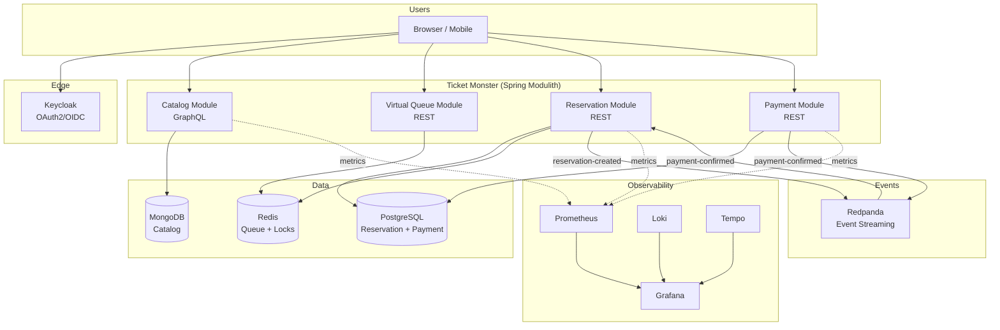
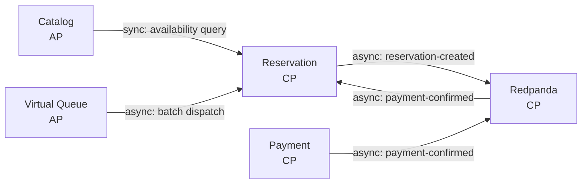
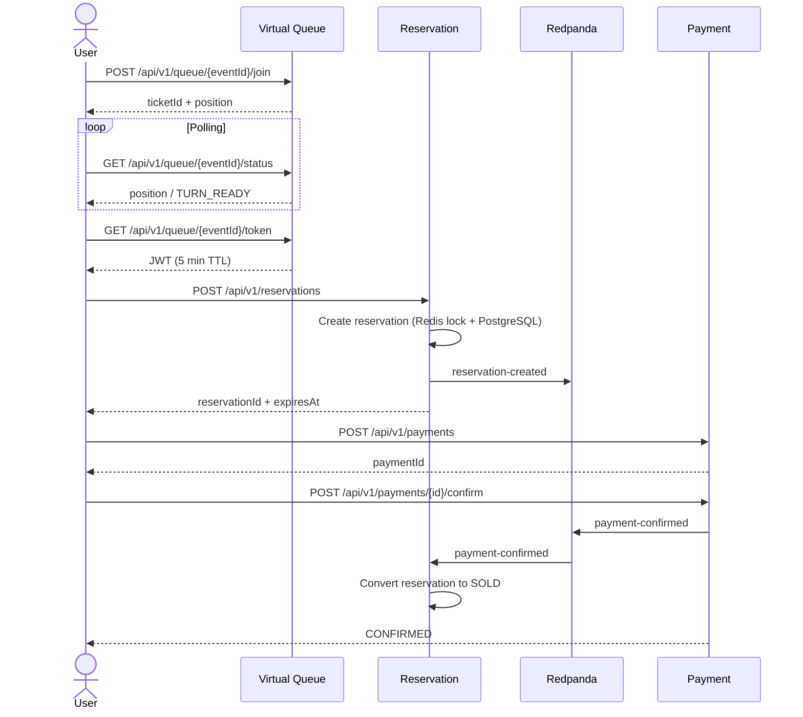
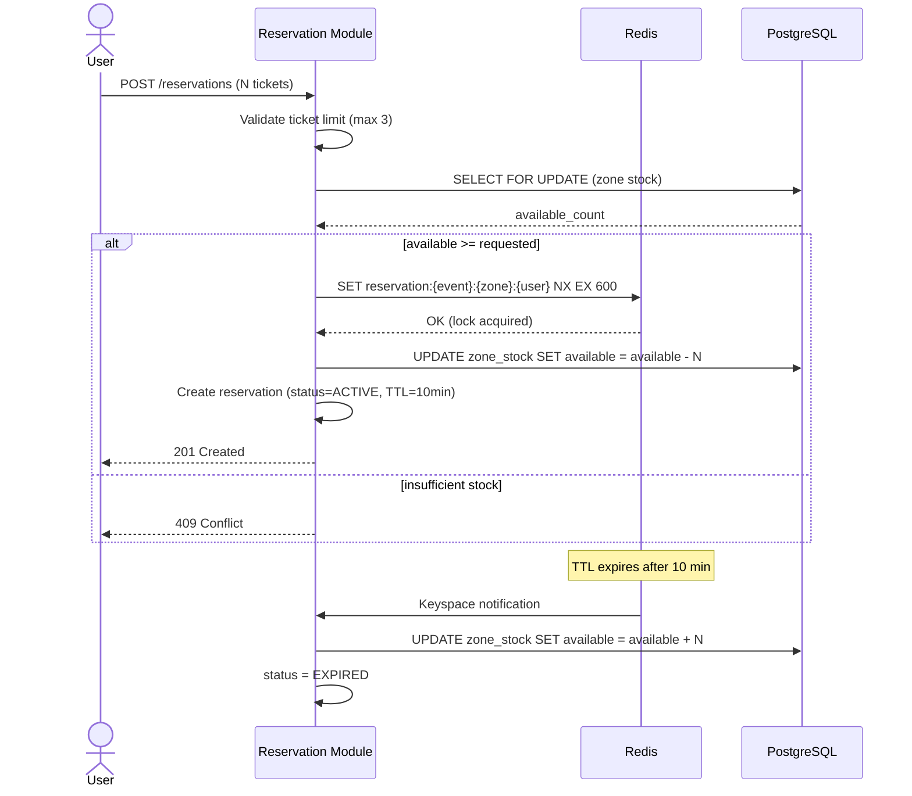
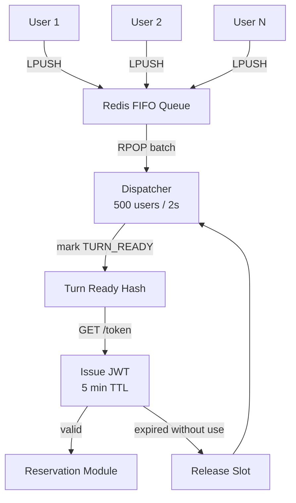
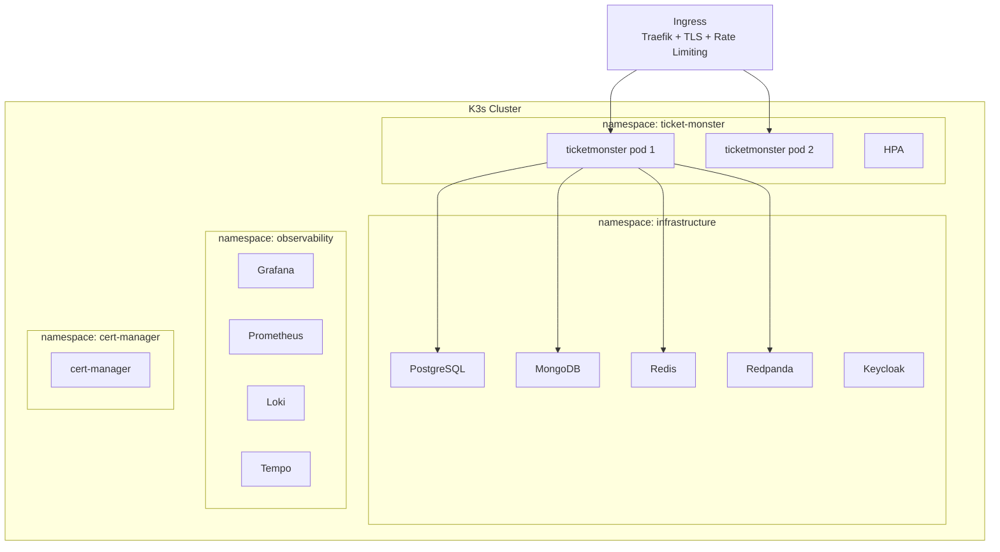

# Ticket Monster — Sistema de Reservaciones de Alta Concurrencia

Sistema en línea de venta de tickets para eventos de gran escala. Soporta 50M usuarios diarios activos (DAU) y 5M usuarios concurrentes en aperturas de venta masivas. Garantía de **cero overbooking**.

## Arquitectura

Monolito modular event-driven con Spring Modulith. Cada módulo mapea a un bounded context de DDD con comunicación híbrida (síncrona + asíncrona).

> **Evolution:** The API Gateway (`Spring Cloud Gateway`) was removed after k6 load tests revealed significant connection pooling overhead and latency under high concurrency. The monolith now handles all traffic directly. In production, **Traefik Ingress** (K3s native) provides TLS termination, rate limiting, and resilience — eliminating the extra network hop and connection churn while still applying policies at the edge.
>
> **Rate limiting strategy:** Read queries (`/graphql`) are **not rate-limited** — they're public and cheap. Rate limiting via Traefik applies only to write endpoints (`/api/v1/reservations`, `/api/v1/payments`, etc.). Two separate Ingress resources enforce this: `ticketmonster-graphql` (catch-all, no rate limit) and `ticketmonster` (`/api/*`, `/actuator/*`, with rate limit + secure headers).



## DDD Context Map



## Flujo de Compra



## Anti-Overbooking



## Fila Virtual



## Despliegue



## CAP Theorem Analysis

| Componente | CAP | Razón |
|---|---|---|
| Reservation Module | **CP** | No se permite overbooking. Se sacrifica disponibilidad para garantizar consistencia. |
| Payment Module | **CP** | Transacciones financieras requieren consistencia absoluta. |
| Catalog Module | **AP** | Read-heavy. Se tolera eventual consistency para mantener alta disponibilidad. |
| Virtual Queue | **AP** | Redis es eventualmente consistente. Perder la cola es un trade-off aceptable. |
| Redpanda | **CP** | Raft consensus garantiza consistencia en el streaming de eventos. |

## Evolución: Monolito → Microservicios

1. **Fase actual**: Monolito modular con Spring Modulith. Boundaries claros, comunicación desacoplada vía Redpanda.
2. **Spring Modulith** verifica automáticamente que no hay acoplamiento indebido entre módulos.
3. **Criterio de extracción**: Se extrae un módulo cuando requiere escalado independiente, diferentes ciclos de release, o tecnología específica.
4. **Extracción gradual**: La comunicación asíncrona vía Redpanda ya está establecida, por lo que extraer un módulo no rompe la aplicación.

## Tech Stack

| Componente | Tecnología |
|---|---|
| Backend | Spring Boot 4.0.6 + Spring Modulith 2.0.6 |
| Event Streaming | Redpanda |
| Cache / Locks / Queue | Redis |
| Orquestador | K3s |
| DB relacional | PostgreSQL |
| DB documental | MongoDB |
| Edge / Ingress | K3s Traefik (TLS termination, rate limiting, secure headers) |
| Auth | Keycloak (OAuth2 + OIDC) |
| API Catalog | Spring for GraphQL |
| Resiliencia | Resilience4j 2.3.0 |
| Observabilidad | Loki + Prometheus + Tempo + Grafana |
| Load Testing | k6 |
| Despliegue | Helm charts + Docker |

## Quick Start (Local Development)

### Prerequisites
- Docker & Docker Compose
- JDK 21
- Gradle 9.5+

### 1. Start everything (infrastructure + app + observability)
```bash
docker compose --profile app up -d
```

This builds and starts the monolith (`ticketmonster` on `:8082`) plus all infrastructure: PostgreSQL, MongoDB, Redis, Redpanda, Keycloak, Prometheus, Loki, Tempo, and Grafana.

> **Important:** If you only rebuild the app with `docker compose --profile app up -d --build ticketmonster`, the observability stack (Prometheus, Loki, Tempo, Grafana) will **not** start because `ticketmonster` does not depend on them. Start them explicitly:
> ```bash
> docker compose --profile app up -d prometheus loki tempo grafana
> ```

### 2. Run the app natively (outside Docker)
```bash
docker compose --profile infra up -d
cd backend/ticketmonster
./gradlew bootRun
```

Or run from IntelliJ:
```bash
# Only infrastructure in Docker, app runs from IDE
docker compose --profile infra up -d
```
Then run the `TicketmonsterApplication` main class in IntelliJ (default profile reads `application.yml` with `localhost` defaults).

The app connects to infrastructure on:
- PostgreSQL → `localhost:5432`
- MongoDB → `localhost:27017`
- Redis → `localhost:6379`
- Redpanda (Kafka) → `localhost:19092`
- Keycloak → `localhost:8180`

> **Note:** Redpanda exposes Kafka on port `19092` externally (not the default `9092`).
> Keycloak is on port `8180` to avoid conflict with other services.

### 3. Build the Docker image locally
```bash
docker build -t ticket-monster:local \
  -f backend/ticketmonster/Dockerfile \
  backend/ticketmonster
```

Rebuild and restart after code changes:
```bash
docker compose --profile app up -d --build ticketmonster

# Also restart observability if not already running:
docker compose --profile app up -d prometheus loki tempo grafana
```

### 4. Get an access token
```bash
TOKEN=$(curl -s -X POST http://localhost:8180/realms/ticket-monster/protocol/openid-connect/token \
  -H "Content-Type: application/x-www-form-urlencoded" \
  -d "client_id=ticket-monster-app" \
  -d "username=user" -d "password=user" \
  -d "grant_type=password" | jq -r '.access_token')
```

### 5. Try the API

```bash
# Query events via GraphQL
curl -s http://localhost:8082/graphql \
  -H "Authorization: Bearer $TOKEN" \
  -H "Content-Type: application/json" \
  -d '{"query": "{ events(page: 0, size: 10) { content { id name } } }"}'

# Join virtual queue
curl -s -X POST http://localhost:8082/api/v1/queue/EVENT_ID/join \
  -H "Authorization: Bearer $TOKEN"
```

### CLI Emulator
```bash
./frontend/frontend.sh admin admin http://localhost:8082 http://localhost:8180
```

### Reset data
```bash
docker compose down -v
```

---

## Tests

### Unit tests (Gradle)

```bash
# Run all tests
cd backend/ticketmonster
./gradlew test --no-daemon

# Build will fail if tests don't pass (CI + build-and-push.sh)
```

### Load tests (k6)

Install k6 (Debian 13 / Trixie):
```bash
sudo apt-get update && sudo apt-get install -y gnupg
curl -fsSL https://dl.k6.io/key.gpg | sudo gpg --dearmor -o /usr/share/keyrings/k6.gpg
echo "deb [signed-by=/usr/share/keyrings/k6.gpg] https://dl.k6.io/deb stable main" sudo tee /etc/apt/sources.list.d/k6.list
sudo apt-get update && sudo apt-get install -y k6
```

Prerequisites: infra + app + observability running:
```bash
docker compose --profile app up -d prometheus loki tempo grafana
```

k6 can push metrics to Prometheus in real-time via the `experimental-prometheus-rw` output. Results appear on the **k6 Prometheus** dashboard in Grafana.

```bash
# 1. Catalog read (public GraphQL, no auth)
./deploy/tests/k6/run-catalog-read.sh

# 2. Queue load (tests Redis throughput for virtual queue joins)
./deploy/tests/k6/run-queue-load.sh

# 3. Reservation contention (tests anti-overbooking under extreme concurrency)
./deploy/tests/k6/run-reservation-contention.sh
```

> **Note:** Defaults are `BASE_URL=http://localhost:8082`. Override with `--env BASE_URL=<url>`.
> Reduce VUs for local runs (e.g. `--vus 100 --duration 10s`). The defaults (5k–10k VUs) target CI/production.
> Metrics appear in Grafana → **k6 Prometheus** dashboard at http://localhost:3000

#### Run against production (janrax.es)

> **⚠️ Remote write limitation:** Prometheus remote write endpoint (`/api/v1/write`) is a ClusterIP service not exposed externally. You **cannot** write directly to `https://janrax.es/api/v1/write`. Use a `kubectl port-forward` tunnel instead:

```bash
# Terminal 1 (VPS) — expose Prometheus locally
kubectl port-forward -n observability prometheus-0 9090:9090

# Terminal 2 (local) — k6 pushes to local tunnel
K6_PROMETHEUS_RW_SERVER_URL=http://localhost:9090/api/v1/write \
K6_PROMETHEUS_RW_TREND_STATS=p(95),p(99),min,max \
k6 run -o experimental-prometheus-rw --tag testid=catalog-read \
  --env BASE_URL=https://janrax.es deploy/tests/k6/catalog-read.js
```

Or run k6 directly on the VPS (same machine as the cluster). **You still need the port-forward** because Prometheus is a `ClusterIP` service and is not exposed on the host:

```bash
# Terminal 1 (VPS) — keep this running in background
kubectl port-forward -n observability svc/prometheus 9090:9090 &

# Terminal 2 (VPS) — run the test
K6_PROMETHEUS_RW_SERVER_URL=http://localhost:9090/api/v1/write \
K6_PROMETHEUS_RW_TREND_STATS=p(95),p(99),min,max \
k6 run -o experimental-prometheus-rw --tag testid=catalog-read \
  --env BASE_URL=https://janrax.es deploy/tests/k6/catalog-read.js

# Stress test (5000 VUs, 30s)
K6_PROMETHEUS_RW_SERVER_URL=http://localhost:9090/api/v1/write \
K6_PROMETHEUS_RW_TREND_STATS=p(95),p(99),min,max \
k6 run -o experimental-prometheus-rw --tag testid=catalog-read \
  --env BASE_URL=https://janrax.es deploy/tests/k6/catalog-read.js \
  --vus 5000 --duration 30s
```

> **Why is this needed?** Prometheus runs inside K3s as a `ClusterIP` service at `prometheus.observability.svc.cluster.local:9090`. There is no Ingress, NodePort, or LoadBalancer exposing it externally. The `/api/v1/write` endpoint is only reachable from within the cluster. `kubectl port-forward` creates a TCP tunnel from `localhost:9090` on the host to the Prometheus pod.

> **Tip:** In local Docker Compose, Prometheus is exposed on `localhost:9090` — no tunnel needed. This only applies to K3s where Prometheus is a ClusterIP service.

For authenticated tests, get a token from the remote Keycloak and set `AUTH_TOKEN`:
```bash
TOKEN=$(curl -s -X POST https://janrax.es/auth/realms/ticket-monster/protocol/openid-connect/token \
  -H "Content-Type: application/x-www-form-urlencoded" \
  -d "client_id=ticket-monster-app" \
  -d "username=admin" -d "password=admin" \
  -d "grant_type=password" | jq -r '.access_token')

EVENT_ID=$(curl -s https://janrax.es/graphql \
  -H "Content-Type: application/json" \
  -d '{"query":"{ events(page: 0, size: 1) { content { id } } }"}' | jq -r '.data.events.content[0].id')

K6_PROMETHEUS_RW_SERVER_URL=https://janrax.es/api/v1/write \
K6_PROMETHEUS_RW_TREND_STATS=p(95),p(99),min,max \
k6 run -o experimental-prometheus-rw --tag testid=queue-load \
  --env BASE_URL=https://janrax.es --env AUTH_TOKEN="$TOKEN" --env EVENT_ID="$EVENT_ID" \
  deploy/tests/k6/queue-load.js
```

---

### Database consoles & queries

#### PostgreSQL (Reservations, Payments)

```bash
# Interactive shell
docker exec -it ticket-monster-postgres-1 psql -U ticketmonster -d ticketmonster

# Quick queries
docker exec -it ticket-monster-postgres-1 psql -U ticketmonster -d ticketmonster -c "SELECT * FROM zone_stock;"
docker exec -it ticket-monster-postgres-1 psql -U ticketmonster -d ticketmonster -c "SELECT * FROM reservations;"
docker exec -it ticket-monster-postgres-1 psql -U ticketmonster -d ticketmonster -c "SELECT * FROM reservation_items;"
docker exec -it ticket-monster-postgres-1 psql -U ticketmonster -d ticketmonster -c "SELECT * FROM payments;"
docker exec -it ticket-monster-postgres-1 psql -U ticketmonster -d ticketmonster -c "SELECT * FROM payment_audit;"
```

#### MongoDB (Catalog: events, venues, artists)

```bash
# Interactive shell
docker exec -it ticket-monster-mongodb-1 mongosh admin -u ticketmonster -p ticketmonster

# Quick queries
docker exec -it ticket-monster-mongodb-1 mongosh --quiet admin -u ticketmonster -p ticketmonster \
  --eval 'db.getSiblingDB("ticketmonster_catalog").events.find().pretty()'
docker exec -it ticket-monster-mongodb-1 mongosh --quiet admin -u ticketmonster -p ticketmonster \
  --eval 'db.getSiblingDB("ticketmonster_catalog").venues.find().pretty()'
docker exec -it ticket-monster-mongodb-1 mongosh --quiet admin -u ticketmonster -p ticketmonster \
  --eval 'db.getSiblingDB("ticketmonster_catalog").artists.find().pretty()'
```

#### Redis (Queue, Locks)

```bash
# Interactive shell
docker exec -it ticket-monster-redis-1 redis-cli

# Quick queries
docker exec -it ticket-monster-redis-1 redis-cli KEYS '*'
docker exec -it ticket-monster-redis-1 redis-cli LLEN queue:EVENT_ID
docker exec -it ticket-monster-redis-1 redis-cli LRANGE queue:EVENT_ID 0 -1
```

#### Redpanda Console (Kafka topics)

Open http://localhost:8081 in a browser to browse topics, messages, and consumer groups.

```bash
# List topics via CLI
docker exec -it ticket-monster-redpanda-1 rpk topic list

# Consume messages from a topic
docker exec -it ticket-monster-redpanda-1 rpk topic consume payment-confirmed -n 5
```

#### Keycloak Admin Console

http://localhost:8180/admin (admin / admin)

---

### Test users

| User | Password | Keycloak roles | Grafana role |
|------|----------|---------------|-------------|
| `admin` | `admin` | ADMIN, USER, grafana-admin | Admin |
| `user` | `user` | USER, grafana-viewer | Viewer |

### Endpoints

| Service | URL |
|---------|-----|
| Monolith (app) | http://localhost:8082 |
| GraphQL endpoint | http://localhost:8082/graphql |
| Keycloak | http://localhost:8180 |
| Redpanda Console | http://localhost:8081 |
| Grafana | http://localhost:3000 |
| Prometheus | http://localhost:9090 |

## Frontend CLI

Emulador interactivo por terminal que consume la API de Ticket Monster. Permite hacer los recorridos completos de administración y compra sin escribir curl manualmente.

### Prerequisitos

- `curl` (obligatorio)
- `jq` (opcional, mejora el formato de salida JSON)

### Uso

```bash
./frontend/frontend.sh <usuario> <password> [monolith_url] [keycloak_url] [-v]
```

- `monolith_url`: URL del monólito (default: `https://janrax.es`)
- `keycloak_url`: URL de Keycloak (default: `https://janrax.es/auth`)
- `-v`: Muestra el comando curl equivalente antes de ejecutar cada llamada.

El script detecta automáticamente si eres administrador o usuario regular y muestra el menú correspondiente.

### Usuarios de prueba

| Usuario | Password | Roles | Menú |
|---------|----------|-------|------|
| `admin` | `admin` | ADMIN, USER | Crear artista/venue/evento, publicar, listar, disponibilidad |
| `user` | `user` | USER | Listar eventos, disponibilidad, comprar entradas, pagar |

### Ejemplos

```bash
# Local
./frontend/frontend.sh admin admin http://localhost:8082 http://localhost:8180

# Remoto (usa defaults)
./frontend/frontend.sh admin admin
```

### Sesión administrador

```bash
./frontend/frontend.sh admin admin http://localhost:8082 http://localhost:8180

# 1. Crear Artista  →  Foo Fighters, Rock
# 2. Crear Venue    →  Wembley, 90000
# 3. Crear Evento   →  Foo Fighters Live, CONCERT, venueId anterior, zonas: Pista 40000x80 + Grada 30000x120
# 4. Publicar Evento → eventId anterior
```

### Sesión usuario

```bash
./frontend/frontend.sh user user http://localhost:8082 http://localhost:8180

# 1. Listar Eventos → elegir un evento
# 3. Comprar entradas → eventId, se une a cola, espera turno, zonaId, cantidad
# 4. Pagar reserva → reservationId, monto
```

## Limitaciones / Próximos Pasos

- [ ] **Asignación de butacas numeradas**: Actualmente el sistema solo lleva un contador de capacidad por zona (ej: "Pista: 40000 disponibles"). Al reservar N entradas, descuenta del contador pero no asigna números de butaca específicos. Pendiente implementar numeración secuencial: `reserved_seats = [capacity - available + 1 .. capacity - available + quantity]`. Afecta al modelo `ReservationItem`, la respuesta de la API y las cancelaciones (reutilización de números).
- [ ] **Manejo amigable de excepciones**: Actualmente las excepciones no controladas (ej: `LazyInitializationException`, `IllegalArgumentException`, formato inválido) devuelven 500 con un JSON genérico. Implementar un `@ControllerAdvice` global que:
  - Capture excepciones comunes y devuelva respuestas con mensajes legibles para el usuario (en español o inglés según el locale)
  - Registre el error completo en los logs estructurados para observabilidad (Loki + Tempo traceId)
  - Exponga el traceId en la respuesta al cliente para correlación

## Performance & Scaling Insights

### Key metrics

| Metric | Meaning | Target |
|--------|---------|--------|
| **p50 (median)** | The 50th percentile — half the requests are faster than this | User-facing perception |
| **p95** | 95% of requests complete under this time — the real user experience | `<200ms` for reads, `<5s` for purchases |
| **p99** | 99th percentile — the long tail | Monitor for outliers |
| **error rate** | Percentage of failed requests | `<1%` |
| **throughput** | Requests per second the system handles | Depends on scale |

> **p95 matters more than average.** The average hides problems: a few very slow requests pull it up only slightly. p95 shows what 95% of your users actually experience.

### Scaling observations (k6 load tests)

Resultados de pruebas de carga con k6 → Prometheus remote write (GraphQL catalog reads):

**Local (1 pod Docker):**

| Escenario | VUs | Throughput | p95 | Avg | Errors | Observación |
|-----------|-----|-----------|-----|-----|--------|-------------|
| **Baja** | 100 | 877 req/s | **31ms** | 12ms | 0% | ✅ Responde excelente |
| **Media** | 500 | — | — | — | 0% | Latencia dentro de target |
| **Alta** | 2000 | 2.336 req/s | **1.41s** | 744ms | 0% | ❌ p95 supera 200ms target |
| **Máxima** | 5000 | 2.512 req/s | **3.93s** | 1.81s | 0% | ❌ VUs efectivas estancadas en ~3.068 |

**K3s VPS (1 pod, janrax.es):**

| Escenario | VUs | Throughput | p95 | Avg | Errors | Observación |
|-----------|-----|-----------|-----|-----|--------|-------------|
| **Remoto 500** | 500 | 677 req/s | **1.55s** | 606ms | 0% | ❌ Latencia de red domina |
| **Remoto 5K** | 5000 | 36 req/s | **32.38s** | 28.7s | **92.56%** | ❌ Colapso total — servidor devuelve HTML en vez de JSON |

El test de 5K VUs contra K3s colapsó completamente: solo 2.994/5.000 VUs efectivas, 92% de requests fallaron con respuestas no-JSON (probablemente timeouts de Traefik o el app server saturó su thread pool). El throughput cayó de 267 req/s (100 VUs) a 36 req/s (5K VUs).

**Hallazgos clave:**

- **A baja carga (100 VUs) el sistema responde en 31ms p95** — el monolito + BDs aguantan sin esfuerzo.
- **El cuello de botella está en ~2.300 req/s.** De 100→2000 VUs el throughput se multiplicó por 2.7×, pero de 2000→5000 VUs solo subió un 7% adicional (2.336→2.512 req/s). La latencia se disparó: p95 pasó de 31ms → 1.41s → 3.93s.
- **En 5K VUs contra K3s el sistema no aguanta** — 92% de fallos. 1 solo pod no tiene capacidad para 5K conexiones concurrentes. El connection pool de HikariCP (20 conexiones) y el thread pool de Tomcat se saturan.
- **El test catalog-read.js solo golpea MongoDB** (GraphQL → Catalog Module → MongoDB). PostgreSQL no es el bottleneck aquí — es la capacidad de MongoDB + el thread pool del monolito.
- **0% de errores en tests locales hasta 5K VUs.** El sistema degrada gracefulmente sin romperse — las conexiones se encolan, no se rechazan. En K3s con 5K VUs, el colapso es total.
- **El error `invalid character 'G'`** indica que el servidor devolvió HTML (página de error) en vez de JSON — probablemente Traefik devolviendo 502/504 al superar el timeout del backend.

### Próximos pasos para mayor throughput

1. **Escalar pods del monolito** — 3 réplicas de ticketmonster distribuyen la carga y multiplican el thread pool ×3. Con HPA activo, escala automáticamente bajo carga.
2. **PgBouncer** — Aunque el test catalog-read no usa PostgreSQL, los tests de escritura (reservations, payments) sí. PgBouncer multiplexa conexiones: en vez de N pods × 20 conexiones HikariCP directas a PG, PgBouncer las consolida en ~10-20 conexiones reales. Sin PgBouncer, 3 pods = 60 conexiones directas compitiendo en PostgreSQL.
3. **MongoDB replica set (3 nodos)** — El catálogo es read-heavy. Un replica set permite distribuir lecturas entre secondaries. Las escrituras (poco frecuentes en catálogo) van al primary. Con 3 nodos, el throughput de lectura se multiplica.
4. **Optimización de queries** — Revisar `pg_stat_statements` y MongoDB profiler para detectar queries lentas e índices faltantes.
5. **HPA tuning** — En K3s, activar HPA (`autoscaling.enabled: true`) y ajustar targets de CPU/memoria para escalar automáticamente bajo carga.

> **¿3 MongoDB + PgBouncer + 3 ticketmonsters mejorarían el test de 5K VUs?**
>
> Para el test catalog-read.js (solo GraphQL → MongoDB): **3 pods del monolito + 3 MongoDB en replica set** es la combinación ganadora. 3 pods × thread pool distribuyen las 5K conexiones concurrentes, y el replica set de MongoDB permite leer desde secondaries. PgBouncer no afecta este test específico porque no toca PostgreSQL.
>
> Para el sistema completo (reservations, payments, queue): **PgBouncer es crítico** para no saturar PostgreSQL con 60+ conexiones directas desde 3 pods.

### Reservation Contention Test (anti-overbooking)

Este test valida que el sistema **nunca sobrevende** bajo concurrencia extrema: 1000 VUs compitiendo por solo **10 tickets** en `zone-vip`, usando **100 usuarios distintos** con su propio token JWT.

#### ¿Qué hace `run-reservation-contention.sh`?

1. **Setup de datos** (GraphQL como admin):
   - Crea un venue (`Estadio Test K6`, Madrid, 500 capacidad)
   - Crea un artist (`DJ Test K6`, Electronic)
   - Crea un evento con dos zonas: `zone-general` (5000 tickets) y **`zone-vip` (solo 10 tickets)**
   - Publica el evento

2. **Setup de usuarios** (Keycloak Admin API):
   - Asegura 100 usuarios `k6user1`..`k6user100` en el realm `ticket-monster`
   - Obtiene los 100 tokens JWT y los guarda en `/tmp/k6-tokens-*.json`

3. **Limpieza** (Redis + PostgreSQL vía `kubectl exec`):
   - Borra todos los locks Redis con key `reservation:*`
   - Borra todas las reservas y pagos de ejecuciones anteriores

4. **Ejecución del test k6**:
   - 1000 VUs, 1000 iteraciones (cada VU ejecuta 1 petición)
   - Cada VU usa un token distinto: `tokens[__VU % tokens.length]` → 10 VUs por usuario
   - Todas las peticiones intentan `POST /api/v1/reservations` con 1 ticket en `zone-vip`

#### Flujo por cada petición dentro del backend

```
VU (token k6userX) → POST /api/v1/reservations
  ├─ Valida max-tickets-per-customer (≤3 por usuario/evento)
  ├─ SELECT ... FOR UPDATE sobre zone_stock de zone-vip (PostgreSQL)
  │   → Solo 1 transacción toca la fila a la vez — serializa las 1000 peticiones
  ├─ Si availableCount >= 1:
  │   ├─ Redis: SETNX reservation:{eventId}:zone-vip:{userId} NX EX 600
  │   │   → Previene que el mismo usuario haga doble reserva en la misma zona
  │   ├─ Decrementa availableCount (PostgreSQL)
  │   └─ Crea ReservationItem → HTTP 201 Created
  └─ Si availableCount === 0:
      └─ InsufficientStockException → HTTP 409 Conflict
```

Los dos mecanismos de lock compiten así:
- **Redis lock** (`SETNX`): 100 usuarios → cada uno pasa su lock sin conflicto (son keys distintas por userId)
- **PostgreSQL `SELECT FOR UPDATE`**: Las 1000 transacciones se serializan sobre la misma fila de `zone_stock`. Solo las primeras 10 ven `availableCount >= 1`. Las 990 restantes encuentran stock agotado y devuelven 409.

#### Resultados (K3s VPS, janrax.es)

```
=== Reservation Contention Test Results ===
Total requests:           1000
Completed iterations:     1000
Success rate:             100.00%
p95 latency:              3170ms
Total test duration:      ~4.0s
```

| Métrica | Valor | Significado |
|----------|-------|-------------|
| **Success rate 100%** | Todas las respuestas son 201 o 409 | Sin errores 500, timeouts ni overbooking |
| **p95 3170ms** | 95% de peticiones completan en <3.2s | El `SELECT FOR UPDATE` serializa las 1000 peticiones sobre 1 fila |
| **100% iterations** | 1000/1000 VUs completaron | Sin VUs interrumpidas ni fallos de red |
| **~10 × 201** | ~10 reservas creadas | Exactamente la capacidad de `zone-vip` |
| **~990 × 409** | ~990 rechazos por stock agotado | Anti-overbooking funcionando correctamente |

#### Por qué es importante

- **Comparativa con 1 solo usuario:** El p95 bajaba a 2790ms. Con 100 usuarios el p95 sube a 3170ms (+14%) porque hay 100 veces más transacciones que pasan el lock Redis y compiten en la fila de PostgreSQL.
- **El `SELECT FOR UPDATE` es el cuello de botella**, no Redis ni el thread pool. Es el precio de la consistencia CP.
- **0 overbooking:** Con 10 tickets y 1000 peticiones, el sistema nunca vendió más de 10. El doble lock (Redis + PostgreSQL) cumple su función.

### Virtual Queue Load Test (Redis throughput)

Este test mide la capacidad del módulo de **Fila Virtual** para absorber una avalancha de usuarios uniéndose a la cola de un evento. A diferencia del test de reservas (CP), la cola virtual es **AP**: opera exclusivamente sobre Redis sin tocar PostgreSQL ni MongoDB.

#### ¿Qué hace `run-queue-load.sh`?

1. **Setup de datos** (GraphQL como admin):
   - Crea venue, artist, evento con zonas (zone-general: 5000 tickets, zone-vip: 1000 tickets)
   - Publica el evento

2. **Setup de usuarios** (Keycloak Admin API):
   - Asegura 50 usuarios `k6user1`..`k6user50` en el realm `ticket-monster`
   - Obtiene 50 tokens JWT y los guarda en `/tmp/k6-tokens-*.json`

3. **Limpieza** (Redis + PostgreSQL vía `kubectl exec`):
   - Borra colas Redis (`queue:*`) y locks (`reservation:*`) de ejecuciones anteriores
   - Borra reservas y pagos de PostgreSQL

4. **Ejecución del test k6**:
   - 200 VUs, 30s de duración (cada VU hace peticiones en loop con `sleep(0.1)`)
   - Cada VU usa un token distinto: `tokens[__VU % tokens.length]`
   - `POST /api/v1/queue/{eventId}/join` → Redis `LPUSH queue:{eventId}`

#### Flujo por cada petición dentro del backend

```
VU (token k6userX) → POST /api/v1/queue/{eventId}/join
  ├─ Valida JWT (Keycloak)
  ├─ Valida que el evento existe (MongoDB — solo la 1ª vez, cacheado)
  └─ Redis: LPUSH queue:{eventId} {userId}
      └─ Retorna ticketId (UUID) + position (LLEN)
```

No hay locks. No hay `SELECT FOR UPDATE`. No hay PostgreSQL. Solo HTTP → Redis.

#### Resultados (K3s VPS, janrax.es, 200 VUs × 30s)

| Métrica | Valor | Significado |
|----------|-------|-------------|
| **Throughput** | 526 req/s | 200 VUs sosteniendo ~2.6 req/s cada uno |
| **Total requests** | 15,904 | 200 VUs × ~80 iteraciones c/u en 30s |
| **p95 latency** | 676ms | 95% bajo 700ms — Redis + HTTP overhead |
| **p50 latency** | 234ms | Mitad de las peticiones bajo 250ms |
| **Error rate** | 0.00% | Cero fallos — Redis no se satura a esta carga |
| **has ticketId** | 100% | Todas las respuestas incluyen ticketId UUID |
| **has position** | 99.8% | 32 de 15,904 sin posición (race condition en LLEN) |

#### Límite de escala detectado

El test se diseñó originalmente para **10,000 VUs**. Resultados a distintas escalas:

**1 pod, 10K VUs:** Colapso total — 80% de fallos, servidor devolviendo HTML en vez de JSON. El thread pool HTTP + HikariCP se saturan con 10K conexiones entrantes.

**5 pods, 10K VUs:** Peor que con 1 pod — solo **144 peticiones completadas** de 10K, error `connection refused` masivo. **El pod de Traefik se cayó.** Al escalar los pods de la app, cada uno abre conexiones a MongoDB, PostgreSQL, Redis, Redpanda y Keycloak, consumiendo más file descriptors del VPS. Traefik como punto único de entrada no puede absorber 10K conexiones TCP simultáneas con los recursos del VPS actual.

**200 VUs (1 pod):** Funciona perfecto — 526 req/s, p95 676ms, 0% errores.

**Conclusión:** El bottleneck para 10K VUs no es la app ni Redis — es **Traefik + los límites TCP del kernel del VPS** (`somaxconn`, file descriptors). Escalar pods dentro del mismo nodo es contraproducente porque compiten por los mismos recursos de red. Para soportar 10K conexiones concurrentes haría falta múltiples nodos K3s o subir los límites del kernel.

#### Comparativa: Queue vs Reservation

| | Queue Load | Reservation Contention |
|---|---|---|
| **Endpoint** | `POST /queue/{id}/join` | `POST /reservations` |
| **Storage** | Solo Redis (`LPUSH`) | PostgreSQL + Redis |
| **CAP** | AP (alta disponibilidad) | CP (consistencia) |
| **p95 a 200 VUs** | 676ms | 3170ms (a 1000 VUs) |
| **Bottleneck** | HTTP thread pool | `SELECT FOR UPDATE` en PostgreSQL |
| **Error rate** | 0% | 0% (201 o 409 válidos) |

### Catalog Read Test (GraphQL + MongoDB throughput)

Este test mide la capacidad del módulo de **Catálogo** para servir consultas GraphQL bajo carga. Es el único test que no requiere autenticación: el endpoint `/graphql` es público y sin rate limiting. Cada iteración ejecuta 2 queries contra MongoDB: listado de eventos y disponibilidad por zona.

#### ¿Qué hace `run-catalog-read.sh`?

1. **Setup de datos** (GraphQL como admin):
   - Crea venue, artist, evento con zonas y lo publica (necesario para la query de `availability`)
   - Pasa el `EVENT_ID` real al test k6

2. **Ejecución del test k6**:
   - 200 VUs, 30s de duración (cada VU hace 2 queries por iteración con `sleep(0.1)`)
   - Endpoint público — sin tokens, sin usuarios Keycloak
   - `POST /graphql` con `{ events(page: 0, size: 20) { ... } }` + `{ availability(eventId: ...) { ... } }`

#### Flujo por cada petición dentro del backend

```
VU → POST /graphql (sin auth)
  ├─ Spring for GraphQL → Catalog Module
  ├─ Query 1: events(page: 0, size: 20)
  │   └─ MongoDB: db.events.find().limit(20)
  ├─ sleep(0.1s)
  └─ Query 2: availability(eventId)
      └─ Reservation Module → PostgreSQL: SELECT availableCount FROM zone_stock
```

El catálogo de eventos está en MongoDB (AP, sin locks). La disponibilidad consulta PostgreSQL (sin `FOR UPDATE`, solo lectura).

#### Resultados (K3s VPS, janrax.es, 2 pods × 200 VUs × 30s)

| Métrica | Valor | Significado |
|----------|-------|-------------|
| **Throughput** | 91 req/s | 200 VUs sosteniendo ~0.45 req/s c/u (2 queries = ~45 iter/s) |
| **Total iterations** | 1,451 | 200 VUs × ~7.25 iteraciones c/u en 30s |
| **p95 latency** | 5.61s | 95% bajo 5.6s — MongoDB es el bottleneck |
| **p50 latency** | 1.61s | Mitad de las queries GraphQL bajo 1.6s |
| **Error rate** | 0.00% | Sin fallos HTTP — todas las respuestas son 200 |
| **events query ok** | 100% | Todas las queries de eventos devuelven 200 |
| **availability query ok** | 100% | Todas las queries de disponibilidad devuelven 200 |

#### Límite de escala detectado

| Escenario | VUs | Resultado |
|-----------|-----|-----------|
| **1 pod, 5K VUs** | 5000 | Colapso — 99% fallos, p95 32s, HTML en vez de JSON |
| **1 pod, 1K VUs** | 1000 | Colapso — 0 iteraciones completadas, servidor saturado |
| **2 pods, 200 VUs** | 200 | Funciona — 0% errores, p95 5.61s, MongoDB es el bottleneck |

A diferencia de queue-load (Redis puro, p95 676ms), el catálogo es **8× más lento** porque cada query GraphQL va a MongoDB. La latencia no mejora al escalar de 1→2 pods porque el cuello de botella es **MongoDB con 1 solo nodo**, no el thread pool de la app.

#### Comparativa Stack: los 3 tests

| | Catalog Read | Queue Load | Reservation Contention |
|---|---|---|---|
| **Endpoint** | `POST /graphql` | `POST /queue/{id}/join` | `POST /reservations` |
| **Auth** | ❌ Público | ✅ JWT | ✅ JWT |
| **Storage** | MongoDB + PostgreSQL | Solo Redis | PostgreSQL + Redis |
| **CAP** | AP | AP | CP |
| **p95 (200 VUs)** | 5.61s | 676ms | 3170ms (1000 iter) |
| **Throughput** | 91 req/s | 526 req/s | ~250 req/s (efectivo) |
| **Bottleneck** | MongoDB (1 nodo) | HTTP thread pool | `SELECT FOR UPDATE` |

```bash
# 1. Provision K3s cluster (production)
./deploy/k3s/k3s-provision.sh -u janrax@janrax.es -d janrax.es

# Or staging to avoid Let's Encrypt rate limits during testing:
./deploy/k3s/k3s-provision.sh -u janrax@janrax.es -d janrax.es -s

# 2. Deploy infrastructure + observability
./deploy/k3s/k3s-infrastructure.sh -u janrax@janrax.es -d janrax.es

# 3. Deploy the monolith
./deploy/k3s/k3s-publish-app.sh -u janrax@janrax.es -d janrax.es

# Or with a specific version tag:
./deploy/k3s/k3s-publish-app.sh -u janrax@janrax.es -d janrax.es -t 1.0.0

# Or all at once:
./deploy/k3s/deploy.sh janrax@janrax.es janrax.es latest
```

### Recreate infrastructure preserving TLS certs

When you need to wipe and redeploy infrastructure (e.g., after Keycloak realm or Helm chart changes) but want to avoid new Let's Encrypt certificate requests:

```bash
./deploy/k3s/k3s-recreate.sh -u janrax@janrax.es -d janrax.es
```

This script runs 4 phases:
1. **Backup** — saves TLS secrets (`<domain>-tls`) from `infrastructure` and `observability` namespaces
2. **Destroy** — deletes `infrastructure`, `observability`, and `ticket-monster` namespaces
3. **Re-provision** — runs `k3s-infrastructure.sh` (secrets, databases, Keycloak, Grafana stack)
4. **Restore** — replaces freshly-issued TLS secrets with the backed-up ones and deletes cert-manager Certificate resources so they reconcile without re-issuing

> This avoids hitting Let's Encrypt rate limits (5 duplicate certs per domain per 7 days). Useful when iterating on infrastructure configuration.

> **Let's Encrypt rate limits:** Testing with frequent redeploys can exhaust your certificate quota
> (5 certs per domain per 7 days). Use the `-s` flag (staging) during development to avoid hitting
> the limit. Staging certs are not trusted by browsers (show a warning), but Grafana's internal
> token/userinfo calls go to `http://keycloak.infrastructure.svc.cluster.local:8080/auth` (no TLS),
> so OAuth still works. When ready for production, re-provision without `-s`.

#### Switching from staging to production (in-place, no data loss)

If you provisioned with `-s` (staging) and want to switch to production certs without destroying
the cluster:

```bash
# 1. Replace the ClusterIssuer with production server
kubectl delete clusterissuer letsencrypt

cat <<'YAML' | kubectl apply -f -
apiVersion: cert-manager.io/v1
kind: ClusterIssuer
metadata:
  name: letsencrypt
spec:
  acme:
    server: https://acme-v02.api.letsencrypt.org/directory
    email: admin@janrax.es
    privateKeySecretRef:
      name: letsencrypt-account-key
    solvers:
    - http01:
        ingress:
          ingressClassName: traefik
YAML

# 2. Delete staging certificates (they'll be reissued automatically)
kubectl delete certificate --all -n infrastructure
kubectl delete certificate --all -n observability

# 3. Wait for production certs to be ready
kubectl get certificates -A -w
```

All services and data (PostgreSQL, MongoDB, Redis) remain untouched. Once certificates show
`Ready=True`, reload the browser and the TLS warning disappears.

Images are built and pushed to GitHub Container Registry via the manual workflow:
`.github/workflows/docker-publish.yml` → `ghcr.io/jrgavilanes/ticket-monster:<version>`.

---

## Grafana OAuth via Keycloak

Grafana delegates authentication to Keycloak via OAuth2 Authorization Code flow.
Users registered in the `ticket-monster` realm can log into Grafana at `https://<domain>/panel`.

### Architecture

```
Browser → https://<domain>/panel
  → Grafana (observability ns)
    → Keycloak OAuth2 (infrastructure ns, /auth)
      → Keycloak realm ticket-monster
        → users: admin/admin, user/user
```

### Role mapping

| Keycloak realm role | Grafana role |
|---------------------|-------------|
| `grafana-admin` | Admin (full access) |
| `grafana-editor` | Editor (view + explore) |
| `grafana-viewer` | Viewer (read-only) |
| none | Denied (login blocked) |

Users without any `grafana-*` role are rejected at login. Role hierarchy: `grafana-admin` > `grafana-editor` > `grafana-viewer`. A user with multiple roles gets the highest one.

The `role_attribute_strict: true` setting ensures that only users with an explicit `grafana-*` role can access Grafana. The `realm_access.roles` claim is exposed to the `/userinfo` endpoint via a protocol mapper on the `grafana` Keycloak client.

### Fresh install (cluster from scratch)

Fully automatic. `k3s-infrastructure.sh` does everything:

1. **`realm-export.json`** includes the `grafana` confidential client (OAuth2, secret: `grafana-client-secret`)
2. After deploying Keycloak, the script uses the **Keycloak Admin API** to add the domain-specific redirect URI (`https://<domain>/panel/login/generic_oauth`)
3. After deploying Grafana, the OAuth env vars (`GF_AUTH_GENERIC_OAUTH_*`) are already configured in the Helm chart

```bash
# Run once — everything is wired automatically:
./deploy/k3s/k3s-infrastructure.sh -u janrax@janrax.es -d janrax.es
```

Then open `https://<domain>/panel` → **Sign in with Keycloak** → `admin / admin`.

### Existing installation (manual setup)

If the cluster was deployed **before** this feature was added, the Keycloak realm already exists
and the `grafana` client must be created manually via the Admin API:

```bash
# 1. Port-forward to Keycloak
kubectl port-forward -n infrastructure svc/keycloak 18080:8080 &
sleep 5

# 2. Get admin token
KC_ADMIN=$(kubectl get secret keycloak-credentials -n infrastructure \
  -o jsonpath='{.data.admin-password}' | base64 -d)
KC_TOKEN=$(curl -s -X POST \
  http://localhost:18080/auth/realms/master/protocol/openid-connect/token \
  -d 'client_id=admin-cli' \
  -d 'username=admin' \
  -d "password=$KC_ADMIN" \
  -d 'grant_type=password' | jq -r '.access_token')

# 3. Create the grafana client
curl -s -X POST \
  -H "Authorization: Bearer $KC_TOKEN" \
  -H 'Content-Type: application/json' \
  http://localhost:18080/auth/admin/realms/ticket-monster/clients \
  -d '{
    "clientId": "grafana",
    "publicClient": false,
    "standardFlowEnabled": true,
    "directAccessGrantsEnabled": false,
    "redirectUris": [
      "http://localhost:3000/login/generic_oauth",
      "https://<domain>/panel/login/generic_oauth"
    ],
    "webOrigins": ["+"],
    "secret": "grafana-client-secret"
  }'

# 4. Store the client secret for Grafana
kubectl patch secret grafana-credentials -n observability \
  --patch '{"data":{"oauth-client-secret":"Z3JhZmFuYS1jbGllbnQtc2VjcmV0"}}'

# 5. Kill port-forward
kill %1

# 6. Redeploy Grafana with OAuth settings
kubectl delete pod -n observability -l app=grafana
```

> **Note:** Replace `<domain>` with your actual domain (e.g. `janrax.es`).
> Re-running `k3s-infrastructure.sh` also works and redeploys Grafana automatically.

### Docker Compose (local development)

Works out of the box. The `grafana` client in `realm-export.json` already includes
`http://localhost:3000/login/generic_oauth` as a redirect URI. Grafana in `docker-compose.yml`
has all OAuth env vars configured pointing to `http://keycloak:8080`.

```bash
docker compose --profile app up -d
# Open http://localhost:3000 → Sign in with Keycloak → admin / admin
```

---

## TODO / Improvements

- **Eliminar hardcoded `janrax.es`** — parametrizar para cualquier dominio:
  - `deploy/k3s/k3s-publish-app.sh` → `--set env.KEYCLOAK_ISSUER_URI`, `--set env.KEYCLOAK_JWK_SET_URI` (se sobreescriben bien, pero `values.yaml` tiene defaults hardcodeados)
  - `deploy/k3s/charts/ticketmonster/values.yaml` → `ingress.host`, `KEYCLOAK_ISSUER_URI`, `KEYCLOAK_JWK_SET_URI`
  - `frontend/frontend.sh` → `DEFAULT_BASE`, `DEFAULT_KEYCLOAK` (ya configurable por argumento, default hardcodeado)```