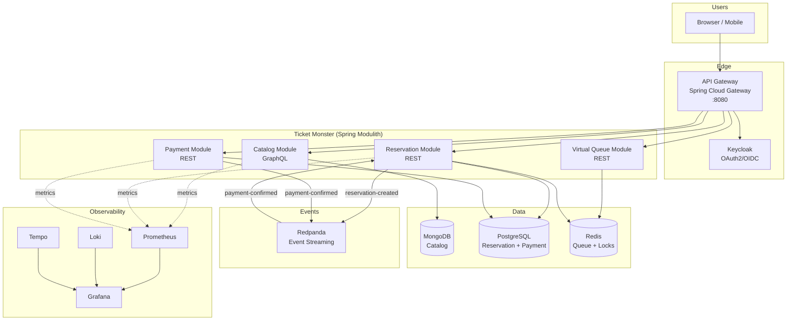
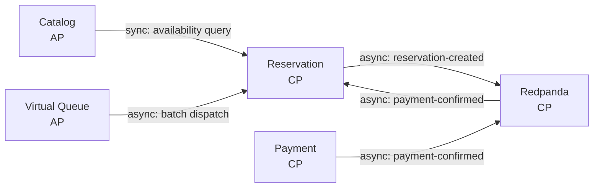
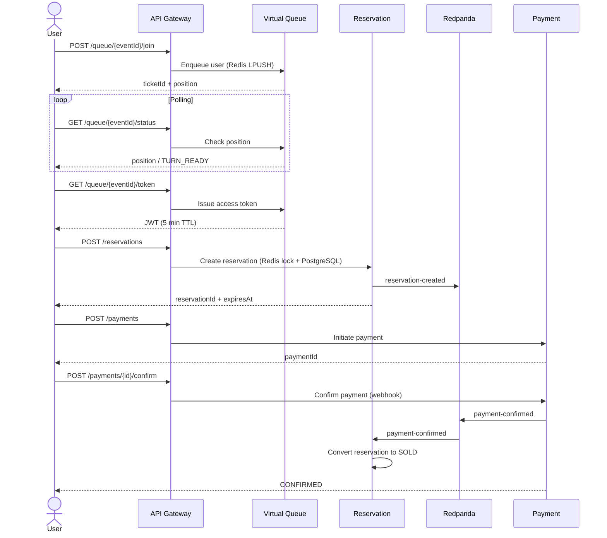
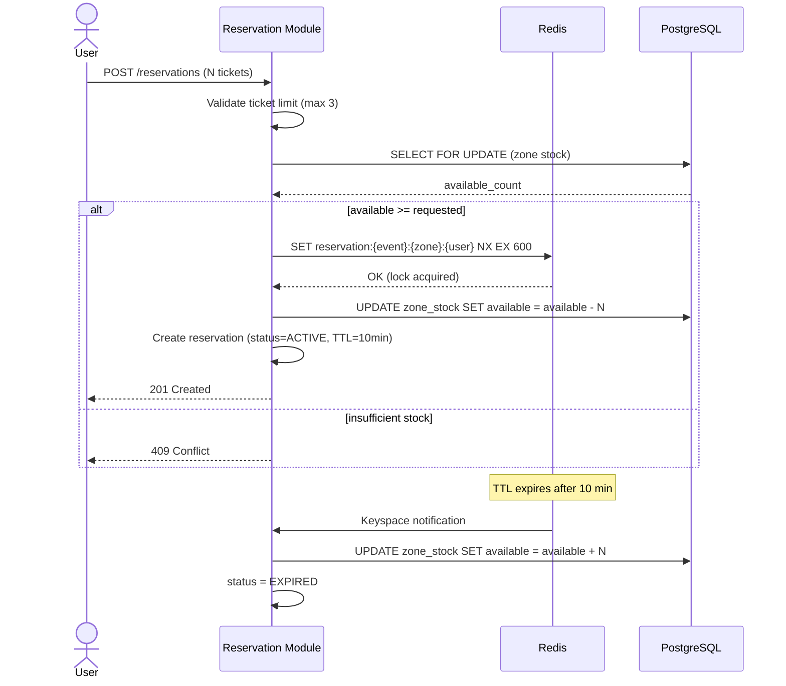
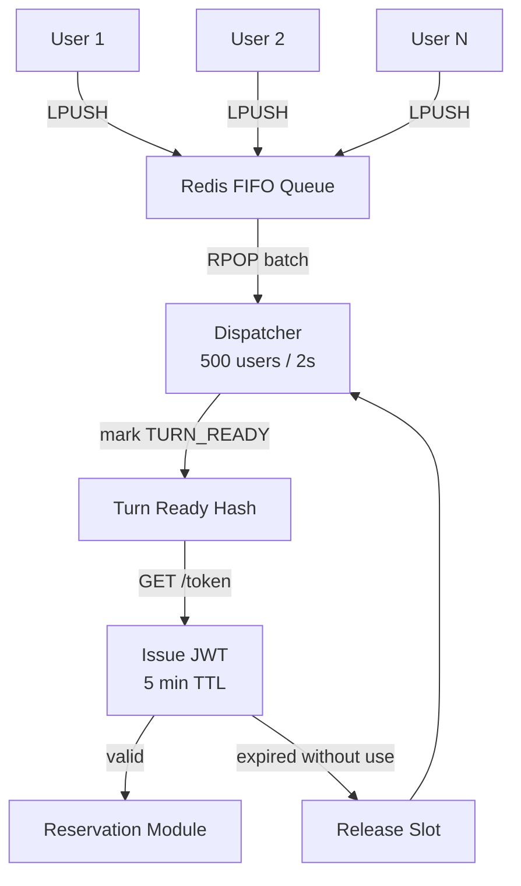
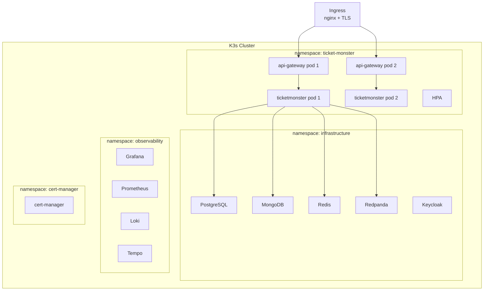

# Ticket Monster — Sistema de Reservaciones de Alta Concurrencia

Sistema en línea de venta de tickets para eventos de gran escala. Soporta 50M usuarios diarios activos (DAU) y 5M usuarios concurrentes en aperturas de venta masivas. Garantía de **cero overbooking**.

## Arquitectura

Monolito modular event-driven con Spring Modulith. Cada módulo mapea a un bounded context de DDD con comunicación híbrida (síncrona + asíncrona).



## DDD Context Map



## Flujo de Compra



## Anti-Overbooking



## Fila Virtual



## Despliegue



## CAP Theorem Analysis

| Componente | CAP | Razón |
|---|---|---|
| Reservation Module | **CP** | No se permite overbooking. Se sacrifica disponibilidad para garantizar consistencia. |
| Payment Module | **CP** | Transacciones financieras requieren consistencia absoluta. |
| Catalog Module | **AP** | Read-heavy. Se tolera eventual consistency para mantener alta disponibilidad. |
| Virtual Queue | **AP** | Redis es eventualmente consistente. Perder la cola es un trade-off aceptable. |
| Redpanda | **CP** | Raft consensus garantiza consistencia en el streaming de eventos. |

## Evolución: Monolito → Microservicios

1. **Fase actual**: Monolito modular con Spring Modulith. Boundaries claros, comunicación desacoplada vía Redpanda.
2. **Spring Modulith** verifica automáticamente que no hay acoplamiento indebido entre módulos.
3. **Criterio de extracción**: Se extrae un módulo cuando requiere escalado independiente, diferentes ciclos de release, o tecnología específica.
4. **Extracción gradual**: La comunicación asíncrona vía Redpanda ya está establecida, por lo que extraer un módulo no rompe la aplicación.

## Tech Stack

| Componente | Tecnología |
|---|---|
| Backend | Spring Boot 4.0.6 + Spring Modulith 2.0.6 |
| Event Streaming | Redpanda |
| Cache / Locks / Queue | Redis |
| Orquestador | K3s |
| DB relacional | PostgreSQL |
| DB documental | MongoDB |
| API Gateway | Spring Cloud Gateway 2025.1.1 |
| Auth | Keycloak (OAuth2 + OIDC) |
| API Catalog | Spring for GraphQL |
| Resiliencia | Resilience4j 2.3.0 |
| Observabilidad | Loki + Prometheus + Tempo + Grafana |
| Load Testing | k6 |
| Despliegue | Helm charts + Docker |

## Quick Start (Local Development)

### Prerequisites
- Docker & Docker Compose
- JDK 21
- Gradle 9.5+

### 1. Start infrastructure
```bash
cp .env.example .env
docker compose --profile dev up -d
```

This starts PostgreSQL, MongoDB, Redis, Redpanda, Keycloak, Prometheus, Loki, Tempo, and Grafana.

### 2. Run the application
```bash
cd backend/ticketmonster
./gradlew bootRun
```

The app connects to infrastructure on:
- PostgreSQL → `localhost:5432`
- MongoDB → `localhost:27017`
- Redis → `localhost:6379`
- Redpanda (Kafka) → `localhost:19092`
- Keycloak → `localhost:8180`

> **Note:** Redpanda exposes Kafka on port `19092` externally (not the default `9092`).
> Keycloak is on port `8180` (not `8080`) to avoid conflict with the API Gateway.

### 3. Get an access token
```bash
TOKEN=$(curl -s -X POST http://localhost:8180/realms/ticket-monster/protocol/openid-connect/token \
  -H "Content-Type: application/x-www-form-urlencoded" \
  -d "client_id=ticket-monster-app" \
  -d "username=user" -d "password=user" \
  -d "grant_type=password" | jq -r '.access_token')
```

### 4. Try the API

```bash
# Query events via GraphQL
curl -s http://localhost:8082/graphql \
  -H "Authorization: Bearer $TOKEN" \
  -H "Content-Type: application/json" \
  -d '{"query": "{ events(page: 0, size: 10) { content { id name } } }"}'

# Join virtual queue
curl -s -X POST http://localhost:8082/api/v1/queue/EVENT_ID/join \
  -H "Authorization: Bearer $TOKEN"
```

### Full stack (Docker only)
```bash
docker compose --profile app up -d
```

This also builds and runs `ticketmonster` and `api-gateway` inside Docker.

### Reset data
```bash
docker compose down -v
```

---

### Database consoles & queries

#### PostgreSQL (Reservations, Payments)

```bash
# Interactive shell
docker exec -it ticket-monster-postgres-1 psql -U ticketmonster -d ticketmonster

# Quick queries
docker exec -it ticket-monster-postgres-1 psql -U ticketmonster -d ticketmonster -c "SELECT * FROM zone_stock;"
docker exec -it ticket-monster-postgres-1 psql -U ticketmonster -d ticketmonster -c "SELECT * FROM reservations;"
docker exec -it ticket-monster-postgres-1 psql -U ticketmonster -d ticketmonster -c "SELECT * FROM reservation_items;"
docker exec -it ticket-monster-postgres-1 psql -U ticketmonster -d ticketmonster -c "SELECT * FROM payments;"
docker exec -it ticket-monster-postgres-1 psql -U ticketmonster -d ticketmonster -c "SELECT * FROM payment_audit;"
```

#### MongoDB (Catalog: events, venues, artists)

```bash
# Interactive shell
docker exec -it ticket-monster-mongodb-1 mongosh admin -u ticketmonster -p ticketmonster

# Quick queries
docker exec -it ticket-monster-mongodb-1 mongosh --quiet admin -u ticketmonster -p ticketmonster \
  --eval 'db.getSiblingDB("ticketmonster_catalog").events.find().pretty()'
docker exec -it ticket-monster-mongodb-1 mongosh --quiet admin -u ticketmonster -p ticketmonster \
  --eval 'db.getSiblingDB("ticketmonster_catalog").venues.find().pretty()'
docker exec -it ticket-monster-mongodb-1 mongosh --quiet admin -u ticketmonster -p ticketmonster \
  --eval 'db.getSiblingDB("ticketmonster_catalog").artists.find().pretty()'
```

#### Redis (Queue, Locks)

```bash
# Interactive shell
docker exec -it ticket-monster-redis-1 redis-cli

# Quick queries
docker exec -it ticket-monster-redis-1 redis-cli KEYS '*'
docker exec -it ticket-monster-redis-1 redis-cli LLEN queue:EVENT_ID
docker exec -it ticket-monster-redis-1 redis-cli LRANGE queue:EVENT_ID 0 -1
```

#### Redpanda Console (Kafka topics)

Open http://localhost:8081 in a browser to browse topics, messages, and consumer groups.

```bash
# List topics via CLI
docker exec -it ticket-monster-redpanda-1 rpk topic list

# Consume messages from a topic
docker exec -it ticket-monster-redpanda-1 rpk topic consume payment-confirmed -n 5
```

#### Keycloak Admin Console

http://localhost:8180/admin (admin / admin)

---

### Test users

| User | Password | Roles |
|------|----------|-------|
| `admin` | `admin` | ADMIN, USER |
| `user` | `user` | USER |

### Endpoints

| Service | URL |
|---------|-----|
| API Gateway | http://localhost:8080 |
| Monolith (app) | http://localhost:8082 |
| GraphQL endpoint | http://localhost:8082/graphql |
| Keycloak | http://localhost:8180 |
| Redpanda Console | http://localhost:8081 |
| Grafana | http://localhost:3000 |
| Prometheus | http://localhost:9090 |

## Observabilidad

El stack de observabilidad usa **LGTM** (Loki, Grafana, Tempo, Metrics/Prometheus).

### Acceso

| Servicio | URL | Credenciales |
|----------|-----|-------------|
| Grafana | http://localhost:3000 | admin / admin |
| Prometheus | http://localhost:9090 | — |
| Tempo | http://localhost:3200 | — |
| Loki | http://localhost:3100 | — |

### Dashboards preconfigurados

- **Ticket Monster - System Overview** (`uid: ticket-monster-overview`): request rate, error rate, latencias (p50/p95/p99), reservas activas, JVM memory, HikariCP connections
- **Ticket Monster - Reservation Module** (`uid: ticket-monster-reservation`): creación/expiración de reservas, latencia PostgreSQL, latencia Redis

### Métricas (Prometheus)

Los servicios exponen métricas via Spring Boot Actuator en `/actuator/prometheus`. Prometheus (`docker/prometheus/prometheus.yml`) escrapea automáticamente:

| Job | Target | Métricas path |
|-----|--------|--------------|
| `ticketmonster` | `172.17.0.1:8082` | `/actuator/prometheus` |
| `api-gateway` | `172.17.0.1:8080` | `/actuator/prometheus` |

> **Nota**: Cuando los servicios corren desde IntelliJ (no Docker), Prometheus los escrapea via `172.17.0.1` (gateway del bridge Docker). Si Prometheus no ve los targets, reinicia el contenedor: `docker compose restart prometheus`.

### Logs (Loki)

Cuando los servicios corren desde **IntelliJ**, los logs del monolith se envían a Loki mediante un appender Logback (`com.github.loki4j.logback.Loki4jAppender`) configurado en `logback-spring.xml`. El appender envía logs estructurados en JSON a `http://localhost:3100/loki/api/v1/push`.

En Grafana → Explore → selecciona **Loki**, query:
```
{app="ticketmonster"}
```

Los logs incluyen `trace_id` y `span_id` en el MDC cuando el agente OpenTelemetry está activo, permitiendo correlación log→traza en Tempo.

### Trazas (Tempo)

El agente **OpenTelemetry Java** instrumenta automáticamente el código y envía trazas distribuidas a Tempo via OTLP (`http://localhost:4318`).

**Configuración en IntelliJ** (VM options del run config):
```
-javaagent:/ruta/al/proyecto/backend/otel/opentelemetry-javaagent.jar
-Dotel.service.name=ticketmonster
-Dotel.exporter.otlp.endpoint=http://localhost:4318
-Dotel.metrics.exporter=none
```

El proyecto incluye run configurations preconfiguradas en `.idea/runConfigurations/` con estas opciones.

**Descargar el agente** (no está incluido en el repo):
```bash
./scripts/download-otel-agent.sh
```

En Grafana → Explore → selecciona **Tempo** para buscar trazas, o usa el panel "Reservation Events" en el dashboard System Overview para navegar desde una métrica a la traza correspondiente.

### Troubleshooting

| Síntoma | Causa | Solución |
|---------|-------|----------|
| Dashboards vacíos | Datasource Prometheus sin `uid: prometheus` fijo | Añadir `uid: prometheus` en `docker/grafana/provisioning/datasources/datasources.yml` y reiniciar Grafana |
| No hay métricas | Prometheus escrapea nombres Docker (`ticketmonster:8082`) pero los servicios corren en host | Cambiar targets a `172.17.0.1:8082` en `docker/prometheus/prometheus.yml` |
| No hay logs en Loki | Los servicios corren desde IntelliJ sin appender Loki | Añadir `com.github.loki4j:loki-logback-appender` y configurar `logback-spring.xml` |
| No hay trazas en Tempo | OTEL agent no cargado, o Tempo no corre | Verificar VM options en IntelliJ run config; `docker compose up -d tempo` |
| Gateway devuelve 405 bajo carga | Rutas definidas en YAML (`spring.cloud.gateway.server.webflux.routes`) no resuelven correctamente con alta concurrencia | Usar `RouteLocator` programático (ver `RouteConfig.java`) en lugar de YAML |
| Gateway no encuentra rutas (404) | Prefijo de propiedades incorrecto | El prefijo correcto es `spring.cloud.gateway.server.webflux` (confirmado en bytecode de `GatewayProperties` para `spring-cloud-gateway-server-webflux:5.0.1`) |

---

## Load Testing

Los tests de carga usan [k6](https://k6.io/) y están en `deploy/tests/k6/`.

### Tests disponibles

| Script | VUs | Duración | Descripción | Thresholds |
|--------|-----|----------|-------------|------------|
| `catalog-read.js` | 100 | 30s | Consultas GraphQL de eventos y disponibilidad | p95 < 2s, error < 1% |
| `queue-load.js` | 10000 | 30s | Stress test de cola virtual | p95 < 2s, error < 1% |
| `e2e-purchase.js` | 500 | 120s | Flujo completo de compra | p95 < 5s, error < 5% |
| `reservation-contention.js` | 1000 iter. | — | Creación concurrente de reservas | p95 < 5s |

### Ejecutar tests

```bash
# Catalog read (100 VUs, 30s) — ideal para probar el gateway + monolith
docker run --rm --network host \
  -v $(pwd)/deploy/tests/k6:/scripts \
  grafana/k6 run /scripts/catalog-read.js

# Queue load (estrés de cola virtual)
docker run --rm --network host \
  -v $(pwd)/deploy/tests/k6:/scripts \
  grafana/k6 run /scripts/queue-load.js

# E2E purchase (requiere EVENT_ID y AUTH_TOKEN)
docker run --rm --network host \
  -v $(pwd)/deploy/tests/k6:/scripts \
  -e BASE_URL=http://localhost:8080 \
  -e EVENT_ID=test-event-1 \
  -e AUTH_TOKEN="<token>" \
  grafana/k6 run /scripts/e2e-purchase.js
```

### Ver resultados en Grafana

Durante y después del test:

1. **Dashboard System Overview**: request rate, latencias, errores, JVM, conexiones HikariCP
2. **Explore → Prometheus**: queries ad-hoc como `rate(http_server_requests_seconds_count[1m])`
3. **Explore → Loki**: logs del monolith: `{app="ticketmonster"}`
4. **Explore → Tempo**: trazas generadas durante el test

> **Nota**: Los dashboards usan `[1m]` en las queries de rate. Si ejecutas tests muy cortos (<1 min), puede que no haya datos suficientes para calcular el rate. Usa `--duration 1m30s` para tests mínimos.

### Gateway vs Monolith directo

Los tests de carga pueden apuntar al **API Gateway** (`localhost:8080`) o directamente al **monolith** (`localhost:8082`).

Resultados de pruebas locales de resistencia:

| VUs | Gateway (error) | Monolith directo (error) | Monolith p95 |
|-----|----------------|------------------------|-------------|
| 100 | **0%** | **0%** | 10ms |
| 500 | **98%** (405) | **0%** | 264ms |
| 1000 | **99%** | **0%** | 705ms |
| 2000 | **99%** | **0%** | 2s |
| 5000 | **99%** | **0%** | 6.5s |

El monolith aguanta **5000 VUs sin un solo fallo** localmente. El gateway es el cuello de botella: el `RoutePredicateHandlerMapping` de Spring Cloud Gateway no escala bajo alta concurrencia en entornos locales (el problema persiste incluso con rutas programáticas).

El script `catalog-read.js` usa `BASE_URL=http://localhost:8080` por defecto. Para pruebas de rendimiento locales, usa directo al monolith:
```bash
docker run --rm --network host \
  -v $(pwd)/deploy/tests/k6:/scripts \
  -e BASE_URL=http://localhost:8082 \
  grafana/k6 run /scripts/catalog-read.js
```

#### ¿Merece la pena el Gateway?

En una arquitectura de **monolito**, el API Gateway aporta menos valor porque no hay múltiples servicios que rutear. El monolith ya incluye:

- **Spring Security** para autenticación JWT
- **Resilience4j** para circuit breakers y rate limiting
- **Actuator** para métricas y health checks

El gateway existe para preparar la **evolución a microservicios** (extracción gradual de módulos del Modulith). En producción (K3s) con varios pods y balanceo de carga, el gateway escala correctamente.

Para desarrollo local, lo recomendado es:
- **Tests de carga** → directo al monolith (sin gateway de por medio)
- **Tests funcionales** → vía gateway (para validar auth, rate limiting, etc.)

---

## Frontend CLI

Emulador interactivo por terminal que consume la API de Ticket Monster. Permite hacer los recorridos completos de administración y compra sin escribir curl manualmente.

### Prerequisitos

- `curl` (obligatorio)
- `jq` (opcional, mejora el formato de salida JSON)

### Uso

```bash
./frontend/frontend.sh <usuario> <password> [-v]
```

- `-v`: Muestra el comando curl equivalente antes de ejecutar cada llamada (modo verbose).

El script detecta automáticamente si eres administrador o usuario regular y muestra el menú correspondiente.

### Usuarios de prueba

| Usuario | Password | Roles | Menú |
|---------|----------|-------|------|
| `admin` | `admin` | ADMIN, USER | Crear artista/venue/evento, publicar, listar, disponibilidad |
| `user` | `user` | USER | Listar eventos, disponibilidad, comprar entradas, pagar |

### URLs configurables

Edita las variables al inicio de `frontend/frontend.sh`:

```bash
KEYCLOAK_URL="http://localhost:8180"
GATEWAY_URL="http://localhost:8080"
MONOLITH_URL="http://localhost:8082"
```

El script usa `GATEWAY_URL` primero; si no responde, prueba `MONOLITH_URL` automáticamente.

### Health check automático

Al ejecutar, el script verifica que Keycloak y el backend responden. Primero intenta con API Gateway (`:8080`); si no está disponible, prueba con el monolith directo (`:8082`). Si ninguno responde, muestra cómo levantar el entorno.

### Ejemplo: Sesión administrador

```bash
./frontend/frontend.sh admin admin

# 1. Crear Artista  →  Foo Fighters, Rock
# 2. Crear Venue    →  Wembley, 90000
# 3. Crear Evento   →  Foo Fighters Live, CONCERT, venueId anterior, zonas: Pista 40000x80 + Grada 30000x120
# 4. Publicar Evento → eventId anterior
# 5. Listar Eventos → muestra el evento creado
```

### Ejemplo: Sesión usuario

```bash
./frontend/frontend.sh user user

# 1. Listar Eventos → elegir un evento
# 3. Comprar entradas → eventId, se une a cola, espera turno, zonaId, cantidad
# 4. Pagar reserva → reservationId, monto
```

## Limitaciones / Próximos Pasos

- [ ] **Asignación de butacas numeradas**: Actualmente el sistema solo lleva un contador de capacidad por zona (ej: "Pista: 40000 disponibles"). Al reservar N entradas, descuenta del contador pero no asigna números de butaca específicos. Pendiente implementar numeración secuencial: `reserved_seats = [capacity - available + 1 .. capacity - available + quantity]`. Afecta al modelo `ReservationItem`, la respuesta de la API y las cancelaciones (reutilización de números).
- [ ] **Manejo amigable de excepciones**: Actualmente las excepciones no controladas (ej: `LazyInitializationException`, `IllegalArgumentException`, formato inválido) devuelven 500 con un JSON genérico. Implementar un `@ControllerAdvice` global que:
  - Capture excepciones comunes y devuelva respuestas con mensajes legibles para el usuario (en español o inglés según el locale)
  - Registre el error completo en los logs estructurados para observabilidad (Loki + Tempo traceId)
  - Exponga el traceId en la respuesta al cliente para correlación
- [ ] **Dashboard Spring Boot 3.x Statistics**: El panel Database Connection Pool HikariCP no muestra datos porque el dashboard usa una variable `$Namespace` que no existe en nuestras métricas. Solución: eliminar la variable y limpiar los filtros `namespace` del JSON del dashboard (`docker/grafana/dashboards/spring-boot-statistics.json`).

## Provisioning (Remote K3s)

```bash
# 1. Provision K3s cluster
./scripts/provision-k3s.sh -u user@host -d domain.com

# 2. Deploy infrastructure
./scripts/provision-infra.sh -u user@host -d domain.com

# 3. Deploy application + run tests
./scripts/provision-services.sh -u user@host -d domain.com
```

