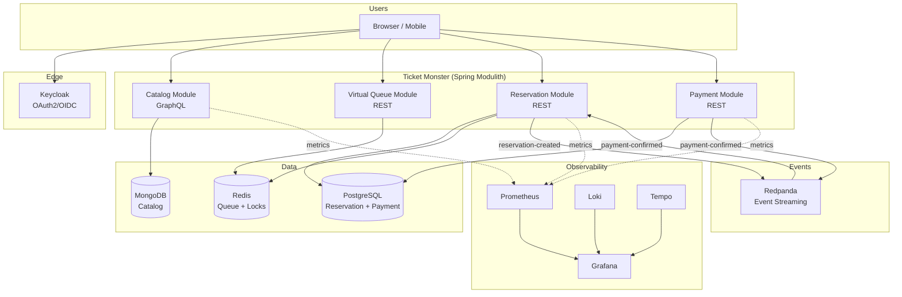
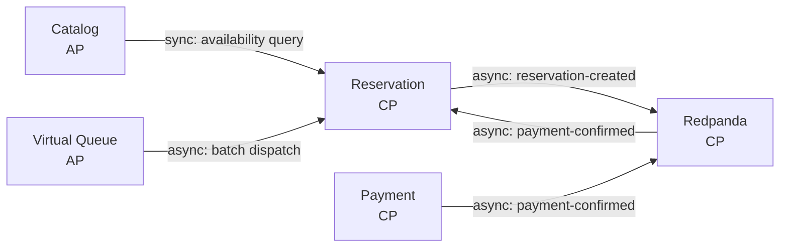
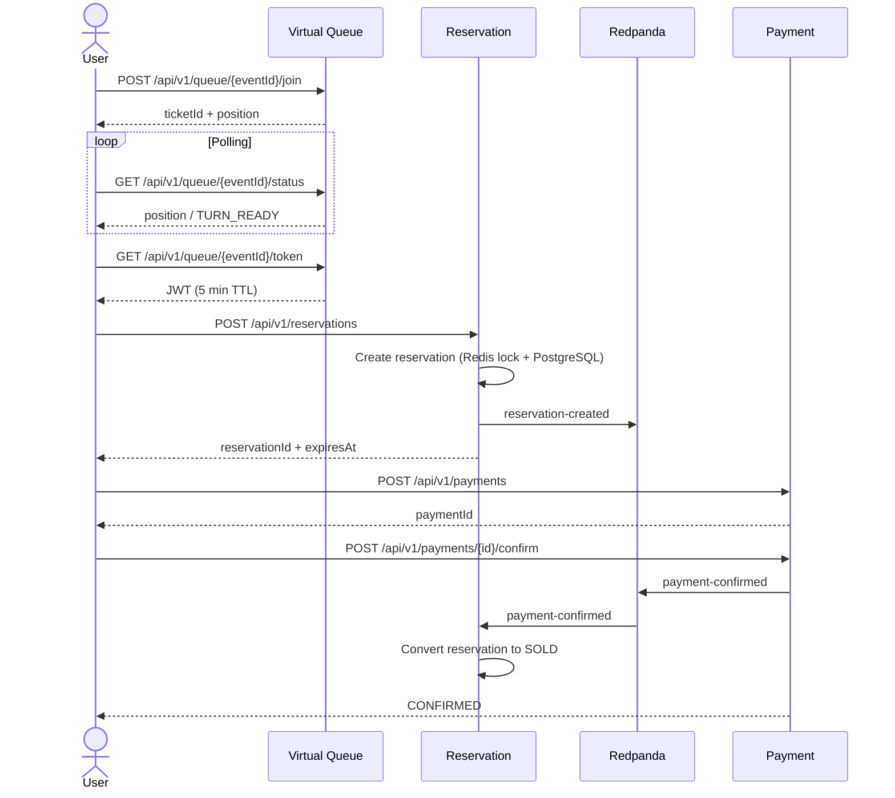
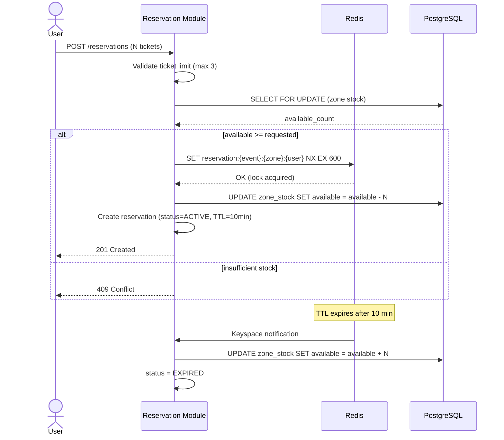
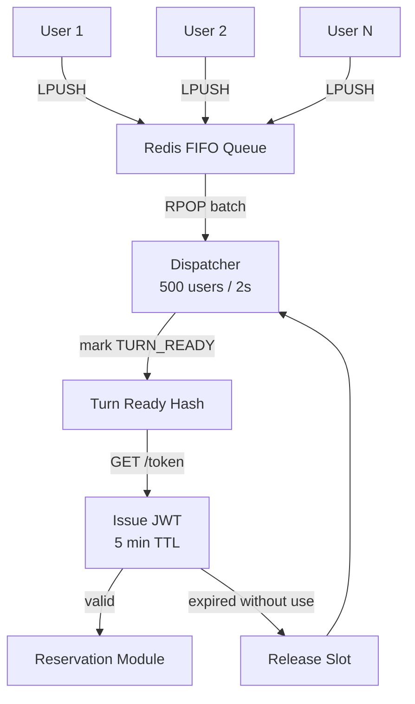
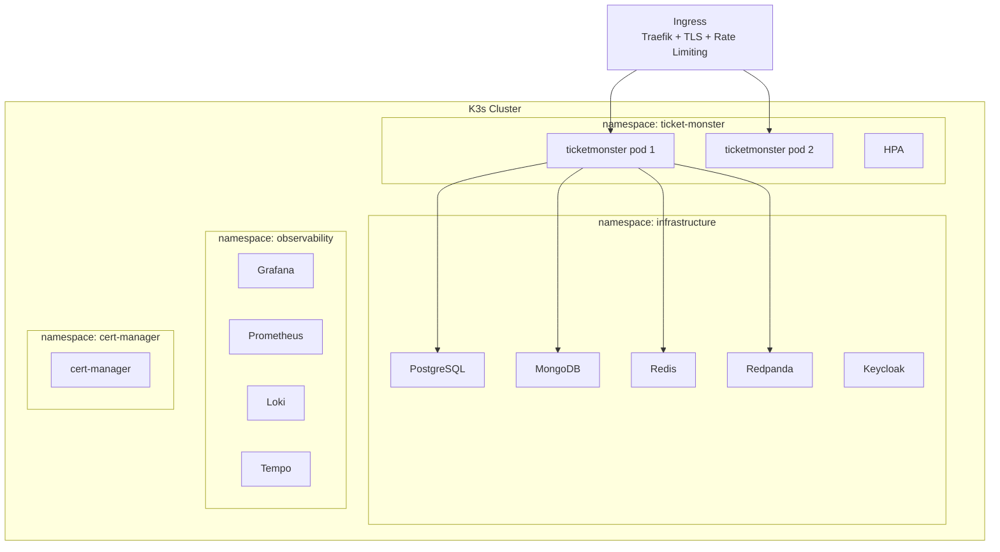

# Ticket Monster — Sistema de Reservaciones de Alta Concurrencia

Sistema en línea de venta de tickets para eventos de gran escala. Soporta 50M usuarios diarios activos (DAU) y 5M usuarios concurrentes en aperturas de venta masivas. Garantía de **cero overbooking**.

## Arquitectura

Monolito modular event-driven con Spring Modulith. Cada módulo mapea a un bounded context de DDD con comunicación híbrida (síncrona + asíncrona).

> **Evolution:** The API Gateway (`Spring Cloud Gateway`) was removed after k6 load tests revealed significant connection pooling overhead and latency under high concurrency. The monolith now handles all traffic directly. In production, **Traefik Ingress** (K3s native) provides TLS termination, rate limiting, and resilience — eliminating the extra network hop and connection churn while still applying policies at the edge.
>
> **Rate limiting strategy:** Read queries (`/graphql`) are **not rate-limited** — they're public and cheap. Rate limiting via Traefik applies only to write endpoints (`/api/v1/reservations`, `/api/v1/payments`, etc.). Two separate Ingress resources enforce this: `ticketmonster-graphql` (catch-all, no rate limit) and `ticketmonster` (`/api/*`, `/actuator/*`, with rate limit + secure headers).



## DDD Context Map



## Flujo de Compra



## Anti-Overbooking



## Fila Virtual



## Despliegue



## CAP Theorem Analysis

| Componente | CAP | Razón |
|---|---|---|
| Reservation Module | **CP** | No se permite overbooking. Se sacrifica disponibilidad para garantizar consistencia. |
| Payment Module | **CP** | Transacciones financieras requieren consistencia absoluta. |
| Catalog Module | **AP** | Read-heavy. Se tolera eventual consistency para mantener alta disponibilidad. |
| Virtual Queue | **AP** | Redis es eventualmente consistente. Perder la cola es un trade-off aceptable. |
| Redpanda | **CP** | Raft consensus garantiza consistencia en el streaming de eventos. |

## Evolución: Monolito → Microservicios

1. **Fase actual**: Monolito modular con Spring Modulith. Boundaries claros, comunicación desacoplada vía Redpanda.
2. **Spring Modulith** verifica automáticamente que no hay acoplamiento indebido entre módulos.
3. **Criterio de extracción**: Se extrae un módulo cuando requiere escalado independiente, diferentes ciclos de release, o tecnología específica.
4. **Extracción gradual**: La comunicación asíncrona vía Redpanda ya está establecida, por lo que extraer un módulo no rompe la aplicación.

## Tech Stack

| Componente | Tecnología |
|---|---|
| Backend | Spring Boot 4.0.6 + Spring Modulith 2.0.6 |
| Event Streaming | Redpanda |
| Cache / Locks / Queue | Redis |
| Orquestador | K3s |
| DB relacional | PostgreSQL |
| DB documental | MongoDB |
| Edge / Ingress | K3s Traefik (TLS termination, rate limiting, secure headers) |
| Auth | Keycloak (OAuth2 + OIDC) |
| API Catalog | Spring for GraphQL |
| Resiliencia | Resilience4j 2.3.0 |
| Observabilidad | Loki + Prometheus + Tempo + Grafana |
| Load Testing | k6 |
| Despliegue | Helm charts + Docker |

## Quick Start (Local Development)

### Prerequisites
- Docker & Docker Compose
- JDK 21
- Gradle 9.5+

### 1. Start everything (infrastructure + app + observability)
```bash
docker compose --profile app up -d
```

This builds and starts the monolith (`ticketmonster` on `:8082`) plus all infrastructure: PostgreSQL, MongoDB, Redis, Redpanda, Keycloak, Prometheus, Loki, Tempo, and Grafana.

> **Important:** If you only rebuild the app with `docker compose --profile app up -d --build ticketmonster`, the observability stack (Prometheus, Loki, Tempo, Grafana) will **not** start because `ticketmonster` does not depend on them. Start them explicitly:
> ```bash
> docker compose --profile app up -d prometheus loki tempo grafana
> ```

### 2. Run the app natively (outside Docker)
```bash
docker compose --profile infra up -d
cd backend/ticketmonster
./gradlew bootRun
```

Or run from IntelliJ:
```bash
# Only infrastructure in Docker, app runs from IDE
docker compose --profile infra up -d
```
Then run the `TicketmonsterApplication` main class in IntelliJ (default profile reads `application.yml` with `localhost` defaults).

The app connects to infrastructure on:
- PostgreSQL → `localhost:5432`
- MongoDB → `localhost:27017`
- Redis → `localhost:6379`
- Redpanda (Kafka) → `localhost:19092`
- Keycloak → `localhost:8180`

> **Note:** Redpanda exposes Kafka on port `19092` externally (not the default `9092`).
> Keycloak is on port `8180` to avoid conflict with other services.

### 3. Build the Docker image locally
```bash
docker build -t ticket-monster:local \
  -f backend/ticketmonster/Dockerfile \
  backend/ticketmonster
```

Rebuild and restart after code changes:
```bash
docker compose --profile app up -d --build ticketmonster

# Also restart observability if not already running:
docker compose --profile app up -d prometheus loki tempo grafana
```

### 4. Get an access token
```bash
TOKEN=$(curl -s -X POST http://localhost:8180/realms/ticket-monster/protocol/openid-connect/token \
  -H "Content-Type: application/x-www-form-urlencoded" \
  -d "client_id=ticket-monster-app" \
  -d "username=user" -d "password=user" \
  -d "grant_type=password" | jq -r '.access_token')
```

### 5. Try the API

```bash
# Query events via GraphQL
curl -s http://localhost:8082/graphql \
  -H "Authorization: Bearer $TOKEN" \
  -H "Content-Type: application/json" \
  -d '{"query": "{ events(page: 0, size: 10) { content { id name } } }"}'

# Join virtual queue
curl -s -X POST http://localhost:8082/api/v1/queue/EVENT_ID/join \
  -H "Authorization: Bearer $TOKEN"
```

### CLI Emulator
```bash
./frontend/frontend.sh admin admin http://localhost:8082 http://localhost:8180
```

### Reset data
```bash
docker compose down -v
```

---

## Tests

### Unit tests (Gradle)

```bash
# Run all tests
cd backend/ticketmonster
./gradlew test --no-daemon

# Build will fail if tests don't pass (CI + build-and-push.sh)
```

### Load tests (k6)

Install k6 (Debian 13 / Trixie):
```bash
sudo apt-get update && sudo apt-get install -y gnupg
curl -fsSL https://dl.k6.io/key.gpg | sudo gpg --dearmor -o /usr/share/keyrings/k6.gpg
echo "deb [signed-by=/usr/share/keyrings/k6.gpg] https://dl.k6.io/deb stable main" sudo tee /etc/apt/sources.list.d/k6.list
sudo apt-get update && sudo apt-get install -y k6
```

Prerequisites: infra + app + observability running:
```bash
docker compose --profile app up -d prometheus loki tempo grafana
```

k6 can push metrics to Prometheus in real-time via the `experimental-prometheus-rw` output. Results appear on the **k6 Prometheus** dashboard in Grafana.

```bash
# 1. Catalog read (public, no auth needed)
K6_PROMETHEUS_RW_SERVER_URL=http://localhost:9090/api/v1/write \
K6_PROMETHEUS_RW_TREND_STATS=p(95),p(99),min,max \
k6 run -o experimental-prometheus-rw --tag testid=catalog-read \
  deploy/tests/k6/catalog-read.js

# 2. Queue join (requires auth + real event)
TOKEN=$(curl -s -X POST http://localhost:8180/realms/ticket-monster/protocol/openid-connect/token \
  -H "Content-Type: application/x-www-form-urlencoded" \
  -d "client_id=ticket-monster-app" \
  -d "username=admin" -d "password=admin" \
  -d "grant_type=password" | jq -r '.access_token')

EVENT_ID=$(curl -s http://localhost:8082/graphql \
  -H "Content-Type: application/json" \
  -d '{"query":"{ events(page: 0, size: 1) { content { id } } }"}' | jq -r '.data.events.content[0].id')

K6_PROMETHEUS_RW_SERVER_URL=http://localhost:9090/api/v1/write \
K6_PROMETHEUS_RW_TREND_STATS=p(95),p(99),min,max \
k6 run -o experimental-prometheus-rw --tag testid=queue-load \
  --env AUTH_TOKEN="$TOKEN" --env EVENT_ID="$EVENT_ID" \
  deploy/tests/k6/queue-load.js

# 3. Reservation contention (requires event with zone stock)
K6_PROMETHEUS_RW_SERVER_URL=http://localhost:9090/api/v1/write \
K6_PROMETHEUS_RW_TREND_STATS=p(95),p(99),min,max \
k6 run -o experimental-prometheus-rw --tag testid=reservation-contention \
  --env AUTH_TOKEN="$TOKEN" --env EVENT_ID="$EVENT_ID" --env ZONE_ID="<zone-id>" \
  deploy/tests/k6/reservation-contention.js
```

> **Note:** Defaults are `BASE_URL=http://localhost:8082`. Override with `--env BASE_URL=<url>`.
> Reduce VUs for local runs (e.g. `--vus 100 --duration 10s`). The defaults (5k–10k VUs) target CI/production.
> Metrics appear in Grafana → **k6 Prometheus** dashboard at http://localhost:3000

#### Run against production (janrax.es)

> **⚠️ Remote write limitation:** Prometheus remote write endpoint (`/api/v1/write`) is a ClusterIP service not exposed externally. You **cannot** write directly to `https://janrax.es/api/v1/write`. Use a `kubectl port-forward` tunnel instead:

```bash
# Terminal 1 (VPS) — expose Prometheus locally
kubectl port-forward -n observability prometheus-0 9090:9090

# Terminal 2 (local) — k6 pushes to local tunnel
K6_PROMETHEUS_RW_SERVER_URL=http://localhost:9090/api/v1/write \
K6_PROMETHEUS_RW_TREND_STATS=p(95),p(99),min,max \
k6 run -o experimental-prometheus-rw --tag testid=catalog-read \
  --env BASE_URL=https://janrax.es deploy/tests/k6/catalog-read.js
```

Or run k6 directly on the VPS (no tunnel needed, writes to `localhost:9090`):

```bash
scp deploy/tests/k6/catalog-read.js janrax@janrax.es:/tmp/
ssh janrax@janrax.es
k6 run /tmp/catalog-read.js -u 100 -d 30s \
  --env BASE_URL=https://janrax.es \
  -o experimental-prometheus-rw \
  --tag testid=catalog-read
```

> **Tip:** In local Docker Compose, Prometheus is exposed on `localhost:9090` — no tunnel needed. The issue only applies to K3s where Prometheus is a ClusterIP service.

For authenticated tests, get a token from the remote Keycloak and set `AUTH_TOKEN`:
```bash
TOKEN=$(curl -s -X POST https://janrax.es/auth/realms/ticket-monster/protocol/openid-connect/token \
  -H "Content-Type: application/x-www-form-urlencoded" \
  -d "client_id=ticket-monster-app" \
  -d "username=admin" -d "password=admin" \
  -d "grant_type=password" | jq -r '.access_token')

EVENT_ID=$(curl -s https://janrax.es/graphql \
  -H "Content-Type: application/json" \
  -d '{"query":"{ events(page: 0, size: 1) { content { id } } }"}' | jq -r '.data.events.content[0].id')

K6_PROMETHEUS_RW_SERVER_URL=https://janrax.es/api/v1/write \
K6_PROMETHEUS_RW_TREND_STATS=p(95),p(99),min,max \
k6 run -o experimental-prometheus-rw --tag testid=queue-load \
  --env BASE_URL=https://janrax.es --env AUTH_TOKEN="$TOKEN" --env EVENT_ID="$EVENT_ID" \
  deploy/tests/k6/queue-load.js
```

---

### Database consoles & queries

#### PostgreSQL (Reservations, Payments)

```bash
# Interactive shell
docker exec -it ticket-monster-postgres-1 psql -U ticketmonster -d ticketmonster

# Quick queries
docker exec -it ticket-monster-postgres-1 psql -U ticketmonster -d ticketmonster -c "SELECT * FROM zone_stock;"
docker exec -it ticket-monster-postgres-1 psql -U ticketmonster -d ticketmonster -c "SELECT * FROM reservations;"
docker exec -it ticket-monster-postgres-1 psql -U ticketmonster -d ticketmonster -c "SELECT * FROM reservation_items;"
docker exec -it ticket-monster-postgres-1 psql -U ticketmonster -d ticketmonster -c "SELECT * FROM payments;"
docker exec -it ticket-monster-postgres-1 psql -U ticketmonster -d ticketmonster -c "SELECT * FROM payment_audit;"
```

#### MongoDB (Catalog: events, venues, artists)

```bash
# Interactive shell
docker exec -it ticket-monster-mongodb-1 mongosh admin -u ticketmonster -p ticketmonster

# Quick queries
docker exec -it ticket-monster-mongodb-1 mongosh --quiet admin -u ticketmonster -p ticketmonster \
  --eval 'db.getSiblingDB("ticketmonster_catalog").events.find().pretty()'
docker exec -it ticket-monster-mongodb-1 mongosh --quiet admin -u ticketmonster -p ticketmonster \
  --eval 'db.getSiblingDB("ticketmonster_catalog").venues.find().pretty()'
docker exec -it ticket-monster-mongodb-1 mongosh --quiet admin -u ticketmonster -p ticketmonster \
  --eval 'db.getSiblingDB("ticketmonster_catalog").artists.find().pretty()'
```

#### Redis (Queue, Locks)

```bash
# Interactive shell
docker exec -it ticket-monster-redis-1 redis-cli

# Quick queries
docker exec -it ticket-monster-redis-1 redis-cli KEYS '*'
docker exec -it ticket-monster-redis-1 redis-cli LLEN queue:EVENT_ID
docker exec -it ticket-monster-redis-1 redis-cli LRANGE queue:EVENT_ID 0 -1
```

#### Redpanda Console (Kafka topics)

Open http://localhost:8081 in a browser to browse topics, messages, and consumer groups.

```bash
# List topics via CLI
docker exec -it ticket-monster-redpanda-1 rpk topic list

# Consume messages from a topic
docker exec -it ticket-monster-redpanda-1 rpk topic consume payment-confirmed -n 5
```

#### Keycloak Admin Console

http://localhost:8180/admin (admin / admin)

---

### Test users

| User | Password | Roles |
|------|----------|-------|
| `admin` | `admin` | ADMIN, USER |
| `user` | `user` | USER |

### Endpoints

| Service | URL |
|---------|-----|
| Monolith (app) | http://localhost:8082 |
| GraphQL endpoint | http://localhost:8082/graphql |
| Keycloak | http://localhost:8180 |
| Redpanda Console | http://localhost:8081 |
| Grafana | http://localhost:3000 |
| Prometheus | http://localhost:9090 |

## Frontend CLI

Emulador interactivo por terminal que consume la API de Ticket Monster. Permite hacer los recorridos completos de administración y compra sin escribir curl manualmente.

### Prerequisitos

- `curl` (obligatorio)
- `jq` (opcional, mejora el formato de salida JSON)

### Uso

```bash
./frontend/frontend.sh <usuario> <password> [monolith_url] [keycloak_url] [-v]
```

- `monolith_url`: URL del monólito (default: `https://janrax.es`)
- `keycloak_url`: URL de Keycloak (default: `https://janrax.es/auth`)
- `-v`: Muestra el comando curl equivalente antes de ejecutar cada llamada.

El script detecta automáticamente si eres administrador o usuario regular y muestra el menú correspondiente.

### Usuarios de prueba

| Usuario | Password | Roles | Menú |
|---------|----------|-------|------|
| `admin` | `admin` | ADMIN, USER | Crear artista/venue/evento, publicar, listar, disponibilidad |
| `user` | `user` | USER | Listar eventos, disponibilidad, comprar entradas, pagar |

### Ejemplos

```bash
# Local
./frontend/frontend.sh admin admin http://localhost:8082 http://localhost:8180

# Remoto (usa defaults)
./frontend/frontend.sh admin admin
```

### Sesión administrador

```bash
./frontend/frontend.sh admin admin http://localhost:8082 http://localhost:8180

# 1. Crear Artista  →  Foo Fighters, Rock
# 2. Crear Venue    →  Wembley, 90000
# 3. Crear Evento   →  Foo Fighters Live, CONCERT, venueId anterior, zonas: Pista 40000x80 + Grada 30000x120
# 4. Publicar Evento → eventId anterior
```

### Sesión usuario

```bash
./frontend/frontend.sh user user http://localhost:8082 http://localhost:8180

# 1. Listar Eventos → elegir un evento
# 3. Comprar entradas → eventId, se une a cola, espera turno, zonaId, cantidad
# 4. Pagar reserva → reservationId, monto
```

## Limitaciones / Próximos Pasos

- [ ] **Asignación de butacas numeradas**: Actualmente el sistema solo lleva un contador de capacidad por zona (ej: "Pista: 40000 disponibles"). Al reservar N entradas, descuenta del contador pero no asigna números de butaca específicos. Pendiente implementar numeración secuencial: `reserved_seats = [capacity - available + 1 .. capacity - available + quantity]`. Afecta al modelo `ReservationItem`, la respuesta de la API y las cancelaciones (reutilización de números).
- [ ] **Manejo amigable de excepciones**: Actualmente las excepciones no controladas (ej: `LazyInitializationException`, `IllegalArgumentException`, formato inválido) devuelven 500 con un JSON genérico. Implementar un `@ControllerAdvice` global que:
  - Capture excepciones comunes y devuelva respuestas con mensajes legibles para el usuario (en español o inglés según el locale)
  - Registre el error completo en los logs estructurados para observabilidad (Loki + Tempo traceId)
  - Exponga el traceId en la respuesta al cliente para correlación

## Performance & Scaling Insights

### Key metrics

| Metric | Meaning | Target |
|--------|---------|--------|
| **p50 (median)** | The 50th percentile — half the requests are faster than this | User-facing perception |
| **p95** | 95% of requests complete under this time — the real user experience | `<200ms` for reads, `<5s` for purchases |
| **p99** | 99th percentile — the long tail | Monitor for outliers |
| **error rate** | Percentage of failed requests | `<1%` |
| **throughput** | Requests per second the system handles | Depends on scale |

> **p95 matters more than average.** The average hides problems: a few very slow requests pull it up only slightly. p95 shows what 95% of your users actually experience.

### Scaling observations (k6 load tests)

Resultados de pruebas de carga local con k6 → Prometheus remote write (GraphQL catalog reads, 1 pod Docker):

| Escenario | VUs | Throughput | p95 | Avg | Errors | Observación |
|-----------|-----|-----------|-----|-----|--------|-------------|
| **Baja** | 100 | 877 req/s | **31ms** | 12ms | 0% | ✅ Responde excelente |
| **Media** | 500 | — | — | — | 0% | Latencia dentro de target |
| **Alta** | 2000 | 2.336 req/s | **1.41s** | 744ms | 0% | ❌ p95 supera 200ms target |
| **Máxima** | 5000 | 2.512 req/s | **3.93s** | 1.81s | 0% | ❌ VUs efectivas se estancan en ~3.068 |
| **Remoto (janrax.es)** | 500 | 677 req/s | **1.55s** | 606ms | 0% | ❌ p95 supera 200ms target |

Comando ejecutado:
```bash
k6 run --vus 500 --duration 30s deploy/tests/k6/catalog-read.js -e BASE_URL=https://janrax.es
```

**Hallazgos clave:**

- **A baja carga (100 VUs) el sistema responde en 31ms p95** — el monolito + BDs aguantan sin esfuerzo.
- **El cuello de botella está en ~2.300 req/s.** De 100→2000 VUs el throughput se multiplicó por 2.7×, pero de 2000→5000 VUs solo subió un 7% adicional (2.336→2.512 req/s). La latencia se disparó: p95 pasó de 31ms → 1.41s → 3.93s.
- **En 5000 VUs el sistema no pudo mantener la carga** — solo ejecutó con ~3.068 VUs efectivos de 5.000. Las VUs restantes quedaron encoladas esperando respuesta del servidor.
- **0% de errores en todos los tests.** El sistema degrada gracefulmente sin romperse — las conexiones se encolan, no se rechazan.
- **El bottleneck es la contención en base de datos** (PostgreSQL + MongoDB compiten por conexiones HikariCP). Coincide con los tests en K3s.

### Próximos pasos para mayor throughput

1. **Connection pooling** — Añadir PgBouncer para multiplexar conexiones a PostgreSQL. Actualmente 1 pod × 20 conexiones Hikari = 20 conexiones concurrentes. PgBouncer en modo transaction puede manejar miles de conexiones cliente sobre pocas conexiones reales a la BD.
2. **Read replicas** — Separar lecturas de catálogo a réplicas de MongoDB / PostgreSQL.
3. **Optimización de queries** — Revisar `pg_stat_statements` para detectar queries lentas e índices faltantes.
4. **HPA tuning** — En K3s, aumentar `minReplicas` y ajustar targets de CPU/memoria.

```bash
# 1. Provision K3s cluster
./deploy/k3s/k3s-provision.sh janrax@janrax.es janrax.es

# 2. Deploy infrastructure + observability
./deploy/k3s/k3s-infrastructure.sh janrax@janrax.es janrax.es

# 3. Deploy the monolith
./deploy/k3s/k3s-publish-app.sh janrax@janrax.es janrax.es latest

# Or all at once:
./deploy/k3s/deploy.sh janrax@janrax.es janrax.es latest
```

Images are built and pushed to GitHub Container Registry via the manual workflow:
`.github/workflows/docker-publish.yml` → `ghcr.io/jrgavilanes/ticket-monster:<version>`.

```

## TODO / Improvements

- **Eliminar hardcoded `janrax.es`** — parametrizar para cualquier dominio:
  - `deploy/k3s/k3s-publish-app.sh` → `--set env.KEYCLOAK_ISSUER_URI`, `--set env.KEYCLOAK_JWK_SET_URI` (se sobreescriben bien, pero `values.yaml` tiene defaults hardcodeados)
  - `deploy/k3s/charts/ticketmonster/values.yaml` → `ingress.host`, `KEYCLOAK_ISSUER_URI`, `KEYCLOAK_JWK_SET_URI`
  - `frontend/frontend.sh` → `DEFAULT_BASE`, `DEFAULT_KEYCLOAK` (ya configurable por argumento, default hardcodeado)```