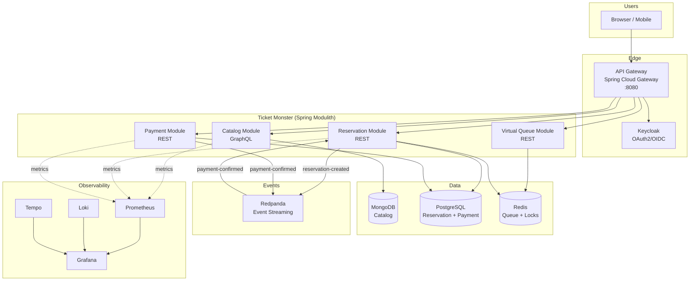
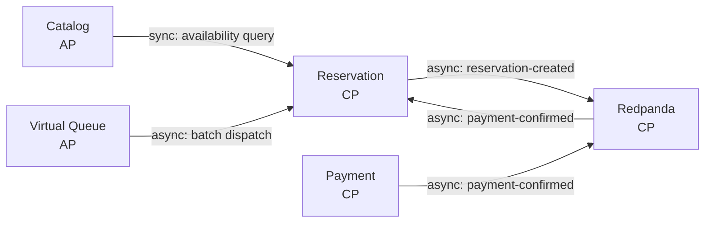
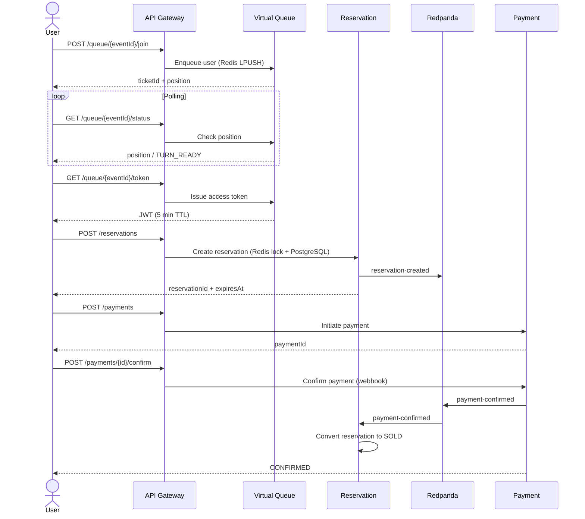
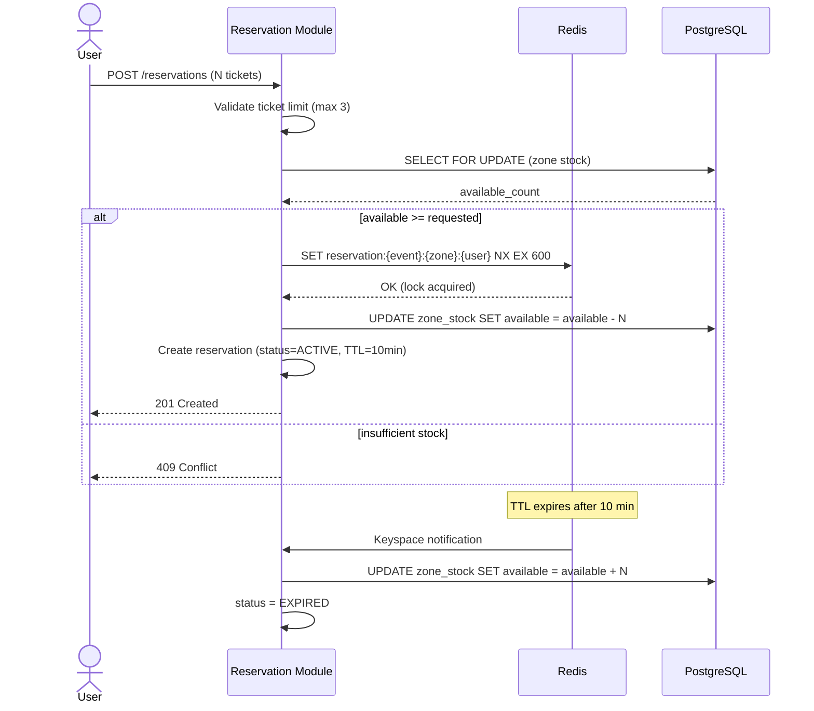
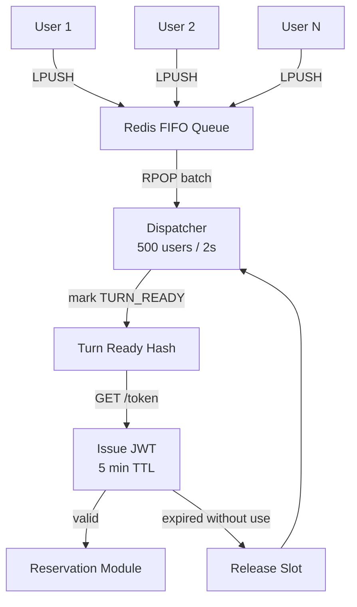
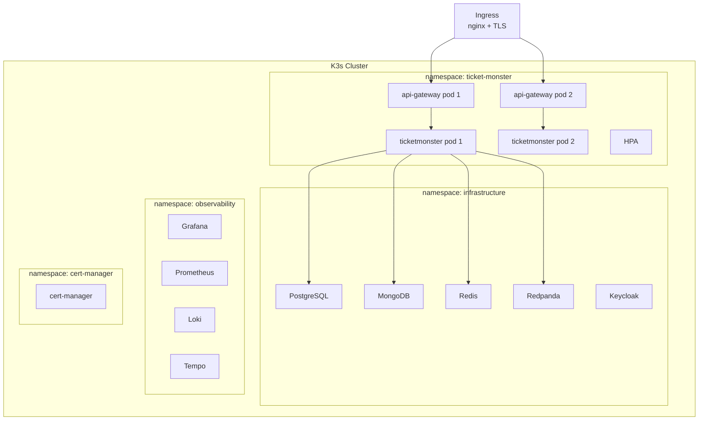

# Ticket Monster — Sistema de Reservaciones de Alta Concurrencia

Sistema en línea de venta de tickets para eventos de gran escala. Soporta 50M usuarios diarios activos (DAU) y 5M usuarios concurrentes en aperturas de venta masivas. Garantía de **cero overbooking**.

## Arquitectura

Monolito modular event-driven con Spring Modulith. Cada módulo mapea a un bounded context de DDD con comunicación híbrida (síncrona + asíncrona).



## DDD Context Map



## Flujo de Compra



## Anti-Overbooking



## Fila Virtual



## Despliegue



## CAP Theorem Analysis

| Componente | CAP | Razón |
|---|---|---|
| Reservation Module | **CP** | No se permite overbooking. Se sacrifica disponibilidad para garantizar consistencia. |
| Payment Module | **CP** | Transacciones financieras requieren consistencia absoluta. |
| Catalog Module | **AP** | Read-heavy. Se tolera eventual consistency para mantener alta disponibilidad. |
| Virtual Queue | **AP** | Redis es eventualmente consistente. Perder la cola es un trade-off aceptable. |
| Redpanda | **CP** | Raft consensus garantiza consistencia en el streaming de eventos. |

## Evolución: Monolito → Microservicios

1. **Fase actual**: Monolito modular con Spring Modulith. Boundaries claros, comunicación desacoplada vía Redpanda.
2. **Spring Modulith** verifica automáticamente que no hay acoplamiento indebido entre módulos.
3. **Criterio de extracción**: Se extrae un módulo cuando requiere escalado independiente, diferentes ciclos de release, o tecnología específica.
4. **Extracción gradual**: La comunicación asíncrona vía Redpanda ya está establecida, por lo que extraer un módulo no rompe la aplicación.

## Tech Stack

| Componente | Tecnología |
|---|---|
| Backend | Spring Boot 4.0.6 + Spring Modulith 2.0.6 |
| Event Streaming | Redpanda |
| Cache / Locks / Queue | Redis |
| Orquestador | K3s |
| DB relacional | PostgreSQL |
| DB documental | MongoDB |
| API Gateway | Spring Cloud Gateway 2025.1.1 |
| Auth | Keycloak (OAuth2 + OIDC) |
| API Catalog | Spring for GraphQL |
| Resiliencia | Resilience4j 2.3.0 |
| Observabilidad | Loki + Prometheus + Tempo + Grafana |
| Load Testing | k6 |
| Despliegue | Helm charts + Docker |

## Quick Start (Local Development)

### Prerequisites
- Docker & Docker Compose
- JDK 21
- Gradle 9.5+

### 1. Start infrastructure
```bash
cp .env.example .env
docker compose --profile infra up -d
```

### 2. Run from IDE
Start `TicketmonsterApplication` and `ApiGatewayApplication` from your IDE. They will connect to the Docker Compose infrastructure.

### 3. Full stack
```bash
docker compose --profile app up -d
```

### 4. Reset data
```bash
docker compose down -v
```

### Test users (Keycloak)
| User | Password | Role |
|---|---|---|
| admin | admin | ADMIN |
| user | user | USER |

### Endpoints
| Service | URL |
|---|---|
| API Gateway | http://localhost:8080 |
| Monolith | http://localhost:8082 |
| Keycloak | http://localhost:8180 |
| Redpanda Console | http://localhost:8081 |
| Grafana | http://localhost:3000 |

## Provisioning (Remote K3s)

```bash
# 1. Provision K3s cluster
./scripts/provision-k3s.sh -u user@host -d domain.com

# 2. Deploy infrastructure
./scripts/provision-infra.sh -u user@host -d domain.com

# 3. Deploy application + run tests
./scripts/provision-services.sh -u user@host -d domain.com
```
