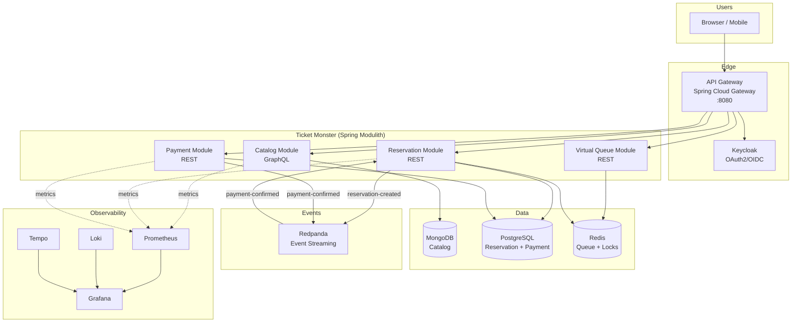
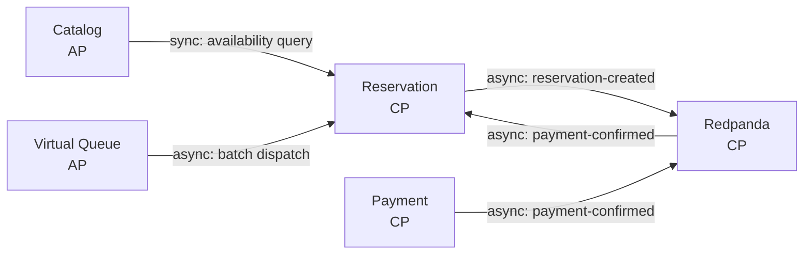
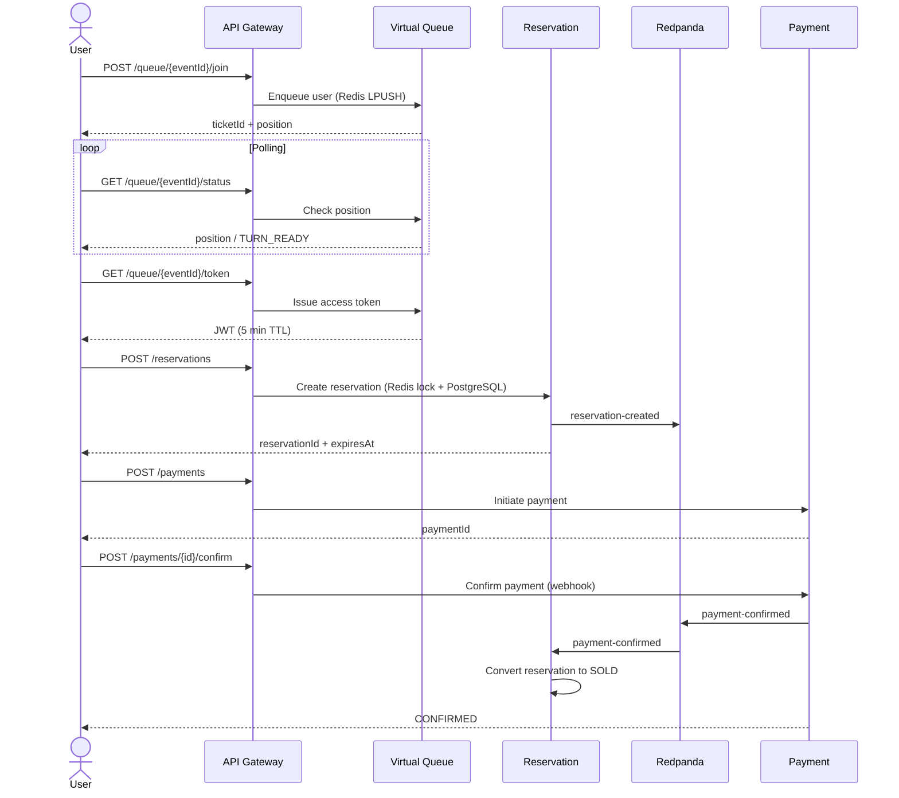
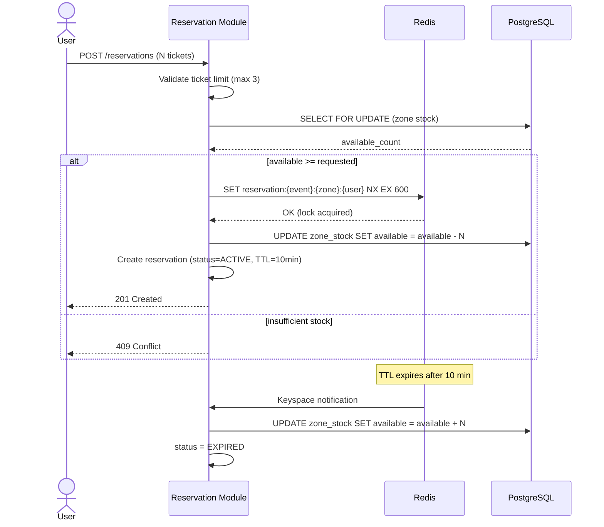
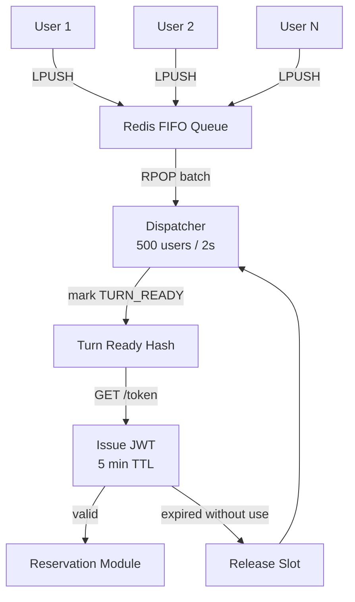
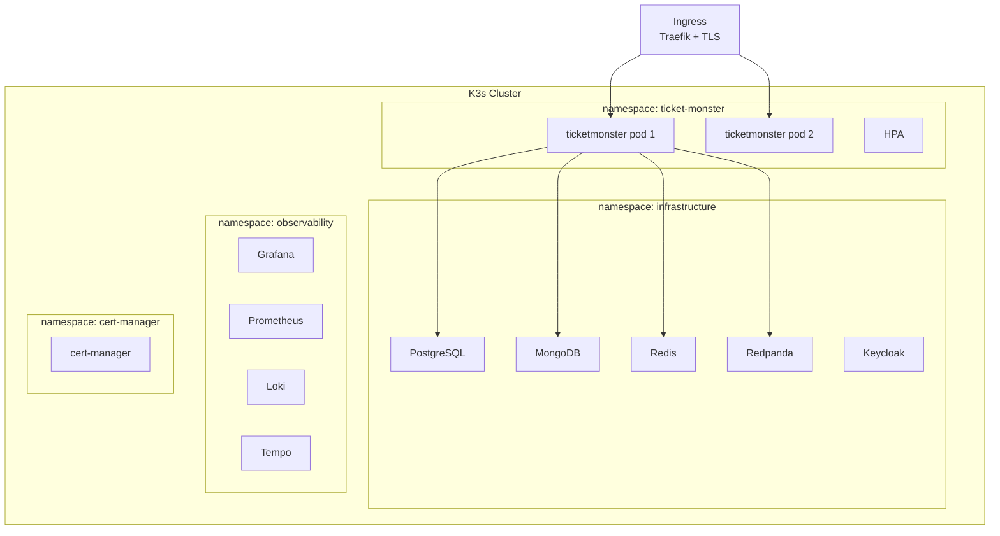

# Ticket Monster — Sistema de Reservaciones de Alta Concurrencia

Sistema en línea de venta de tickets para eventos de gran escala. Soporta 50M usuarios diarios activos (DAU) y 5M usuarios concurrentes en aperturas de venta masivas. Garantía de **cero overbooking**.

## Arquitectura

Monolito modular event-driven con Spring Modulith. Cada módulo mapea a un bounded context de DDD con comunicación híbrida (síncrona + asíncrona).



## DDD Context Map



## Flujo de Compra



## Anti-Overbooking



## Fila Virtual



## Despliegue



## CAP Theorem Analysis

| Componente | CAP | Razón |
|---|---|---|
| Reservation Module | **CP** | No se permite overbooking. Se sacrifica disponibilidad para garantizar consistencia. |
| Payment Module | **CP** | Transacciones financieras requieren consistencia absoluta. |
| Catalog Module | **AP** | Read-heavy. Se tolera eventual consistency para mantener alta disponibilidad. |
| Virtual Queue | **AP** | Redis es eventualmente consistente. Perder la cola es un trade-off aceptable. |
| Redpanda | **CP** | Raft consensus garantiza consistencia en el streaming de eventos. |

## Evolución: Monolito → Microservicios

1. **Fase actual**: Monolito modular con Spring Modulith. Boundaries claros, comunicación desacoplada vía Redpanda.
2. **Spring Modulith** verifica automáticamente que no hay acoplamiento indebido entre módulos.
3. **Criterio de extracción**: Se extrae un módulo cuando requiere escalado independiente, diferentes ciclos de release, o tecnología específica.
4. **Extracción gradual**: La comunicación asíncrona vía Redpanda ya está establecida, por lo que extraer un módulo no rompe la aplicación.

## Tech Stack

| Componente | Tecnología |
|---|---|
| Backend | Spring Boot 4.0.6 + Spring Modulith 2.0.6 |
| Event Streaming | Redpanda |
| Cache / Locks / Queue | Redis |
| Orquestador | K3s |
| DB relacional | PostgreSQL |
| DB documental | MongoDB |
| Edge / Ingress | K3s Traefik (rate limiting, TLS, headers) |
| Auth | Keycloak (OAuth2 + OIDC) |
| API Catalog | Spring for GraphQL |
| Resiliencia | Resilience4j 2.3.0 |
| Observabilidad | Loki + Prometheus + Tempo + Grafana |
| Load Testing | k6 |
| Despliegue | Helm charts + Docker |

## Quick Start (Local Development)

### Prerequisites
- Docker & Docker Compose
- JDK 21
- Gradle 9.5+

### 1. Start infrastructure
```bash
cp .env.example .env
docker compose --profile dev up -d
```

This starts PostgreSQL, MongoDB, Redis, Redpanda, Keycloak, Prometheus, Loki, Tempo, and Grafana.

### 2. Run the application
```bash
cd backend/ticketmonster
./gradlew bootRun
```

The app connects to infrastructure on:
- PostgreSQL → `localhost:5432`
- MongoDB → `localhost:27017`
- Redis → `localhost:6379`
- Redpanda (Kafka) → `localhost:19092`
- Keycloak → `localhost:8180`

> **Note:** Redpanda exposes Kafka on port `19092` externally (not the default `9092`).
> Keycloak is on port `8180` (not `8080`) to avoid conflict with the API Gateway.

### 3. Get an access token
```bash
TOKEN=$(curl -s -X POST http://localhost:8180/realms/ticket-monster/protocol/openid-connect/token \
  -H "Content-Type: application/x-www-form-urlencoded" \
  -d "client_id=ticket-monster-app" \
  -d "username=user" -d "password=user" \
  -d "grant_type=password" | jq -r '.access_token')
```

### 4. Try the API

```bash
# Query events via GraphQL
curl -s http://localhost:8082/graphql \
  -H "Authorization: Bearer $TOKEN" \
  -H "Content-Type: application/json" \
  -d '{"query": "{ events(page: 0, size: 10) { content { id name } } }"}'

# Join virtual queue
curl -s -X POST http://localhost:8082/api/v1/queue/EVENT_ID/join \
  -H "Authorization: Bearer $TOKEN"
```

### Full stack (Docker only)
```bash
docker compose --profile app up -d
```

This also builds and runs `ticketmonster` and `api-gateway` inside Docker.

### Reset data
```bash
docker compose down -v
```

---

### Database consoles & queries

#### PostgreSQL (Reservations, Payments)

```bash
# Interactive shell
docker exec -it ticket-monster-postgres-1 psql -U ticketmonster -d ticketmonster

# Quick queries
docker exec -it ticket-monster-postgres-1 psql -U ticketmonster -d ticketmonster -c "SELECT * FROM zone_stock;"
docker exec -it ticket-monster-postgres-1 psql -U ticketmonster -d ticketmonster -c "SELECT * FROM reservations;"
docker exec -it ticket-monster-postgres-1 psql -U ticketmonster -d ticketmonster -c "SELECT * FROM reservation_items;"
docker exec -it ticket-monster-postgres-1 psql -U ticketmonster -d ticketmonster -c "SELECT * FROM payments;"
docker exec -it ticket-monster-postgres-1 psql -U ticketmonster -d ticketmonster -c "SELECT * FROM payment_audit;"
```

#### MongoDB (Catalog: events, venues, artists)

```bash
# Interactive shell
docker exec -it ticket-monster-mongodb-1 mongosh admin -u ticketmonster -p ticketmonster

# Quick queries
docker exec -it ticket-monster-mongodb-1 mongosh --quiet admin -u ticketmonster -p ticketmonster \
  --eval 'db.getSiblingDB("ticketmonster_catalog").events.find().pretty()'
docker exec -it ticket-monster-mongodb-1 mongosh --quiet admin -u ticketmonster -p ticketmonster \
  --eval 'db.getSiblingDB("ticketmonster_catalog").venues.find().pretty()'
docker exec -it ticket-monster-mongodb-1 mongosh --quiet admin -u ticketmonster -p ticketmonster \
  --eval 'db.getSiblingDB("ticketmonster_catalog").artists.find().pretty()'
```

#### Redis (Queue, Locks)

```bash
# Interactive shell
docker exec -it ticket-monster-redis-1 redis-cli

# Quick queries
docker exec -it ticket-monster-redis-1 redis-cli KEYS '*'
docker exec -it ticket-monster-redis-1 redis-cli LLEN queue:EVENT_ID
docker exec -it ticket-monster-redis-1 redis-cli LRANGE queue:EVENT_ID 0 -1
```

#### Redpanda Console (Kafka topics)

Open http://localhost:8081 in a browser to browse topics, messages, and consumer groups.

```bash
# List topics via CLI
docker exec -it ticket-monster-redpanda-1 rpk topic list

# Consume messages from a topic
docker exec -it ticket-monster-redpanda-1 rpk topic consume payment-confirmed -n 5
```

#### Keycloak Admin Console

http://localhost:8180/admin (admin / admin)

---

### Test users

| User | Password | Roles |
|------|----------|-------|
| `admin` | `admin` | ADMIN, USER |
| `user` | `user` | USER |

### Endpoints

| Service | URL |
|---------|-----|
| API Gateway | http://localhost:8080 |
| Monolith (app) | http://localhost:8082 |
| GraphQL endpoint | http://localhost:8082/graphql |
| Keycloak | http://localhost:8180 |
| Redpanda Console | http://localhost:8081 |
| Grafana | http://localhost:3000 |
| Prometheus | http://localhost:9090 |

## Frontend CLI

Emulador interactivo por terminal que consume la API de Ticket Monster. Permite hacer los recorridos completos de administración y compra sin escribir curl manualmente.

### Prerequisitos

- `curl` (obligatorio)
- `jq` (opcional, mejora el formato de salida JSON)

### Uso

```bash
./frontend/frontend.sh <usuario> <password> [-v]
```

- `-v`: Muestra el comando curl equivalente antes de ejecutar cada llamada (modo verbose).

El script detecta automáticamente si eres administrador o usuario regular y muestra el menú correspondiente.

### Usuarios de prueba

| Usuario | Password | Roles | Menú |
|---------|----------|-------|------|
| `admin` | `admin` | ADMIN, USER | Crear artista/venue/evento, publicar, listar, disponibilidad |
| `user` | `user` | USER | Listar eventos, disponibilidad, comprar entradas, pagar |

### URLs configurables

Edita las variables al inicio de `frontend/frontend.sh`:

```bash
KEYCLOAK_URL="http://localhost:8180"
GATEWAY_URL="http://localhost:8080"
MONOLITH_URL="http://localhost:8082"
```

El script usa `GATEWAY_URL` primero; si no responde, prueba `MONOLITH_URL` automáticamente.

### Health check automático

Al ejecutar, el script verifica que Keycloak y el backend responden. Primero intenta con API Gateway (`:8080`); si no está disponible, prueba con el monolith directo (`:8082`). Si ninguno responde, muestra cómo levantar el entorno.

### Ejemplo: Sesión administrador

```bash
./frontend/frontend.sh admin admin

# 1. Crear Artista  →  Foo Fighters, Rock
# 2. Crear Venue    →  Wembley, 90000
# 3. Crear Evento   →  Foo Fighters Live, CONCERT, venueId anterior, zonas: Pista 40000x80 + Grada 30000x120
# 4. Publicar Evento → eventId anterior
# 5. Listar Eventos → muestra el evento creado
```

### Ejemplo: Sesión usuario

```bash
./frontend/frontend.sh user user

# 1. Listar Eventos → elegir un evento
# 3. Comprar entradas → eventId, se une a cola, espera turno, zonaId, cantidad
# 4. Pagar reserva → reservationId, monto
```

## Limitaciones / Próximos Pasos

- [ ] **Asignación de butacas numeradas**: Actualmente el sistema solo lleva un contador de capacidad por zona (ej: "Pista: 40000 disponibles"). Al reservar N entradas, descuenta del contador pero no asigna números de butaca específicos. Pendiente implementar numeración secuencial: `reserved_seats = [capacity - available + 1 .. capacity - available + quantity]`. Afecta al modelo `ReservationItem`, la respuesta de la API y las cancelaciones (reutilización de números).
- [ ] **Manejo amigable de excepciones**: Actualmente las excepciones no controladas (ej: `LazyInitializationException`, `IllegalArgumentException`, formato inválido) devuelven 500 con un JSON genérico. Implementar un `@ControllerAdvice` global que:
  - Capture excepciones comunes y devuelva respuestas con mensajes legibles para el usuario (en español o inglés según el locale)
  - Registre el error completo en los logs estructurados para observabilidad (Loki + Tempo traceId)
  - Exponga el traceId en la respuesta al cliente para correlación

## Provisioning (Remote K3s)

```bash
# 1. Provision K3s cluster
./deploy/k3s/k3s-provision.sh janrax@janrax.es janrax.es

# 2. Deploy infrastructure + observability
./deploy/k3s/k3s-infrastructure.sh janrax@janrax.es janrax.es

# 3. Deploy the monolith
./deploy/k3s/k3s-app.sh janrax@janrax.es janrax.es latest

# Or all at once:
./deploy/k3s/deploy.sh janrax@janrax.es janrax.es latest
```

Images are built and pushed to GitHub Container Registry via the manual workflow:
`.github/workflows/docker-publish.yml` → `ghcr.io/jrgavilanes/ticket-monster:<version>`.

ejemplos de llamadas. BORRAR ----
```sh
1394  ADMIN_TOKEN=$(curl -s -X POST http://localhost:8180/realms/ticket-monster/protocol/openid-connect/token \
  -H "Content-Type: application/x-www-form-urlencoded" \
  -d "client_id=ticket-monster-app" \
  -d "username=admin" -d "password=admin" \
  -d "grant_type=password" | jq -r '.access_token')
 1395  curl -s http://localhost:8080/graphql   -H "Authorization: Bearer $ADMIN_TOKEN"   -H "Content-Type: application/json"   -d '{"query":"mutation { createArtist(input: { name: \"Foo Fighters\", genre: \"Rock\" }) { id name } }"}' | jq .
 1396  VENUE_RESP=$(curl -s http://localhost:8080/graphql \
  -H "Authorization: Bearer $ADMIN_TOKEN" \
  -H "Content-Type: application/json" \
  -d '{"query":"mutation { createVenue(input: { name: \"Wembley\", totalCapacity: 90000 }) { id name } }"}')
 1397  VENUE_ID=$(echo "$VENUE_RESP" | jq -r '.data.createVenue.id')
 1398  echo "VENUE_ID=$VENUE_ID"
 1399  EVENT_RESP=$(curl -s http://localhost:8080/graphql \
  -H "Authorization: Bearer $ADMIN_TOKEN" \
  -H "Content-Type: application/json" \
  -d "{\"query\":\"mutation { createEvent(input: { name: \\\"Foo Fighters Live\\\", type: CONCERT, date: \\\"2025-12-25T22:00:00\\\", venueId: \\\"$VENUE_ID\\\", zones: [{ name: \\\"Pista\\\", capacity: 40000, price: 80.0 }, { name: \\\"Grada\\\", capacity: 30000, price: 120.0 }] }) { id name status zones { id name capacity price } } }\"}")
 1400  EVENT_ID=$(echo "$EVENT_RESP" | jq -r '.data.createEvent.id')
 1401  ZONE_ID=$(echo "$EVENT_RESP" | jq -r '.data.createEvent.zones[0].id')
 1402  echo "EVENT_ID=$EVENT_ID  ZONE_ID_PISTA=$ZONE_ID"
 1403  curl -s http://localhost:8080/graphql   -H "Authorization: Bearer $ADMIN_TOKEN"   -H "Content-Type: application/json"   -d "{\"query\":\"mutation { updateEvent(id: \\\"$EVENT_ID\\\", input: { status: PUBLISHED }) { id name status } }\"}" | jq .
 1404  curl -s http://localhost:8080/graphql   -H "Content-Type: application/json"   -d '{"query":"{ events(page:0, size:10) { content { id name venue { name } zones { id name capacity price } } } }"}' | jq .
 1405  USER_TOKEN=$(curl -s -X POST http://localhost:8180/realms/ticket-monster/protocol/openid-connect/token \
  -H "Content-Type: application/x-www-form-urlencoded" \
  -d "client_id=ticket-monster-app" \
  -d "username=user" -d "password=user" \
  -d "grant_type=password" | jq -r '.access_token')
 1406  curl -s -X POST "http://localhost:8080/api/v1/queue/$EVENT_ID/join"   -H "Authorization: Bearer $USER_TOKEN"   -H "Content-Type: application/json" | jq .
 1407  curl -s "http://localhost:8080/api/v1/queue/$EVENT_ID/status"   -H "Authorization: Bearer $USER_TOKEN" | jq .
 1408  curl -s "http://localhost:8080/api/v1/queue/$EVENT_ID/token"   -H "Authorization: Bearer $USER_TOKEN" | jq .
 1409  RESERVATION=$(curl -s -X POST "http://localhost:8080/api/v1/reservations" \
  -H "Authorization: Bearer $USER_TOKEN" \
  -H "Content-Type: application/json" \
  -d "{\"eventId\":\"$EVENT_ID\",\"items\":[{\"zoneId\":\"$ZONE_ID\",\"quantity\":2}]}")
 1410  RESERVATION_ID=$(echo "$RESERVATION" | jq -r '.id')
 1411  echo "RESERVATION_ID=$RESERVATION_ID"
 1412  PAYMENT=$(curl -s -X POST "http://localhost:8080/api/v1/payments" \
  -H "Authorization: Bearer $USER_TOKEN" \
  -H "Content-Type: application/json" \
  -d "{\"reservationId\":\"$RESERVATION_ID\",\"amount\":160.0}")
 1413  PAYMENT_ID=$(echo "$PAYMENT" | jq -r '.id')
 1414  echo "PAYMENT_ID=$PAYMENT_ID"
 1415  curl -s -X POST "http://localhost:8080/api/v1/payments/$PAYMENT_ID/confirm"   -H "Authorization: Bearer $USER_TOKEN"   -H "Content-Type: application/json"   -d "{\"idempotencyKey\":\"test-$(date +%s)\"}" | jq .
 1416  curl -s http://localhost:8080/graphql   -H "Content-Type: application/json"   -d "{\"query\":\"{ availability(eventId: \\\"$EVENT_ID\\\") { zoneName totalCapacity reservedCount availableCount } }\"}" | jq .
 1417  curl -s http://localhost:8080/graphql   -H "Content-Type: application/json"   -d '{"query":"mutation { deleteEvent(id: \"x\") }"}' | jq .


```