# Documento de Arquitectura de Software (SAD)

## Sistema de Reservas de Alta Concurrencia — Ticket Monster

**Versión:** 1.0  
**Autor:** Juan Ramón Gavilanes Sánchez  
**Fecha:** Julio 2026  
**Bootcamp:** Arquitecturas Backend a Gran Escala con Java

---

## Índice

1. [Introducción y contexto de negocio](#1-introducción-y-contexto-de-negocio)
   - 1.1 [Alcance del sistema](#11-alcance-del-sistema)
   - 1.2 [Flujo de compra end-to-end](#12-flujo-de-compra-end-to-end)
2. [Drivers de arquitectura](#2-drivers-de-arquitectura)
   - 2.1 [Requisitos funcionales](#21-requisitos-funcionales)
   - 2.2 [Requisitos no funcionales](#22-requisitos-no-funcionales)
3. [Visión general de arquitectura](#3-visión-general-de-arquitectura)
   - 3.1 [C4 Nivel 1: Diagrama de contexto](#31-c4-nivel-1-diagrama-de-contexto)
   - 3.2 [C4 Nivel 2: Diagrama de contenedores](#32-c4-nivel-2-diagrama-de-contenedores)
   - 3.3 [C4 Nivel 3: Diagrama de componentes](#33-c4-nivel-3-diagrama-de-componentes)
4. [Descomposición DDD](#4-descomposición-ddd)
   - 4.1 [Catalog (AP)](#41-catalog-ap)
   - 4.2 [Virtual Queue (AP)](#42-virtual-queue-ap)
   - 4.3 [Reservation (CP)](#43-reservation-cp)
   - 4.4 [Payment (CP)](#44-payment-cp)
   - 4.5 [Context Map](#45-context-map)
5. [API Specification](#5-api-specification)
   - 5.1 [GraphQL API — Catálogo](#51-graphql-api--catálogo)
   - 5.2 [REST API — Fila Virtual](#52-rest-api--fila-virtual)
   - 5.3 [REST API — Reservas](#53-rest-api--reservas)
   - 5.4 [REST API — Pagos](#54-rest-api--pagos)
6. [Modelo de datos](#6-modelo-de-datos)
    - 6.1 [MongoDB — Catálogo](#61-mongodb--catálogo)
    - 6.2 [PostgreSQL — Reservas y Pagos](#62-postgresql--reservas-y-pagos)
    - 6.3 [Redis — Colas y Locks](#63-redis--colas-y-locks)
    - 6.4 [Estimación de capacidad y dimensionamiento de hardware](#64-estimación-de-capacidad-y-dimensionamiento-de-hardware)
7. [Mecanismo anti-overbooking](#7-mecanismo-anti-overbooking)
8. [Estrategia de Fila Virtual](#8-estrategia-de-fila-virtual)
9. [Comunicación asíncrona](#9-comunicación-asíncrona)
10. [Seguridad](#10-seguridad)
11. [Resiliencia y concurrencia](#11-resiliencia-y-concurrencia)
12. [Análisis CAP Theorem](#12-análisis-cap-theorem)
13. [Observabilidad](#13-observabilidad)
14. [Despliegue](#14-despliegue)
15. [Estrategia de evolución](#15-estrategia-de-evolución)
16. [Tech stack con justificaciones](#16-tech-stack-con-justificaciones)
17. [Trade-offs y decisiones arquitectónicas](#17-trade-offs-y-decisiones-arquitectónicas)

**Anexos**

- [Anexo A: Cuestionario de evaluación](#anexo-a-cuestionario-de-evaluación)
- [Anexo B: Glosario de términos](#anexo-b-glosario-de-términos)
- [Anexo C: Matriz de trazabilidad](#anexo-c-matriz-de-trazabilidad-requisitos--secciones)

---

## 1. Introducción y contexto de negocio

### 1.1 Alcance del sistema

Ticket Monster es un sistema en línea de venta de tickets para eventos de gran escala. Está diseñado para soportar los picos extremos de demanda que se producen durante las aperturas de venta de eventos masivos, garantizando en todo momento que no se produzca **overbooking**.

El sistema gestiona múltiples venues (recintos), tipos de evento (conciertos, deportes, teatro, festivales, conferencias), fechas y artistas. Los usuarios pueden consultar el catálogo de eventos públicos, unirse a una fila virtual cuando se abre la venta de un evento popular, reservar entradas por zona con un límite de 10 minutos para completar el pago, y confirmar la compra.

**Métricas de escala objetivo:**

- **50 millones** de usuarios diarios activos (DAU)
- **5 millones** de usuarios concurrentes en aperturas de venta masivas
- **Cero overbooking** bajo cualquier condición de concurrencia

### 1.2 Flujo de compra end-to-end

El siguiente diagrama de secuencia ilustra el recorrido completo de un usuario, desde que descubre un evento hasta que confirma el pago. El flujo consta de seis etapas diferenciadas:

1. **Unirse a la cola virtual**: el usuario solicita `POST /join`, el sistema lo encola en Redis (FIFO) y le asigna un `ticketId` único junto con su posición actual.

2. **Esperar turno (polling)**: el cliente consulta periódicamente `GET /status`. Mientras haya usuarios delante, el estado es `WAITING`. Cuando el dispatcher lo selecciona, transiciona a `TURN_READY`.

3. **Obtener token de acceso**: al llegar su turno, el usuario llama a `GET /token` y recibe un token firmado con HMAC-SHA256, válido por 5 minutos. Este token actúa como llave de entrada al motor de reservas.

4. **Reservar entradas**: el usuario presenta el token en `POST /reservations` indicando zona y cantidad. El sistema ejecuta el mecanismo anti-overbooking (doble lock Redis + PostgreSQL), crea la reserva con estado `ACTIVE` y TTL de 10 minutos, y publica el evento `reservation-created` en Redpanda.

5. **Iniciar pago**: con el `reservationId`, el usuario llama a `POST /payments`. El sistema crea un pago en estado `PENDING` con una clave de idempotencia.

6. **Confirmar pago**: el usuario envía `POST /payments/{id}/confirm` con su `idempotencyKey`. El sistema valida la clave, marca el pago como `CONFIRMED`, publica `payment-confirmed` en Redpanda, y el Reservation Module convierte la reserva a `SOLD`.

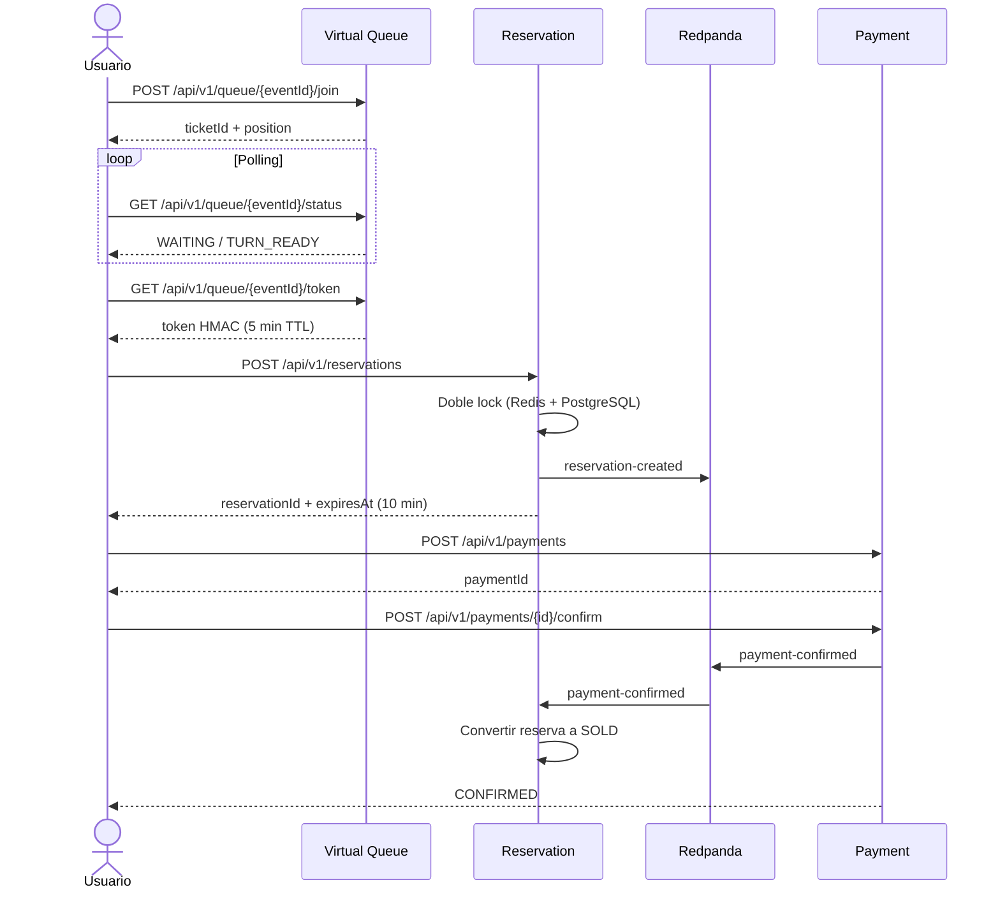

El flujo está diseñado intencionadamente como una secuencia de pasos explícitos — unirse a la cola, esperar turno, obtener token, reservar, pagar, confirmar — en lugar de una única operación atómica. Esta separación permite que cada etapa escale y falle de forma independiente. La fila virtual absorbe la avalancha inicial sin tocar la base de datos de reservas, y el token de acceso actúa como mecanismo de control de flujo entre la cola y el motor de reservas.

---

## 2. Drivers de arquitectura

### 2.1 Requisitos funcionales

| ID    | Requisito                          | Descripción                                                                     |
|-------|------------------------------------|---------------------------------------------------------------------------------|
| RF-01 | Ver eventos                        | Listar eventos públicos paginados con información de venue, artistas y zonas    |
| RF-02 | Buscar eventos                     | Búsqueda por texto, tipo de evento, fecha y venue                               |
| RF-03 | Fila Virtual                       | Unirse a una cola FIFO, consultar posición, obtener token de acceso al llegar turno |
| RF-04 | Reservar tickets                   | Reservar entradas por zona con TTL de 10 minutos. Límite de 3 tickets por usuario |
| RF-05 | Comprar tickets                    | Iniciar pago y confirmar con clave de idempotencia                              |
| RF-06 | Administrar catálogo               | Crear/modificar/eliminar eventos, venues y artistas (solo ADMIN)                |
| RF-07 | Consultar disponibilidad           | Ver en tiempo real la disponibilidad de entradas por zona                       |

### 2.2 Requisitos no funcionales

| ID     | Categoría      | Requisito                              | Métrica / Objetivo                     | Origen     |
|--------|----------------|----------------------------------------|----------------------------------------|------------|
| NFR-01 | Consistencia   | Cero overbooking                       | 0 reservas que excedan la capacidad    | Requisito  |
| NFR-02 | Escalabilidad  | Volumen diario de usuarios             | 50M DAU                                | Requisito  |
| NFR-03 | Escalabilidad  | Pico de concurrencia en apertura       | 5M usuarios concurrentes               | Requisito  |
| NFR-04 | Rendimiento    | Latencia de lecturas de catálogo       | p95 < 200ms                            | Prototipo  |
| NFR-05 | Rendimiento    | Latencia de flujo de compra completo   | p95 < 5s                               | Prototipo  |
| NFR-06 | Disponibilidad | Tasa de fallos en peticiones           | < 1%                                   | Prototipo  |
| NFR-07 | Seguridad      | Autenticación y autorización           | OAuth2/OIDC con roles USER y ADMIN     | Requisito  |
| NFR-08 | Observabilidad | Trazabilidad end-to-end                | Métricas + logs + trazas por petición  | Buenas prácticas |
| NFR-09 | Resiliencia    | Degradación graceful bajo sobrecarga   | Circuit breakers + rate limiting       | Prototipo  |
| NFR-10 | Evolución      | Preparación para extracción a µservicios | Comunicación asíncrona desacoplada  | Buenas prácticas |

Los NFR-04, NFR-05 y NFR-06 se derivan de los targets de las pruebas de carga k6 realizadas sobre el prototipo funcional. El resto de NFRs provienen directamente del documento de requisitos del bootcamp o de buenas prácticas de arquitectura de software para sistemas de alta concurrencia.

---

## 3. Visión general de arquitectura

El sistema sigue un patrón **monolito modular event-driven** construido con Spring Modulith. Cada módulo mapea a un bounded context de Domain-Driven Design (DDD), con comunicación híbrida: síncrona para queries que requieren consistencia inmediata y asíncrona vía Redpanda (Kafka-compatible) para eventos de dominio que desacoplan los flujos de escritura.

Los diagramas de esta sección siguen la metodología **C4** (Context, Container, Component, Code), un enfoque estándar para visualizar la arquitectura de software en cuatro niveles progresivos de detalle. Cada nivel responde a una audiencia y a una pregunta distinta:

| Nivel | Nombre | Pregunta que responde | Audiencia |
|---|---|---|---|
| **C4 Nivel 1** | Contexto | ¿Qué sistema es este y cómo se relaciona con sus usuarios y sistemas externos? | Equipo técnico y no técnico (visión general) |
| **C4 Nivel 2** | Contenedores | ¿Qué piezas principales (aplicaciones, bases de datos, brokers) componen el sistema y cómo se comunican? | Equipo técnico (arquitectos, desarrolladores) |
| **C4 Nivel 3** | Componentes | ¿Cómo se organiza internamente cada contenedor en módulos, servicios y repositorios? | Desarrolladores del sistema |
| **C4 Nivel 4** | Código | Diagramas de clases, paquetes o entidades. | Desarrolladores (no incluido en este documento por mantenerse a nivel de arquitectura) |

### 3.1 C4 Nivel 1: Diagrama de contexto

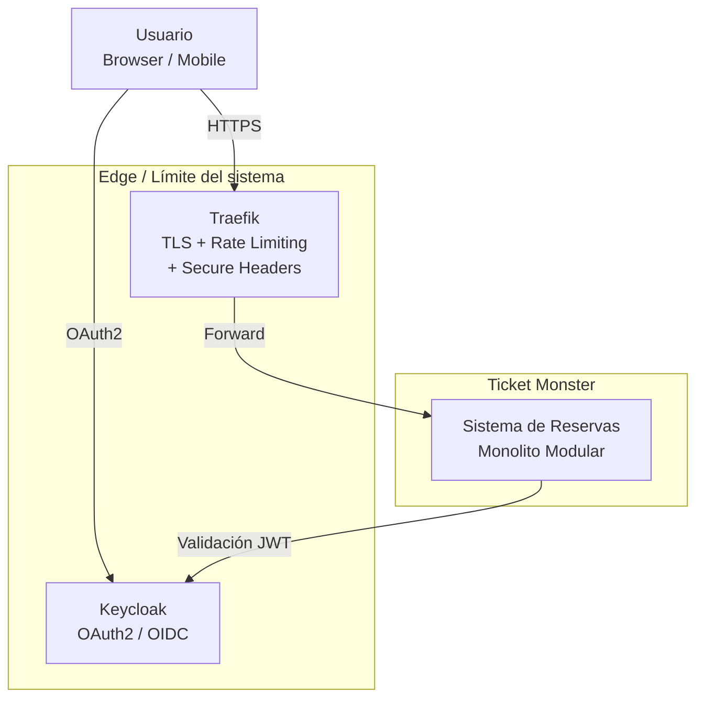

**Descripción:**

El usuario interactúa exclusivamente a través de HTTPS. En el borde del sistema, **Traefik** actúa como ingress controller del clúster K3s, proporcionando terminación TLS (certificados Let's Encrypt), rate limiting en endpoints de escritura, y cabeceras de seguridad HTTP. En paralelo, **Keycloak** gestiona la autenticación OAuth2/OIDC: emite tokens JWT que el monolito valida internamente mediante Spring Security Resource Server.

El sistema es autocontenido: no depende de pasarelas de pago externas (el módulo de pagos es una simulación con idempotencia) ni de proveedores cloud específicos. Todo se despliega en un clúster K3s sobre un VPS.

### 3.2 C4 Nivel 2: Diagrama de contenedores

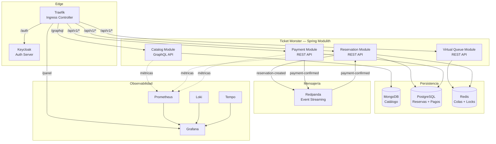

**Descripción:**

El monolito contiene **cuatro módulos** que se corresponden con los bounded contexts de DDD:

- **Catalog Module** expone una API GraphQL pública para consultar eventos, venues, artistas y disponibilidad. Es el único módulo con acceso a MongoDB, elegido por su flexibilidad de esquema para un catálogo con tipos de evento heterogéneos.
- **Virtual Queue Module** implementa una cola FIFO sobre Redis. Absorbe la avalancha de usuarios en aperturas de venta sin tocar PostgreSQL. Es AP (alta disponibilidad) porque perder el estado de la cola ante una caída de Redis es aceptable: los usuarios pueden volver a unirse.
- **Reservation Module** es el núcleo transaccional CP. Implementa el mecanismo anti-overbooking con doble lock (Redis SETNX + PostgreSQL SELECT FOR UPDATE) y publica eventos de dominio en Redpanda.
- **Payment Module** es también CP. Gestiona el ciclo de vida del pago con idempotencia y auditoría completa. Publica `payment-confirmed` en Redpanda, que el Reservation Module consume para convertir la reserva a SOLD.

Las bases de datos están aisladas por bounded context: PostgreSQL usa schemas separados (`reservation`, `payment`) para garantizar que una futura extracción a microservicios no requiera migración de datos. Redis se comparte entre Queue (AP) y Reservation (locks CP con TTL), pero con prefijos de clave diferenciados (`queue:` y `reservation:`) que evitan colisiones entre módulos.

El stack de observabilidad (Loki + Prometheus + Tempo + Grafana) recibe métricas de cada módulo vía Micrometer, logs estructurados en JSON vía Logback, y trazas distribuidas vía OpenTelemetry Java Agent.

### 3.3 C4 Nivel 3: Diagrama de componentes

#### 3.3.1 Catalog Module

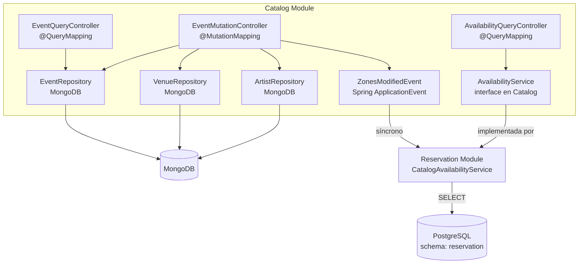

**Descripción:**

- **EventQueryController** resuelve las queries `events` (paginada), `event` (por ID) y `searchEvents` (búsqueda full-text con filtros por tipo, fecha y venue). Los campos anidados (venue, artists) se resuelven mediante `@SchemaMapping`.
- **EventMutationController** gestiona mutaciones `createEvent`, `updateEvent`, `deleteEvent`, `createVenue` y `createArtist`. Protegidas por `@PreAuthorize("hasRole('ADMIN')")`. Publica `ZonesModifiedEvent` al modificar zonas.
- **AvailabilityQueryController** expone `availability(eventId)` que consulta PostgreSQL a través del Reservation Module, no MongoDB.

#### 3.3.2 Virtual Queue Module

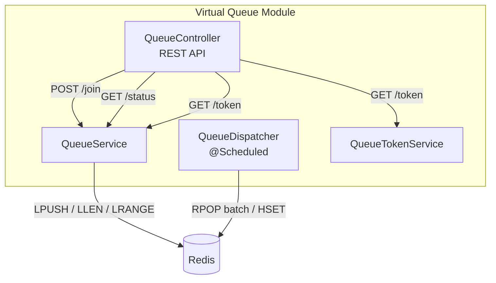
**Descripción:**

- **QueueController** expone los tres endpoints REST de la fila virtual: `POST /{eventId}/join` para encolar al usuario de forma idempotente, `GET /{eventId}/status` para consultar posición y estado (`WAITING` / `TURN_READY`), y `GET /{eventId}/token` para obtener el token HMAC de acceso al llegar el turno.
- **QueueService** implementa la lógica FIFO sobre Redis usando operaciones atómicas: `LPUSH` para encolar (O(1)), `LLEN` para calcular la posición actual, y `LRANGE` para buscar la posición exacta del usuario dentro de la lista. La idempotencia se garantiza mediante un `SET` auxiliar (`queue:members:{eventId}`) que impide que un mismo usuario se una dos veces.
- **QueueDispatcher** es un job programado con `@Scheduled` que actúa como **control de flujo**: cada 2 segundos extrae lotes de hasta 500 usuarios mediante `RPOP` y los marca como `TURN_READY` en un hash Redis (`HSET`). Esto limita la tasa de entrada al motor de reservas a 250 usuarios/segundo, protegiendo PostgreSQL de una avalancha.
- **QueueTokenService** emite tokens firmados con HMAC-SHA256 que contienen `userId:eventId:ticketId:expiresAt`. El TTL es de 5 minutos y la firma se valida en el Reservation Module sin dependencia de Keycloak, evitando una llamada externa en el path caliente de compra.

El módulo **no publica ni consume eventos de Redpanda**. Su única interacción con otros módulos es a través del cliente: el usuario recibe el token HMAC y lo presenta directamente al Reservation Module por HTTP.

#### 3.3.3 Reservation Module

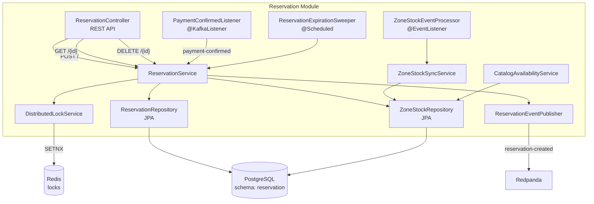

**Descripción:**

- **ReservationController** expone tres endpoints REST autenticados: `POST /` para crear reserva (requiere token de cola válido), `GET /{id}` para consultar (filtrado por `userId` del JWT), y `DELETE /{id}` para cancelar (restaura el stock automáticamente). Gestiona los códigos de error específicos: 409 Conflict por falta de stock o lock, 422 Unprocessable por exceder límite de tickets, 403 Forbidden si la reserva no pertenece al usuario.
- **ReservationService** orquesta el flujo central del sistema: valida el límite de 3 tickets por usuario, ejecuta `SELECT FOR UPDATE` sobre `zone_stock` para serializar el acceso, adquiere lock Redis vía `DistributedLockService`, decrementa el stock, persiste la reserva y publica `reservation-created` en Redpanda. También gestiona `cancelReservation()`, `expireReservation()` y `confirmSale()`.
- **DistributedLockService** implementa locks con `SETNX` + TTL en Redis. La key `reservation:{eventId}:{zoneId}:{userId}` garantiza que un mismo usuario no pueda hacer dos reservas concurrentes en la misma zona. El TTL de 10 minutos asegura que el lock no quede huérfano si el servidor falla.
- **ReservationEventPublisher** publica eventos de dominio en Redpanda: `reservation-created`, `reservation-cancelled`, `reservation-expired` y `payment-refund-required`. Usa `acks=all` e `enable.idempotence=true` para garantizar entrega.
- **ReservationExpirationSweeper** (`@Scheduled`) es el **fallback** ante pérdida de keyspace notifications de Redis: cada 60 segundos barre reservas `ACTIVE` con `expires_at < NOW()`, restaura el stock y las marca como `EXPIRED`.
- **PaymentConfirmedListener** (`@KafkaListener`) consume el tópico `payment-confirmed` de Redpanda y llama a `ReservationService.confirmSale()` para convertir la reserva de `ACTIVE` a `SOLD`. Es el único mecanismo para transicionar una reserva a vendida.
- **ZoneStockEventProcessor** (`@EventListener`) recibe `ZonesModifiedEvent` desde Catalog Module (vía Spring ApplicationEvents) y dispara **ZoneStockSyncService**, que crea, actualiza o elimina filas en `zone_stock` para mantener PostgreSQL sincronizado con el catálogo de MongoDB.
- **CatalogAvailabilityService** implementa la interfaz `AvailabilityService` definida en Catalog Module. Consulta `zone_stock` en PostgreSQL para devolver la disponibilidad en tiempo real por zona. Es la **única dependencia síncrona** entre módulos: Catalog la invoca como interfaz Java, pero la implementación reside en Reservation.

#### 3.3.4 Payment Module

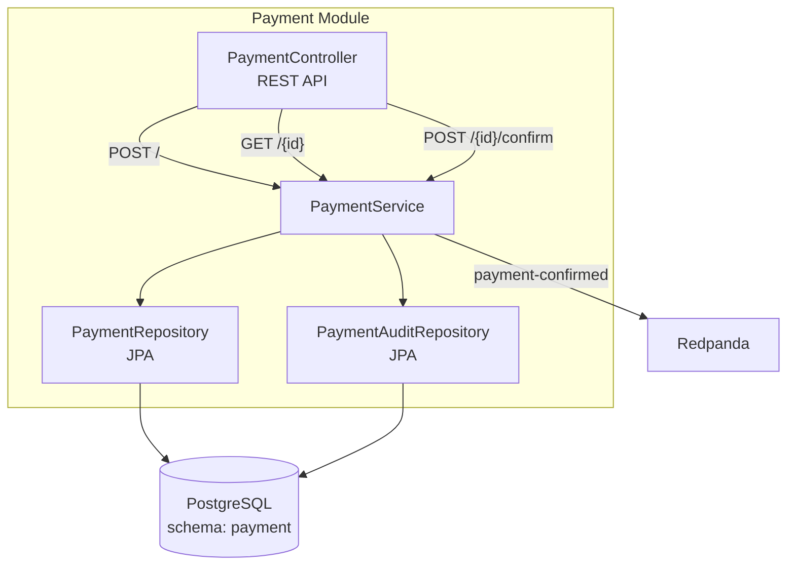

**Descripción general del Nivel 3:**

- **Catalog Module:** toda la API es GraphQL con el modelo de programación `@QueryMapping`/`@MutationMapping`. La query `availability` es la única que cruza la frontera del módulo (consulta PostgreSQL a través de Reservation).
- **Virtual Queue Module:** opera exclusivamente sobre Redis. El `QueueDispatcher` es un `@Scheduled` que actúa como control de flujo limitando la tasa de entrada al motor de reservas.
- **Reservation Module:** es el más complejo. `ReservationService` orquesta el doble lock. `PaymentConfirmedListener` consume eventos de Redpanda. `ZoneStockSyncService` mantiene la tabla `zone_stock` sincronizada con el catálogo.
- **Payment Module:** `PaymentService` implementa idempotencia en ambas operaciones de escritura. `payment_audit` es append-only. Al confirmar, publica en Redpanda.

---

## 4. Descomposición DDD

### 4.1 Catalog (AP)

| Aspecto | Detalle |
|---|---|
| **Responsabilidad** | Gestionar el catálogo de eventos, venues y artistas. Punto de entrada para administradores y consultas de usuarios. |
| **Tipo de contexto** | Supporting Domain — el catálogo es visible para el usuario pero no es el core diferenciador del negocio. |
| **Almacenamiento** | MongoDB (documental, schema flexible, optimizado para lecturas). |
| **API** | GraphQL público (queries sin auth, mutaciones requieren ROLE_ADMIN). |
| **Comunicación saliente** | Síncrono: llama a Reservation para `availability`. Asíncrono interno: publica `ZonesModifiedEvent` vía Spring ApplicationEvents. |
| **Comunicación entrante** | Ninguna. Catalog es el origen del flujo de administración. |
| **CAP** | AP — se prioriza disponibilidad de lectura sobre consistencia inmediata. |
| **Eventos de dominio** | `ZonesModifiedEvent { eventId, action: CREATED/UPDATED/DELETED, zones: [ZoneData] }` |
| **Eventos que consume** | Ninguno externo. |

### 4.2 Virtual Queue (AP)

| Aspecto | Detalle |
|---|---|
| **Responsabilidad** | Absorber la avalancha de usuarios en apertura de venta, formando cola FIFO y liberando por lotes hacia el motor de reservas. |
| **Tipo de contexto** | Core Domain — la fila virtual permite escalar a 5M de usuarios concurrentes sin saturar PostgreSQL. |
| **Almacenamiento** | Redis (in-memory, sin persistencia en disco). |
| **API** | REST autenticado (JWT de Keycloak). |
| **Comunicación saliente** | Ninguna directa. El usuario recibe token HMAC y lo presenta a Reservation (iniciativa del cliente). |
| **Comunicación entrante** | Ninguna. |
| **CAP** | AP — si Redis se reinicia, la cola se pierde; usuarios pueden volver a unirse. |
| **Eventos de dominio** | Ninguno publicado en Redpanda. |
| **Eventos que consume** | Ninguno. |

### 4.3 Reservation (CP)

| Aspecto | Detalle |
|---|---|
| **Responsabilidad** | Gestionar el ciclo de vida de las reservas: creación con control de stock, expiración por TTL, cancelación, confirmación de venta. Guardián del cero overbooking. |
| **Tipo de contexto** | Core Domain — la reserva sin overbooking es el producto principal. |
| **Almacenamiento** | PostgreSQL (ACID, schema `reservation`) + Redis (locks distribuidos con TTL). |
| **API** | REST autenticado (JWT de Keycloak). |
| **Comunicación saliente** | Redpanda topics: `reservation-created`, `reservation-cancelled`, `reservation-expired`, `payment-refund-required`. |
| **Comunicación entrante** | Síncrono: Catalog consulta `availability`. Asíncrono: consume `payment-confirmed`, `ZonesModifiedEvent`. |
| **CAP** | CP — se sacrifica disponibilidad para garantizar consistencia. `SELECT FOR UPDATE` serializa el acceso. |
| **Eventos de dominio** | `reservation-created { reservationId, eventId, userId, items, expiresAt }`, `reservation-cancelled`, `reservation-expired`, `payment-refund-required` |
| **Eventos que consume** | `payment-confirmed { reservationId, paymentId, userId, amount, confirmedAt }`, `ZonesModifiedEvent` (interno) |

### 4.4 Payment (CP)

| Aspecto | Detalle |
|---|---|
| **Responsabilidad** | Gestionar inicio, confirmación y auditoría de pagos. Garantiza idempotencia y registro de auditoría. |
| **Tipo de contexto** | Supporting Domain — lógica de pago simulada. En producción real se delegaría a un proveedor externo. |
| **Almacenamiento** | PostgreSQL (ACID, schema `payment`). |
| **API** | REST autenticado (JWT de Keycloak). |
| **Comunicación saliente** | Redpanda topic: `payment-confirmed`. |
| **Comunicación entrante** | Ninguna directa. |
| **CAP** | CP — transacciones financieras requieren consistencia absoluta. |
| **Eventos de dominio** | `payment-confirmed { reservationId, paymentId, userId, amount, confirmedAt, idempotencyKey }` |
| **Eventos que consume** | Ninguno. |

### 4.5 Context Map

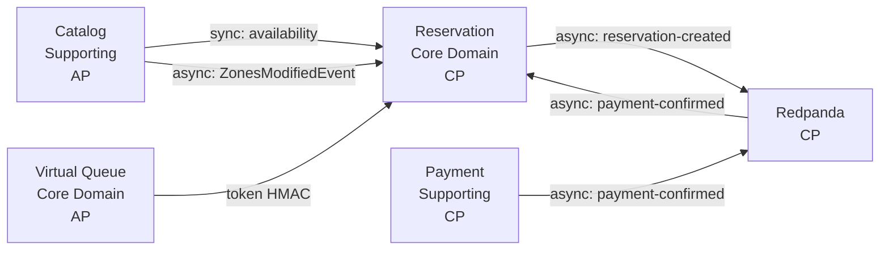

**Relaciones entre bounded contexts:**

| Origen → Destino | Tipo de relación DDD | Mecanismo | Justificación |
|---|---|---|---|
| Catalog → Reservation | **Customer-Supplier** | Síncrono: `AvailabilityService` | Catalog necesita disponibilidad en tiempo real. Al ser solo lectura, la llamada síncrona es aceptable. |
| Catalog → Reservation | **Customer-Supplier** (interno) | Asíncrono: Spring ApplicationEvent | Creación de zonas debe reflejarse en `zone_stock`. Evento interno evita bloqueo al usuario. |
| Virtual Queue → Reservation | **Partnership** | Token HMAC pasado por el cliente | Acopladas por protocolo. Sin comunicación directa servidor-servidor. |
| Reservation → Payment | **Customer-Supplier** (asíncrono) | Redpanda `reservation-created` | Desacoplamiento temporal: Reservation no espera a Payment. |
| Payment → Reservation | **Customer-Supplier** (asíncrono) | Redpanda `payment-confirmed` | Única forma de transicionar reserva a SOLD. |


## 5. API Specification

### 5.1 GraphQL API — Catálogo

Endpoint `/graphql` público. Mutaciones requieren rol `ADMIN`.

**Schema SDL completo:**

```graphql
type Query {
    events(page: Int = 0, size: Int = 20): EventPage!
    event(id: ID!): Event
    searchEvents(query: String!, type: EventType, dateFrom: String, dateTo: String, venueId: ID, page: Int = 0, size: Int = 20): EventPage!
    availability(eventId: ID!): [ZoneAvailability!]!
}

type Mutation {
    createEvent(input: CreateEventInput!): Event!
    updateEvent(id: ID!, input: UpdateEventInput!): Event!
    deleteEvent(id: ID!): Boolean!
    createVenue(input: CreateVenueInput!): Venue!
    createArtist(input: CreateArtistInput!): Artist!
}

type EventPage {
    content: [Event!]!
    totalElements: Int!
    totalPages: Int!
    page: Int!
    size: Int!
}

type Event {
    id: ID!
    name: String!
    description: String
    type: EventType!
    date: String!
    endDate: String
    venue: Venue!
    artists: [Artist!]!
    zones: [Zone!]!
    status: EventStatus!
    createdAt: String!
    updatedAt: String!
}

type Venue {
    id: ID!
    name: String!
    description: String
    location: Location!
    totalCapacity: Int!
    layoutType: String
}

type Location {
    address: String
    city: String
    country: String
    latitude: Float
    longitude: Float
}

type Artist {
    id: ID!
    name: String!
    genre: String
    bio: String
    imageUrl: String
}

type Zone {
    id: ID!
    name: String!
    capacity: Int!
    price: Float!
    section: String
}

type ZoneAvailability {
    zoneId: ID!
    zoneName: String!
    totalCapacity: Int!
    reservedCount: Int!
    availableCount: Int!
}

enum EventType {
    CONCERT, SPORTS, THEATER, FESTIVAL, CONFERENCE, OTHER
}

enum EventStatus {
    DRAFT, PUBLISHED, CANCELLED, COMPLETED
}

input CreateEventInput {
    name: String!
    description: String
    type: EventType!
    date: String!
    endDate: String
    venueId: ID!
    artistIds: [ID!]
    zones: [ZoneInput!]
}

input UpdateEventInput {
    name: String
    description: String
    type: EventType
    date: String
    endDate: String
    venueId: ID
    artistIds: [ID!]
    zones: [ZoneInput!]
    status: EventStatus
}

input ZoneInput {
    id: ID
    name: String!
    capacity: Int!
    price: Float!
    section: String
}

input CreateVenueInput {
    name: String!
    description: String
    address: String
    city: String
    country: String
    latitude: Float
    longitude: Float
    totalCapacity: Int!
    layoutType: String
}

input CreateArtistInput {
    name: String!
    genre: String
    bio: String
    imageUrl: String
}
```

**Ejemplo de query (pública):**

```graphql
query {
  events(page: 0, size: 10) {
    content {
      id
      name
      type
      date
      venue { name city }
      zones { name capacity price }
    }
  }
}
```

**Ejemplo de mutación (requiere ADMIN):**

```graphql
mutation {
  createEvent(input: {
    name: "Foo Fighters Live"
    type: CONCERT
    date: "2026-12-15T20:00:00"
    venueId: "60d5f484f1a2c8b1f8e4e1a1"
    zones: [
      { name: "Pista", capacity: 40000, price: 80.0 }
      { name: "Grada", capacity: 30000, price: 120.0 }
    ]
  }) {
    id
    name
    status
  }
}
```

### 5.2 REST API — Fila Virtual

**Base path:** `/api/v1/queue`  
**Autenticación:** Requerida (JWT Bearer token de Keycloak)

| Método | Path | Descripción | Request Body | Response (200 OK) | Códigos de error |
|---|---|---|---|---|---|
| `POST` | `/{eventId}/join` | Unirse a la cola de un evento | — | `{ "ticketId": "uuid", "position": 1423 }` | 401 Unauthorized, 404 Evento no encontrado |
| `GET` | `/{eventId}/status` | Consultar posición actual | — | `{ "status": "WAITING", "position": 890 }` | 401 Unauthorized |
| `GET` | `/{eventId}/token` | Obtener token de acceso al llegar turno | — | `{ "token": "base64...", "error": null }` | 401 Unauthorized, 403 Forbidden ("Turn has not arrived") |

**Notas:**
- `POST /join` es idempotente: si el usuario ya está en la cola, devuelve el mismo `ticketId` y posición actual.
- El token devuelto por `GET /token` tiene un TTL de 5 minutos. Si expira sin usarse, el slot se libera automáticamente.
- `GET /status` devuelve `"WAITING"` mientras el usuario está en la cola, o `"TURN_READY"` cuando el dispatcher lo ha seleccionado.

### 5.3 REST API — Reservas

**Base path:** `/api/v1/reservations`  
**Autenticación:** Requerida (JWT Bearer token de Keycloak)

| Método | Path | Descripción | Request Body | Response | Códigos de error |
|---|---|---|---|---|---|
| `POST` | `/` | Crear reserva (requiere token de cola válido) | `{ "eventId": "...", "items": [{"zoneId": "...", "quantity": 2}] }` | `201 Created`: `{ "id": "uuid", "userId": "...", "eventId": "...", "status": "ACTIVE", "expiresAt": "...", "createdAt": "...", "items": [...] }` | 401 Unauthorized, 409 Conflict (sin stock / lock no adquirido), 422 Unprocessable (límite de tickets excedido) |
| `GET` | `/{id}` | Consultar reserva por ID | — | `200 OK`: igual que arriba | 401 Unauthorized, 403 Forbidden (no es tu reserva), 404 Not Found |
| `DELETE` | `/{id}` | Cancelar reserva activa | — | `200 OK`: `{ "status": "CANCELLED" }` | 401 Unauthorized, 403 Forbidden, 404 Not Found, 409 Conflict (reserva no está ACTIVE) |

**Notas:**
- Límite configurable de tickets por usuario por evento (por defecto: 3).
- La reserva expira automáticamente tras 10 minutos (configurable) si no se completa el pago.
- `DELETE` restaura el stock de la zona automáticamente.

### 5.4 REST API — Pagos

**Base path:** `/api/v1/payments`  
**Autenticación:** Requerida (JWT Bearer token de Keycloak)

| Método | Path | Descripción | Request Body | Response | Códigos de error |
|---|---|---|---|---|---|
| `POST` | `/` | Iniciar pago para una reserva | `{ "reservationId": "...", "amount": 160.00 }` | `201 Created`: `{ "id": "uuid", "reservationId": "...", "userId": "...", "amount": "160.00", "status": "PENDING", "createdAt": "...", "confirmedAt": "" }` | 401 Unauthorized |
| `GET` | `/{id}` | Consultar estado de pago | — | `200 OK`: igual que arriba | 401 Unauthorized, 403 Forbidden, 404 Not Found |
| `POST` | `/{id}/confirm` | Confirmar pago (webhook simulado) | `{ "idempotencyKey": "uuid" }` | `200 OK`: `{ ..., "status": "CONFIRMED", "confirmedAt": "..." }` | 404 Not Found |

**Notas:**
- `POST /` es idempotente por `reservationId`: si ya existe un pago para esa reserva, devuelve el existente.
- `POST /{id}/confirm` es idempotente por `idempotencyKey`: confirmar dos veces con la misma key devuelve 200 sin efectos secundarios.
- El `amount` debe coincidir con el precio de las zonas reservadas.
- La confirmación del pago dispara el evento `payment-confirmed` que convierte la reserva a `SOLD`.

---

## 6. Modelo de datos

El sistema utiliza un enfoque de **persistencia poliglota**: cada bounded context utiliza el motor de base de datos más adecuado para sus requisitos de consistencia, rendimiento y modelo de datos.

### 6.1 MongoDB — Catálogo

MongoDB se eligió para el catálogo por tres razones:
1. **Schema flexible**: los eventos pueden ser de tipos muy diversos (concierto, obra de teatro, partido) con atributos diferentes. Un documento embebido evita las migraciones de esquema constantes que requeriría un modelo relacional.
2. **Rendimiento de lectura**: el catálogo es read-heavy (cientos de miles de lecturas por segundo durante picos). MongoDB escala horizontalmente mediante replica sets y sharding.
3. **Full-text search nativo**: MongoDB incluye índices de texto que permiten la búsqueda `searchEvents` sin necesidad de un motor externo como Elasticsearch.

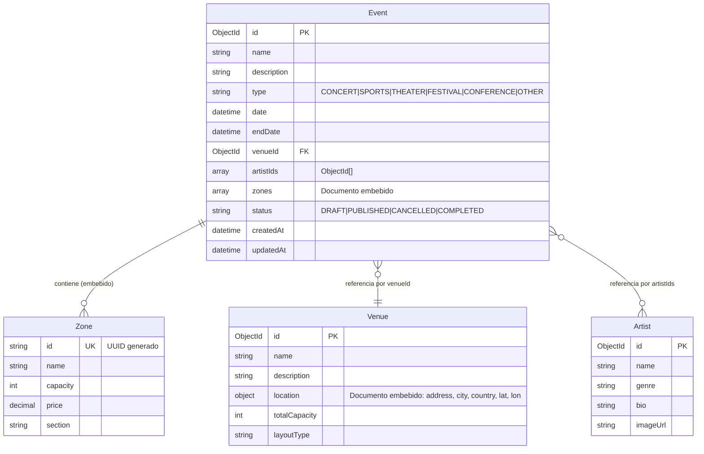

Las zonas están embebidas en el documento Event en lugar de ser una colección separada porque:
- Una zona no existe fuera del contexto de un evento.
- Al leer un evento, siempre se necesitan sus zonas (patrón de acceso conjunto).
- Evita JOINs en MongoDB, que son costosos.

Venue y Artist son colecciones independientes referenciadas por `venueId` y `artistIds` respectivamente. Se referencian en lugar de embeber porque un mismo venue o artista participa en múltiples eventos, y embeberlos duplicaría los datos.

### 6.2 PostgreSQL — Reservas y Pagos

PostgreSQL se eligió para los módulos transaccionales (Reservation y Payment) porque:
1. **ACID**: las garantías de atomicidad, consistencia, aislamiento y durabilidad son imprescindibles para evitar overbooking y asegurar la integridad de los pagos.
2. **SELECT FOR UPDATE**: el bloqueo pesimista a nivel de fila permite serializar el acceso a `zone_stock` sin necesidad de locks externos.
3. **Schemas separados**: cada bounded context tiene su propio schema PostgreSQL (`reservation`, `payment`), lo que facilita la extracción futura a bases de datos independientes sin migración de datos.

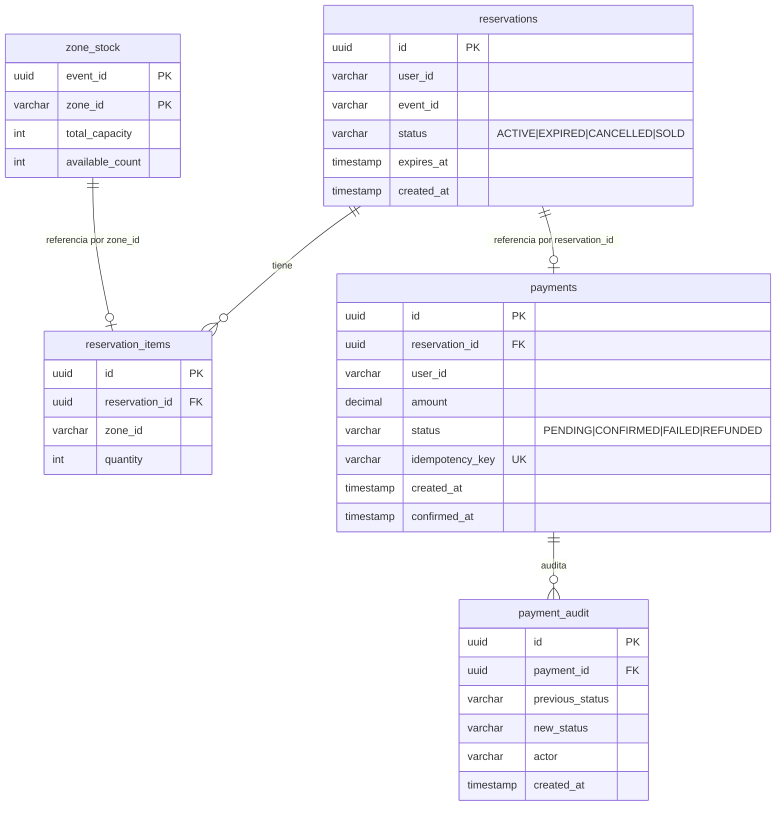

**Esquema `reservation`:**

| Entidad | Tabla | Columnas clave | Restricciones |
|---|---|---|---|
| ZoneStock | `zone_stock` | `event_id` (UUID), `zone_id` (VARCHAR), `total_capacity` (INT), `available_count` (INT) | PK compuesta (`event_id`, `zone_id`). `available_count >= 0`. |
| Reservation | `reservations` | `id` (UUID PK), `user_id`, `event_id`, `status` (ENUM), `expires_at`, `created_at` | `expires_at > created_at`. Status solo transiciona ACTIVE→EXPIRED/CANCELLED/SOLD. |
| ReservationItem | `reservation_items` | `id` (UUID PK), `reservation_id` (FK), `zone_id`, `quantity` | FK a `reservations`. `quantity > 0`. |

**Esquema `payment`:**

| Entidad | Tabla | Columnas clave | Restricciones |
|---|---|---|---|
| Payment | `payments` | `id` (UUID PK), `reservation_id`, `user_id`, `amount` (DECIMAL), `status` (ENUM), `idempotency_key` (VARCHAR UNIQUE), `created_at`, `confirmed_at` | `idempotency_key` UNIQUE. Status: PENDING→CONFIRMED/FAILED, CONFIRMED→REFUNDED. |
| PaymentAudit | `payment_audit` | `id` (UUID PK), `payment_id` (FK), `previous_status`, `new_status`, `actor`, `created_at` | FK a `payments`. Solo inserción (append-only). |

### 6.3 Redis — Colas y Locks

Redis se eligió para colas y locks porque:
1. **Rendimiento en memoria**: operaciones atómicas en microsegundos, esencial para manejar 5M de usuarios concurrentes.
2. **Estructuras de datos nativas**: `LIST` para colas FIFO, `SET` para detección de duplicados, y `SETNX` con TTL para locks distribuidos.
3. **Keyspace notifications**: permiten reaccionar a la expiración de locks automáticamente sin polling.

**Estructura de keys y patrones:**

| Key pattern | Tipo Redis | Propósito | TTL |
|---|---|---|---|
| `queue:{eventId}` | LIST | Cola FIFO de usuarios esperando para un evento | Sin TTL (persiste mientras haya usuarios) |
| `queue:members:{eventId}` | SET | Conjunto de userIds que ya están en la cola (idempotencia) | Sin TTL |
| `queue:turn:{eventId}` | HASH | Hash donde `field = userId`, `value = "1"`. Indica `TURN_READY` | Sin TTL |
| `reservation:{eventId}:{zoneId}:{userId}` | STRING (lock) | Lock distribuido adquirido con `SETNX EX 600` | 600s (10 min, configurable) |

**Operaciones Redis por endpoint:**

| Endpoint | Operaciones Redis |
|---|---|
| `POST /queue/{eventId}/join` | `SADD queue:members:{eventId} {userId}`, `LPUSH queue:{eventId} {userId}`, `LLEN queue:{eventId}` |
| `GET /queue/{eventId}/status` | `HEXISTS queue:turn:{eventId} {userId}` → TURN_READY. `LRANGE queue:{eventId} 0 -1` → posición. |
| `GET /queue/{eventId}/token` | `HEXISTS` + `HDEL` (limpiar TURN_READY al emitir token). |
| `POST /reservations` | `SETNX reservation:{eventId}:{zoneId}:{userId} EX 600` (adquirir lock). |
| `DELETE /reservations/{id}` | `DEL reservation:{eventId}:{zoneId}:{userId}` (liberar lock). |


### 6.4 Estimación de capacidad y dimensionamiento de hardware

Esta sección traduce el modelo de datos y las métricas de escala objetivo a requisitos concretos de almacenamiento y procesamiento. El cálculo parte del tamaño estimado de cada registro y lo proyecta sobre los volúmenes anuales esperados.

#### 6.4.1 Tamaño de registros por entidad

Las estimaciones de tamaño incluyen overhead de motor de base de datos (headers de tupla en PostgreSQL, field names y type markers en BSON de MongoDB, metadata interna de Redis).

**MongoDB (documentos BSON):**

| Entidad | Campos | Tamaño unitario |
|---|---|---|
| `Event` | `_id`, `name`, `description`, `type`, `date`, `endDate`, `venueId`, `artistIds[]`, `zones[]` (≈5 embebidos), `status`, `createdAt`, `updatedAt` | ~1 KB |
| `Venue` | `_id`, `name`, `description`, `location{}` (6 campos), `totalCapacity`, `layoutType` | ~400 B |
| `Artist` | `_id`, `name`, `genre`, `bio`, `imageUrl` | ~500 B |

**PostgreSQL (tuplas + overhead de 28 B por fila):**

| Tabla | Esquema | Tamaño unitario |
|---|---|---|
| `reservations` | `reservation` | ~140 B |
| `reservation_items` | `reservation` | ~84 B |
| `zone_stock` | `reservation` | ~72 B |
| `payments` | `payment` | ~176 B |
| `payment_audit` | `payment` | ~128 B |

**Redis (keys + metadata interna):**

| Patrón de key | Tamaño por entrada |
|---|---|
| `queue:{eventId}` (LIST, userId) | ~50 B |
| `queue:members:{eventId}` (SET, userId) | ~50 B |
| `queue:turn:{eventId}` (HASH, userId→1) | ~60 B |
| `reservation:{ev}:{zone}:{user}` (STRING, lock) | ~200 B |

#### 6.4.2 Proyección de volúmenes de datos

**Supuestos de negocio** alineados con las métricas objetivo de la sección 2.2:

| Parámetro | Valor | Justificación |
|---|---|---|
| DAU | 50 M | NFR-02 |
| Tasa de conversión a compra | 0.2 % | ~1 de cada 500 navegaciones termina en compra en ticketing masivo |
| Tickets vendidos / día | 100 000 | 50 M × 0.2 % |
| Tickets vendidos / año | 36.5 M | — |
| Reservas / año | 18 M | ~2 tickets de media por reserva |
| Pagos / año | 18 M | Una reserva → un pago |
| Auditorías / pago | 2 | `PENDING→CONFIRMED`, posible `CONFIRMED→REFUNDED` |
| Eventos activos / año | 500 | Rotación de catálogo |
| Zones / evento | 5 | Media entre pequeñas (2) y grandes (8+) |
| Zonas totales (zone_stock) | 2 500 | 500 eventos × 5 zonas |
| Pico usuarios en cola | 5 M | NFR-03 |
| Pico reservas activas simultáneas | 350 000 | ~5 eventos en venta simultánea × 70 K capacidad |

#### 6.4.3 Requisitos de almacenamiento

**MongoDB — Catálogo:**

| Concepto | Cálculo | Total |
|---|---|---|
| Events | 500 × 1 KB | 0.5 MB |
| Venues | 50 × 400 B | 20 KB |
| Artists | 200 × 500 B | 100 KB |
| **Datos brutos** | — | **~0.6 MB** |
| Índices (≈ 2× datos) | índices compuestos: type+date, venueId, status, texto | ~1.2 MB |
| **Total MongoDB** | — | **~2 MB** |

El catálogo es pequeño en volumen de datos pero intensivo en lecturas (~10 K+ req/s en picos). El almacenamiento no es el factor limitante.

**PostgreSQL — Reservas (schema `reservation`):**

| Concepto | Cálculo | Año 1 | Año 3 |
|---|---|---|---|
| `reservations` | 18 M/año × 140 B | 2.5 GB | 7.5 GB |
| `reservation_items` | 36.5 M/año × 84 B | 3.1 GB | 9.2 GB |
| `zone_stock` | 2 500 filas × 72 B | < 1 MB | < 1 MB |
| Índices | ~100 % del tamaño de datos | 5.6 GB | 16.8 GB |
| WAL, autovacuum, bloat | ~50 % adicional | 5.6 GB | 16.8 GB |
| **Total schema reservation** | — | **~17 GB** | **~51 GB** |

**PostgreSQL — Pagos (schema `payment`):**

| Concepto | Cálculo | Año 1 | Año 3 |
|---|---|---|---|
| `payments` | 18 M/año × 176 B | 3.2 GB | 9.5 GB |
| `payment_audit` | 36.5 M/año × 128 B | 4.7 GB | 14.0 GB |
| Índices | ~100 % del tamaño de datos | 7.9 GB | 23.5 GB |
| WAL, autovacuum, bloat | ~50 % adicional | 7.9 GB | 23.5 GB |
| **Total schema payment** | — | **~24 GB** | **~71 GB** |

| **Total PostgreSQL** | — | **~41 GB** | **~122 GB** |

**Redis:**

| Concepto | Cálculo | Total |
|---|---|---|
| Cola FIFO (pico 5 M usuarios) | 5 M × 50 B | 250 MB |
| Set de miembros (idempotencia) | 5 M × 50 B | 250 MB |
| Hash de turnos listos | batch de 500 usuarios activos × 60 B | < 1 MB |
| Locks de reserva (pico 350 K) | 350 K × 200 B | 70 MB |
| Overhead interno Redis | ~30 % | ~170 MB |
| **Total Redis pico** | — | **~750 MB** |
| **PV recomendado (margen 3×)** | — | **5 Gi** |

Redis opera casi enteramente en memoria. La persistencia RDB/AOF se usa solo para recuperación tras caída, no como almacenamiento primario. El pico de 750 MB es transitorio — fuera de eventos masivos el consumo es mínimo (< 50 MB).

#### 6.4.4 Requisitos de procesamiento

**Throughput por componente en hora pico de apertura de venta:**

| Componente | Operación | Throughput pico | Operaciones / s |
|---|---|---|---|
| Catalog (GraphQL) | Lectura de eventos y disponibilidad | 10 K req/s | 12 K queries MongoDB + 5 K queries PostgreSQL |
| Virtual Queue | `POST /join`, `GET /status`, `GET /token` | 200 K ops/s | 200 K operaciones Redis |
| Reservation | `POST /`, `GET /{id}`, `DELETE /{id}` | 250 reservas/s | ~750 transacciones PostgreSQL + 250 SETNX Redis |
| Payment | `POST /`, `POST /{id}/confirm` | 250 pagos/s | ~500 transacciones PostgreSQL |

**Dimensionamiento de réplicas del monolito (cada réplica = 1 vCPU, 2 Gi RAM):**

| Módulo | Throughput por réplica (observado en k6) | Réplicas mínimas | Notas |
|---|---|---|---|
| Catalog | ~500 req/s GraphQL | **20** | Principal consumidor de réplicas. Escalar con HPA. |
| Virtual Queue | ~500 req/s REST | **3** | Redis es el límite real, no el monolito. |
| Reservation | ~100 reservas/s | **3** | Limitado por PostgreSQL, no por el monolito. |
| Payment | ~200 pagos/s | **2** | Menor demanda que Reservation. |

| **Total réplicas** | — | **~28** | En pico. HPA reduce a ~5 en valle. |

Las réplicas no se despliegan por módulo (es un monolito) — el cálculo se desglosa para entender qué módulo presiona el escalado. En la práctica, todas las réplicas ejecutan los 4 módulos y HPA escala basado en CPU/memoria agregada.

#### 6.4.5 Dimensionamiento del clúster K3s

Partiendo de los requisitos de almacenamiento y procesamiento, el clúster de producción se dimensiona en tres tiers:

**Tier 1 — Nodos de aplicación (monolito + edge):**

| Recurso | Cantidad | Notas |
|---|---|---|
| Nodos worker | 4 × (4 vCPU, 8 Gi RAM) | ~7 réplicas del monolito por nodo en pico |
| Traefik | 2 réplicas | Ingress controller, integrado en K3s |
| **Total vCPU app** | **16** | — |
| **Total RAM app** | **32 Gi** | — |

**Tier 2 — Nodos de bases de datos:**

| Servicio | Instancias | vCPU | RAM | Disco (PV) | Notas |
|---|---|---|---|---|---|
| PostgreSQL | 1 primario + 1 réplica | 4 + 2 | 8 Gi + 4 Gi | 200 Gi SSD | PV dimensionado para 3 años (122 Gi datos + margen). PgBouncer sidecar. |
| MongoDB | 1 primario + 2 secundarios (replica set) | 2 + 1 + 1 | 4 Gi + 2 Gi + 2 Gi | 10 Gi SSD c/u | Datos pequeños (~2 MB). Lecturas se distribuyen entre secundarios. |
| Redis | 2 (sentinel) | 1 c/u | 2 Gi c/u | 10 Gi SSD c/u | Sentinel para failover automático. Sin persistencia en caliente. |

**Tier 3 — Mensajería y observabilidad:**

| Servicio | Instancias | vCPU | RAM | Disco (PV) | Notas |
|---|---|---|---|---|---|
| Redpanda | 3 brokers | 2 c/u | 4 Gi c/u | 50 Gi SSD c/u | Raft requiere 3 nodos para consenso. Retención: 7 días. |
| Keycloak | 1 | 1 | 2 Gi | 5 Gi | Usa PostgreSQL como backend. |
| Prometheus | 1 | 2 | 4 Gi | 50 Gi | Retención de métricas: 30 días. |
| Loki | 1 | 1 | 2 Gi | 30 Gi | Retención de logs: 14 días. |
| Tempo | 1 | 1 | 2 Gi | 20 Gi | Retención de trazas: 7 días. |
| Grafana | 1 | 1 | 1 Gi | 1 Gi | — |

**Resumen del clúster:**

| Recurso | Total | Notas |
|---|---|---|
| Nodos | 4 app + 3 data + 1 infra | 8 nodos mínimo |
| **vCPU total** | **~40 vCPU** | — |
| **RAM total** | **~80 Gi** | — |
| **Disco total** | **~600 Gi SSD** | Suma de todos los PVs |

**Estimación de coste mensual en cloud:**

| Proveedor | Tipo de instancia | Coste/mes estimado |
|---|---|---|
| OVH (bare metal VPS × 2) | 8 vCPU, 32 Gi RAM c/u | ~100–150 € |
| Hetzner Cloud | 4 × CX41 (8 vCPU, 16 Gi) + 2 × CX51 (16 vCPU, 32 Gi) | ~300–400 € |
| AWS (EC2 + RDS + DocumentDB + ElastiCache) | Equivalente gestionado | ~2500–4000 € |
| **Prototipo actual** (VPS OVH 6 vCPU, 12 Gi) | — | **~12 €/mes** |

El prototipo actual funciona sobre un único VPS de 12 €/mes con todas las bases de datos coexistiendo en el mismo nodo — suficiente para desarrollo y pruebas de carga moderadas (hasta ~500 VUs sin errores). La tabla anterior describe el dimensionamiento para producción a la escala objetivo de 50 M DAU.

#### 6.4.6 Métricas de capacidad límite

| Recurso | Límite identificado | Consecuencia | Mitigación |
|---|---|---|---|
| PostgreSQL — conexiones | ~200 conexiones directas (sin PgBouncer) | 3+ réplicas del monolito saturan el pool | PgBouncer multiplexando a 25 conexiones reales |
| PostgreSQL — `SELECT FOR UPDATE` | ~250 reservas/s por zona | Cola de transacciones crece → p95 sube | Fila virtual ya limita la tasa de entrada |
| MongoDB — lecturas/nodo | ~2 500 req/s por nodo | p95 > 2s | Replica set: 3 nodos → ~7 500 req/s combinados |
| Redis — single thread | ~100 K ops/s | Límite duro por instancia | Redis Sentinel + sharding si se supera |
| Redpanda — particiones | ~2 000 particiones por broker | Throughput de escritura degradado | Monitorear número de tópicos × particiones |
| Monolito — Virtual Threads | ~10 K threads virtuales por GB de heap | Threads no se crean → timeouts | Escalar réplicas con HPA |

---

## 7. Mecanismo anti-overbooking

El anti-overbooking es la invariante de negocio más crítica del sistema. Se implementa mediante **tres capas de defensa superpuestas** que garantizan consistencia incluso bajo concurrencia extrema (1000+ peticiones simultáneas compitiendo por las mismas entradas).

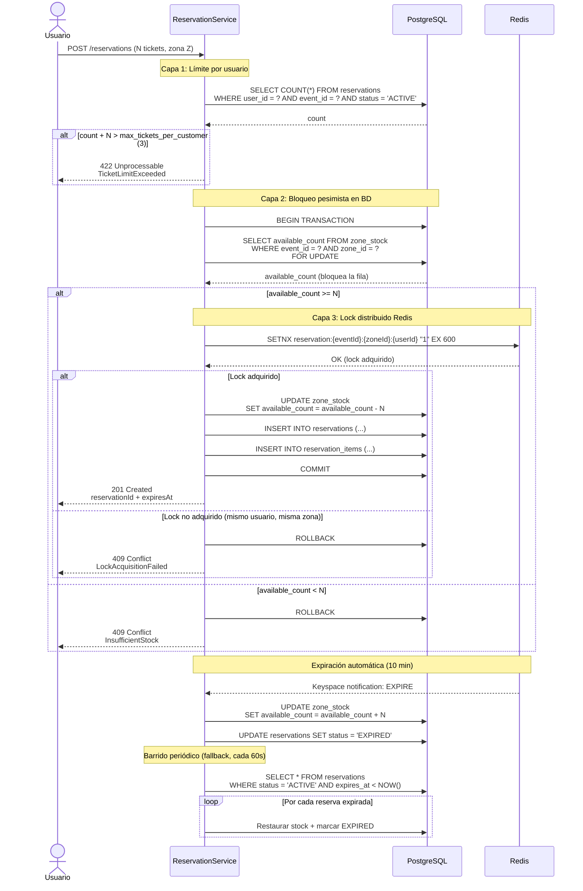

**Capa 1 — Límite de tickets por usuario:**
Antes de cualquier lock, se verifica que el usuario no exceda el máximo configurable de tickets por evento (por defecto 3). Esta es una protección anti-abuso y anti-reventa, no una garantía de consistencia, pero reduce la contención en las capas siguientes.

**Capa 2 — `SELECT FOR UPDATE` en PostgreSQL:**
El bloqueo pesimista a nivel de fila es la pieza central del anti-overbooking. Cuando una transacción ejecuta `SELECT ... FOR UPDATE` sobre la fila de `zone_stock`, PostgreSQL bloquea esa fila para cualquier otra transacción que intente leerla o escribirla con `FOR UPDATE`. Esto **serializa** todas las peticiones concurrentes que compiten por la misma zona:

- 1000 peticiones simultáneas → se ejecutan secuencialmente sobre la fila de `zone_stock`
- La primera transacción ve `available_count = 10`, decrementa a 9, COMMIT
- La segunda ve `available_count = 9`, decrementa a 8, COMMIT
- ...
- La undécima ve `available_count = 0`, ROLLBACK, devuelve 409

PostgreSQL garantiza que dos transacciones nunca pueden leer y modificar la misma fila simultáneamente con `FOR UPDATE`. El precio es la latencia: cada transacción debe esperar a que la anterior libere el lock, lo que explica los ~3 segundos de p95 en las pruebas de carga con 1000 VUs compitiendo por 10 tickets.

**Capa 3 — Lock distribuido en Redis:**
`SELECT FOR UPDATE` garantiza la atomicidad a nivel de zona, pero no evita que el mismo usuario haga dos peticiones concurrentes y ambas pasen el chequeo de `FOR UPDATE` (en transacciones distintas de PostgreSQL). Redis `SETNX` cierra esta brecha:

- Key: `reservation:{eventId}:{zoneId}:{userId}` — específica por usuario y zona
- `SETNX` (SET if Not eXists) es atómico: solo una de las peticiones concurrentes del mismo usuario adquirirá el lock
- El TTL de 10 minutos garantiza que el lock no sobreviva a la reserva si el servidor falla

**Expiración automática vía keyspace notifications:**
Redis puede notificar a la aplicación cuando una key expira (`EXPIRE` event). El Reservation Module escucha estas notificaciones y restaura automáticamente el stock.

**Barrido periódico (fallback):**
Las keyspace notifications de Redis son *best-effort*. El `ReservationExpirationSweeper` (`@Scheduled(fixedRate = 60000)`) actúa como red de seguridad: cada 60 segundos busca reservas `ACTIVE` con `expires_at < NOW()` y las expira manualmente, restaurando el stock.

**Verificación empírica:**
Las pruebas de carga k6 (`reservation-contention.js`) validaron este diseño con 1000 peticiones concurrentes de 100 usuarios distintos compitiendo por 10 tickets en `zone-vip`:
- **0 overbooking**: exactamente 10 reservas creadas (HTTP 201), 990 rechazos (HTTP 409)
- **0 errores**: ninguna respuesta 500 ni timeout
- **Success rate 100%**: todas las peticiones recibieron respuesta válida

---

## 8. Estrategia de Fila Virtual

La fila virtual es la respuesta arquitectónica al problema de los **5 millones de usuarios concurrentes** en la apertura de venta de un evento popular.

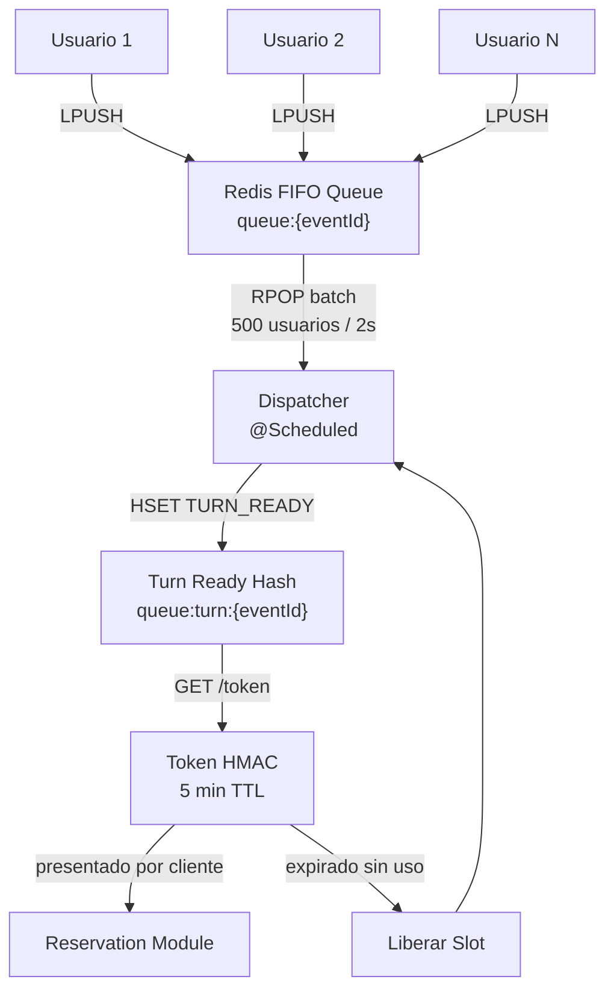

**Funcionamiento:**

1. **Entrada a la cola** (`POST /join`): Redis ejecuta `LPUSH queue:{eventId} {userId}` y devuelve la posición actual (`LLEN`). La operación es O(1) y tarda microsegundos. Un `SET` auxiliar (`queue:members:{eventId}`) garantiza idempotencia.

2. **Polling de estado** (`GET /status`): El cliente consulta periódicamente su posición. El servidor verifica si el usuario está en el hash `queue:turn:{eventId}` (estado `TURN_READY`). Si no, busca su posición mediante `LRANGE`.

3. **Batch dispatcher** (`@Scheduled`): Un job programado extrae lotes de usuarios cada 2 segundos (configurable): `RPOP` × batch_size (500) + `HSET` para marcar `TURN_READY`. Esto limita la tasa de entrada al motor de reservas a 250 usuarios/segundo por evento, protegiendo PostgreSQL.

4. **Token de acceso** (`GET /token`): Cuando el usuario está en `TURN_READY`, solicita un token firmado con HMAC-SHA256 (`userId:eventId:ticketId:expiresAt`). TTL de 5 minutos, generado sin dependencia de Keycloak.

5. **Expiración del token**: Si el token expira sin usarse, el slot se libera y el dispatcher emite nuevos tokens si hay capacidad disponible.

**¿Por qué Redis y no Kafka/Redpanda para la cola?**

| Aspecto | Redis | Kafka/Redpanda |
|---|---|---|
| Latencia por operación | < 1ms | ~5-10ms |
| Throughput en single node | ~100K ops/s | ~1M msg/s (con más overhead) |
| Modelo de datos | LIST nativa (FIFO) | Log inmutable (no diseñado para colas efímeras) |
| Posición del usuario | LLEN O(1) | Requiere contador externo |
| Complejidad operacional | Mínima | Requiere consumidores, offsets, particiones |

**Trade-off aceptado: pérdida de datos en caída de Redis.** Si Redis se reinicia durante una apertura de venta, la cola se vacía. Los usuarios reciben error y vuelven a unirse. Es un trade-off AP deliberado: se prioriza disponibilidad y rendimiento sobre durabilidad. Para los eventos de dominio (reservas, pagos) donde la durabilidad sí es crítica, se usa Redpanda.

---

## 9. Comunicación asíncrona

La comunicación asíncrona entre bounded contexts se implementa sobre **Redpanda**, un broker de eventos compatible con el protocolo Kafka. Se eligió Redpanda sobre Apache Kafka por su menor huella operacional (single binary, sin ZooKeeper) y latencias más bajas en despliegues pequeños.

### 9.1 Tópicos y esquemas de eventos

| Tópico | Productor | Consumidor(es) | Garantía |
|---|---|---|---|
| `reservation-created` | Reservation Module | Payment Module, Notificaciones (futuro) | At-least-once |
| `reservation-cancelled` | Reservation Module | Payment Module (futuro: reembolso) | At-least-once |
| `reservation-expired` | Reservation Module | Payment Module (futuro: reembolso) | At-least-once |
| `payment-confirmed` | Payment Module | Reservation Module | At-least-once |
| `payment-refund-required` | Reservation Module (futuro) | Payment Module (futuro) | At-least-once |

### 9.2 Flujo de eventos en una compra exitosa

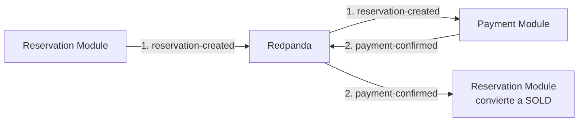

### 9.3 Justificación: por qué comunicación asíncrona entre módulos

1. **Desacoplamiento temporal**: Reservation no necesita esperar a que Payment procese el evento. La reserva se crea y se responde al usuario inmediatamente (201 Created).
2. **Resiliencia**: Si Payment Module está caído, los eventos se acumulan en Redpanda y se procesan cuando el módulo se recupera.
3. **Preparación para extracción a microservicios**: Al comunicarse vía Redpanda, cada módulo puede extraerse a un microservicio independiente sin cambiar el protocolo de comunicación.

### 9.4 Garantías de entrega

- **acks=all**: el productor espera confirmación de todas las réplicas
- **enable.idempotence=true**: exactly-once a nivel de partición
- **Consumidores con commit manual**: el offset solo avanza tras procesar exitosamente

### 9.5 Comunicación síncrona y su evolución a microservicios

La arquitectura actual minimiza deliberadamente las dependencias síncronas entre módulos. Existe **una única llamada síncrona** entre bounded contexts:

| Origen → Destino | Operación | Mecanismo actual | Frecuencia |
|---|---|---|---|
| Catalog → Reservation | `availability(eventId)` — consultar plazas disponibles por zona | `AvailabilityService` (interfaz Java implementada por Reservation Module) | Alta (cada consulta de disponibilidad desde GraphQL) |

**Funcionamiento actual en el monolito:**

Catalog define la interfaz `AvailabilityService` en su capa de servicio. Reservation implementa esta interfaz con la clase `CatalogAvailabilityService`, que consulta directamente la tabla `zone_stock` en PostgreSQL mediante JPA. Al estar ambos módulos en la misma JVM, la llamada es una invocación de método Java — sin serialización, sin latencia de red, sin puntos de fallo adicionales:

```
CatalogModule.AvailabilityQueryController
  → AvailabilityService.availability(eventId)    // llamada a interfaz
    → CatalogAvailabilityService (Reservation)    // implementación real
      → ZoneStockRepository.findByEventId()       // SELECT en PostgreSQL
```

**Impacto al extraer Catalog a microservicio:**

Cuando Catalog se extraiga a un servicio independiente, la interfaz `AvailabilityService` **no podrá seguir siendo una llamada en la misma JVM**. La implementación de Reservation (`CatalogAvailabilityService`) residirá en otro proceso, potencialemente en otro nodo del clúster. Para mantener la funcionalidad habrá que reemplazar la llamada local por una llamada remota:

| Estrategia de reemplazo | Ventajas | Desventajas |
|---|---|---|
| **gRPC** (recomendado) | Contrato tipado (`.proto`), serialización binaria eficiente, baja latencia, bidirectional streaming si se necesita | Requiere generar stubs, añade complejidad operacional (puerto gRPC adicional) |
| **REST/HTTP** | Simple, compatible con herramientas existentes, mismo stack que ya usa el sistema | JSON/texto añade overhead de serialización, sin contrato tipado automático |
| **GraphQL federation** | Unificar ambos schemas GraphQL en un solo endpoint federado para el cliente | Complejidad adicional (Apollo Federation o similar), overkill para una sola query |

**Estrategia recomendada: gRPC**

La decisión de usar gRPC se basa en que:
- Es la única dependencia síncrona entre módulos — no justifica GraphQL federation.
- La query `availability` es de alto volumen durante picos de venta — gRPC minimiza la latencia añadida.
- El contrato se define en un archivo `.proto` compartido, eliminando ambigüedades.

```
# availability.proto (fichero compartido entre Catalog y Reservation)
service AvailabilityService {
  rpc GetAvailability(GetAvailabilityRequest) returns (GetAvailabilityResponse);
}

message GetAvailabilityRequest {
  string event_id = 1;
}

message GetAvailabilityResponse {
  repeated ZoneAvailability zones = 1;
}

message ZoneAvailability {
  string zone_id = 1;
  string zone_name = 2;
  int32 total_capacity = 3;
  int32 reserved_count = 4;
  int32 available_count = 5;
}
```

El cambio en Catalog sería mínimo: donde antes inyectaba `AvailabilityService` (interfaz Java), ahora inyectará un cliente gRPC autogenerado que implementa la misma interfaz o una similar. La lógica de GraphQL no cambia.

**Impacto en la comunicación asíncrona existente:**

La comunicación asíncrona (Redpanda) **no se ve afectada** por la extracción de Catalog. Los eventos `ZonesModifiedEvent` (que hoy viajan como Spring ApplicationEvents internos) se migrarían a un tópico de Redpanda (`zones-modified`), manteniendo el mismo contrato de datos. El `ZoneStockEventProcessor` de Reservation pasaría de escuchar eventos de Spring a consumir de Redpanda, sin cambios en la lógica de sincronización.

---

## 10. Seguridad

La seguridad del sistema se implementa en **cuatro capas**:

### 10.1 Capa 1: Edge — Traefik

| Función | Implementación | Detalle |
|---|---|---|
| **TLS termination** | cert-manager + Let's Encrypt | Certificados para `*.janrax.es`. Renovación automática. |
| **Rate limiting** | Traefik RateLimit Middleware | Solo en endpoints de escritura (`/api/*`). 10K req/s media, 20K burst. |
| **Secure headers** | Traefik Headers Middleware | X-Content-Type-Options, X-Frame-Options, X-XSS-Protection, HSTS. |
| **Routing dual** | 2 Ingress resources | `ticketmonster-graphql`: `/graphql` público, sin rate limit. `ticketmonster`: `/api/*`, con rate limit. |

La separación en dos Ingress es una decisión deliberada: el catálogo (GraphQL, solo lectura, público) no debe competir por rate limit con las operaciones de escritura.

### 10.2 Capa 2: Autenticación — Keycloak

| Aspecto | Configuración |
|---|---|
| **Realm** | `ticket-monster` |
| **Clientes** | `ticket-monster-app` (público, password grant). `grafana` (confidencial, authorization code flow). |
| **Usuarios** | `admin/admin` (USER, ADMIN, grafana-admin). `user/user` (USER, grafana-viewer). |
| **Tokens** | JWT con RS256. Claims: `sub` (userId), `realm_access.roles`, `exp`, `iat`. |

### 10.3 Capa 3: Autorización — Spring Security

El monolito actúa como OAuth2 Resource Server validando JWT contra Keycloak. Los roles de Keycloak se mapean a autoridades de Spring Security (`ROLE_ADMIN`, `ROLE_USER`).

**Endpoints públicos vs protegidos:**

| Endpoint | Auth requerida | Rate limit |
|---|---|---|
| `GET/POST /graphql` | No (queries). Sí en mutaciones (por método). | No |
| `POST /api/v1/queue/{id}/join` | Sí, JWT válido | Sí, Traefik |
| `POST /api/v1/reservations` | Sí, JWT válido | Sí, Traefik |
| `POST /api/v1/payments` | Sí, JWT válido | Sí, Traefik |

### 10.4 Capa 4: Seguridad a nivel de negocio

| Mecanismo | Propósito |
|---|---|
| **Token HMAC de cola** | Garantizar que solo usuarios con turno válido puedan reservar |
| **Idempotencia de pagos** | Evitar cobros duplicados vía `idempotency_key` única en PostgreSQL |
| **Autoría de recursos** | Cada query a reservation/payment filtra por `userId` del JWT |
| **Límite de tickets** | Máximo 3 tickets por usuario por evento |
| **Locks por usuario** | Redis SETNX con key `reservation:{eventId}:{zoneId}:{userId}` |

### 10.5 Decisión: Eliminación del API Gateway con Spring Cloud Gateway

En la primera iteración del prototipo existía un microservicio independiente `api-gateway` construido con Spring Cloud Gateway. Los tests de carga k6 revelaron:

- **Connection pooling overhead**: el gateway introducía un salto de red adicional (Usuario → Gateway → Monolito), duplicando las conexiones HTTP.
- **Latencia adicional**: cada petición sumaba ~50-100ms por atravesar el gateway.
- **Single point of failure**: el gateway se saturaba antes que el monolito.

**Decisión**: eliminar el API Gateway y delegar sus responsabilidades:

| Responsabilidad | Antes | Ahora |
|---|---|---|
| TLS termination | Gateway → Traefik | Traefik directamente |
| Rate limiting | Gateway (Spring) | Traefik RateLimit Middleware |
| CORS | Gateway (Spring) | Traefik Headers Middleware |
| Circuit breaking | Gateway (Spring) | Resilience4j en el monolito |
| Autenticación JWT | Gateway (Spring) | Spring Security Resource Server en el monolito |

Esta decisión eliminó un salto de red innecesario y un punto de fallo. La contrapartida es que se pierde granularidad en rate limiting y circuit breaking por endpoint individual.

---

## 11. Resiliencia y concurrencia

### 11.1 Circuit Breakers — Resilience4j

Se configuran tres circuit breakers independientes:

```yaml
resilience4j:
  circuitbreaker:
    instances:
      catalog:
        sliding-window-size: 10
        failure-rate-threshold: 50        # Abre si 50% de llamadas fallan
        wait-duration-in-open-state: 10s
        permitted-number-of-calls-in-half-open-state: 3
      reservation:
        sliding-window-size: 10
        failure-rate-threshold: 50
        wait-duration-in-open-state: 10s
        permitted-number-of-calls-in-half-open-state: 3
      payment:
        sliding-window-size: 10
        failure-rate-threshold: 50
        wait-duration-in-open-state: 10s
        permitted-number-of-calls-in-half-open-state: 3
  ratelimiter:
    instances:
      global:
        limit-for-period: 100
        limit-refresh-period: 1m
        timeout-duration: 0
  timelimiter:
    instances:
      default:
        timeout-duration: 5s
```

**Estrategia de fallback**: cuando un circuit breaker se abre, el módulo correspondiente devuelve un error controlado (HTTP 503) en lugar de propagar timeouts. Esto evita el efecto cascada: si MongoDB falla, el catálogo deja de responder pero las reservas y los pagos siguen funcionando.

### 11.2 Virtual Threads (Java 21)

El monolito utiliza **Virtual Threads** (Project Loom):

```yaml
spring:
  threads:
    virtual:
      enabled: true
```

| Aspecto | Thread Pool tradicional | Virtual Threads (Java 21) |
|---|---|---|
| Concurrencia máxima | Limitada por pool size (~200 threads) | Millones de threads virtuales |
| Bloqueo en I/O | El thread se bloquea | El thread virtual se desmonta de la platform thread |
| Memoria por thread | ~1 MB de stack | ~1 KB (objeto Java en heap) |
| Modelo de programación | Reactivo (WebFlux) o imperative con límites | Imperativo tradicional |

Virtual Threads permiten que el monolito maneje decenas de miles de conexiones concurrentes con código imperativo tradicional, eliminando la complejidad del modelo reactivo.

### 11.3 Resultados de pruebas de carga (k6)

Se realizaron pruebas sobre el prototipo desplegado en un clúster **K3s sobre VPS económico de OVH** (6 CPU, 12 GB RAM, ~12€/mes). **Sin optimizaciones de base de datos** (MongoDB nodo único, PostgreSQL sin PgBouncer, 1 réplica del monolito).

#### Catalog Read Test (GraphQL → MongoDB)

| Escenario | VUs | Throughput | p95 | Errores |
|---|---|---|---|---|
| Local Docker baja | 100 | 877 req/s | 31ms | 0% |
| Local Docker alta | 2000 | 2,336 req/s | 1.41s | 0% |
| Local Docker máxima | 5000 | 2,512 req/s | 3.93s | 0% |
| K3s remoto | 500 | 677 req/s | 1.55s | 0% |
| K3s remoto | 5000 | 36 req/s | 32.38s | 92.56% |

#### Virtual Queue Load Test (Redis)

| Escenario | VUs | Throughput | p95 | Errores |
|---|---|---|---|---|
| K3s remoto (1 pod) | 200 | 526 req/s | 676ms | 0% |

#### Reservation Contention Test (Anti-overbooking)

| Escenario | VUs | p95 | Errores |
|---|---|---|---|
| K3s remoto (100 usuarios, 10 tickets) | 1000 | 3,170ms | 0% |

**Hallazgos clave:**

1. El cuello de botella está en ~2,300 req/s. MongoDB con un solo nodo no escala más.
2. 5,000 VUs contra K3s colapsan (92% errores). El VPS no tiene capacidad TCP para 5K conexiones concurrentes.
3. La cola virtual funciona impecablemente: 526 req/s, p95 676ms, 0% errores.
4. El anti-overbooking resiste 1,000 peticiones concurrentes sin un solo caso de overbooking.
5. Los fallos masivos en K3s no son del backend sino de la capa de red (Traefik + límites kernel).

### 11.4 Próximas optimizaciones

| Optimización | Impacto esperado | Esfuerzo |
|---|---|---|
| **MongoDB replica set (3 nodos)** | Multiplica el throughput de lectura del catálogo | Medio |
| **PgBouncer** | Multiplexa conexiones a PostgreSQL. Crítico con 3+ réplicas del monolito | Bajo |
| **Escalar a 3 réplicas del monolito** | Multiplica thread pool ×3. HPA para escalado automático | Bajo |
| **HPA tuning** | Activar Horizontal Pod Autoscaler con targets de CPU/memoria | Bajo |
| **Optimización de queries** | `pg_stat_statements` y MongoDB profiler para índices faltantes | Medio |
| **Múltiples nodos K3s** | Distribuir carga TCP entre nodos del clúster | Alto |

---

## 12. Análisis CAP Theorem

Ticket Monster **no elige un solo lado del teorema**. Cada bounded context adopta la estrategia CAP adecuada para su caso de uso:

| Componente | Elección CAP | Justificación |
|---|---|---|
| **Reservation Module** | **CP** | Cero overbooking. `SELECT FOR UPDATE` serializa el acceso. Si PostgreSQL no responde, se rechazan reservas en lugar de arriesgar sobreventa. |
| **Payment Module** | **CP** | Transacciones financieras requieren consistencia absoluta. Idempotencia vía `idempotency_key` en PostgreSQL. |
| **Catalog Module** | **AP** | Read-heavy y público. Se tolera eventual consistency: un cambio de zona puede tardar milisegundos en reflejarse en `availability`. |
| **Virtual Queue** | **AP** | Redis standalone. Si se cae, se pierde la cola. Usuarios pueden reintentar. La alternativa CP no soportaría 500K+ operaciones/s. |
| **Redpanda** | **CP** | Raft consensus garantiza que los eventos de dominio no se pierdan ni dupliquen durante una partición. |

### Análisis por escenario de fallo

**Caída de PostgreSQL (Reservation CP):**
- El módulo de reservas deja de aceptar peticiones (503 o timeout).
- Los circuit breakers se abren.
- Los usuarios permanecen en la cola virtual (Redis AP sigue funcionando).
- Cuando PostgreSQL se recupera, el sistema vuelve a aceptar reservas.

**Caída de Redis (Queue AP + Locks CP):**
- **Queue**: la cola desaparece. Usuarios reintentan al recuperarse Redis.
- **Locks**: sin Redis, `SETNX` falla y se rechazan reservas (409). Degradación elegante: sin Redis no hay nuevas reservas, pero las existentes no se corrompen.

**Caída de MongoDB (Catalog AP):**
- GraphQL devuelve error. Reservas, pagos y cola virtual siguen funcionando independientemente.

**Partición de red entre módulos:**
- Catalog → Reservation (síncrono): la query de disponibilidad falla → "no disponible" (fail-close).
- Reservation ↔ Payment (asíncrono, Redpanda): eventos se acumulan. Raft garantiza que no se pierden. Al resolverse la partición, se entregan.

---

## 13. Observabilidad

El sistema implementa los tres pilares de observabilidad — logs, métricas y trazas — sobre un stack open source estándar CNCF.

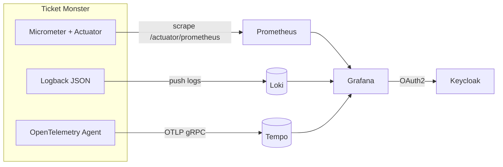

### 13.1 Componentes

| Componente | Propósito |
|---|---|
| **Loki** | Agregación de logs estructurados en JSON desde Logback vía Promtail (Docker) o agente Loki (K3s). |
| **Prometheus** | Scrapea `/actuator/prometheus` cada 15s. Métricas de JVM, HTTP y de negocio. |
| **Tempo** | Recibe spans OTLP del OpenTelemetry Java Agent. Trazabilidad a través de módulos y servicios externos. |
| **Grafana** | Dashboards preconfigurados. Acceso con roles vía OAuth2 de Keycloak. |

### 13.2 Métricas custom de negocio

| Métrica | Tipo | Descripción |
|---|---|---|
| `reservations.created` | Counter | Reservas creadas (por evento, zona) |
| `reservations.expired` | Counter | Reservas expiradas por TTL |
| `reservations.confirmed` | Counter | Reservas convertidas a SOLD |
| `reservations.cancelled` | Counter | Reservas canceladas por usuario |
| `reservations.active` | Gauge | Número de reservas activas en este momento |

### 13.3 Trazabilidad end-to-end

Cada petición HTTP incluye un `traceId` generado por OpenTelemetry que se propaga a través de logs (Logback incluye `trace_id` en JSON), HTTP calls (instrumentación automática), database calls (drivers JDBC y MongoDB instrumentados) y Kafka/Redpanda (contexto de tracing en cabeceras de mensajes).

### 13.4 Dashboards y acceso

Grafana se integra con Keycloak vía OAuth2. Acceso restringido por roles:

| Rol Keycloak | Rol Grafana | Acceso |
|---|---|---|
| `grafana-admin` | Admin | Completo |
| `grafana-editor` | Editor | Ver + editar dashboards |
| `grafana-viewer` | Viewer | Solo lectura |
| Sin rol `grafana-*` | Denegado | Login rechazado |


## 14. Despliegue

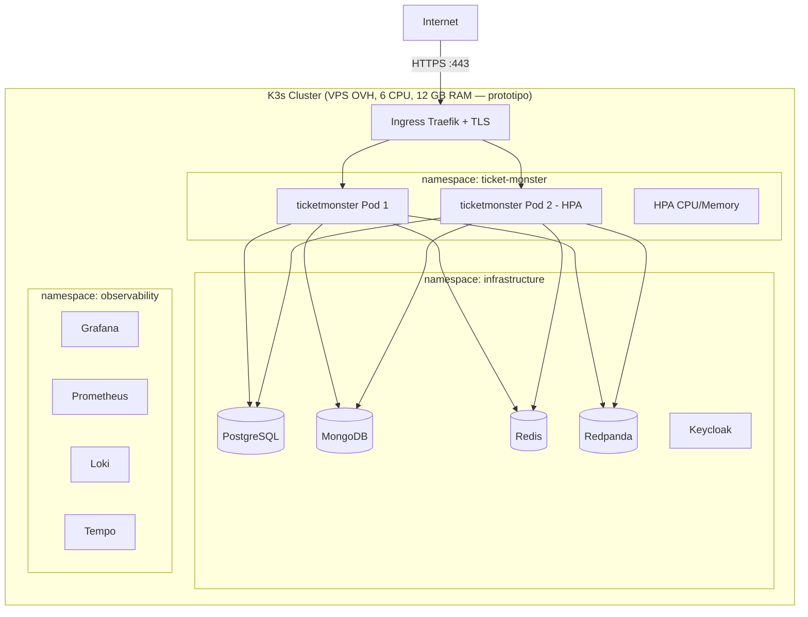

### 14.1 Estrategia de despliegue

El sistema se despliega en un clúster **K3s** sobre un VPS con Debian 12. Se eligió K3s sobre soluciones cloud gestionadas (EKS, GKE, AKS) por coste (~12€/mes frente a cientos de euros), simplicidad (single binary) y suficiencia para el alcance del bootcamp.

> **Nota:** Esta sección describe el despliegue actual del prototipo (single-node). El dimensionamiento para producción a la escala objetivo de 50 M DAU se detalla en la sección [6.4.5](#645-dimensionamiento-del-clúster-k3s).

### 14.2 Namespaces y servicios

| Namespace | Servicios | Propósito |
|---|---|---|
| `infrastructure` | PostgreSQL, MongoDB, Redis, Redpanda, Keycloak | Bases de datos, mensajería y autenticación. |
| `ticket-monster` | ticketmonster (Deployment), HPA, 2 Ingress | El monolito y sus recursos de red. |
| `observability` | Prometheus, Loki, Tempo, Grafana | Stack de observabilidad. |
| `cert-manager` | cert-manager | Gestión de certificados TLS vía Let's Encrypt. |

### 14.3 Helm charts

Cada componente se despliega mediante un chart de Helm independiente (13 charts en total):

| Chart | Recurso | Storage (prototipo) | Storage (producción, ver §6.4.5) |
|---|---|---|---|
| `ticketmonster` | Deployment (1 réplica, HPA opcional), ClusterIP, 2 Ingress | Sin storage | Sin storage |
| `postgresql` | StatefulSet + Service | PVC (10 Gi) | PVC (200 Gi) |
| `mongodb` | StatefulSet + Service | PVC (10 Gi) | PVC (10 Gi c/u, 3 nodos) |
| `redis` | StatefulSet + Service | PVC (5 Gi) | PVC (10 Gi) |
| `redpanda` | StatefulSet + Service | PVC (10 Gi) | PVC (50 Gi c/u, 3 brokers) |
| `keycloak` | Deployment + Service + Ingress | PostgreSQL (schema `keycloak`) | PostgreSQL (schema `keycloak`) |

### 14.4 TLS y certificados

cert-manager automatiza la emisión y renovación de certificados TLS mediante Let's Encrypt ACME. ClusterIssuer configurado para HTTP-01 challenge a través de Traefik. Staging vs production configurables. Renovación automática 30 días antes de expiración.

### 14.5 Infraestructura como código

| Script | Función |
|---|---|
| `k3s-provision.sh` | Instalar K3s, cert-manager, ClusterIssuer |
| `k3s-infrastructure.sh` | Desplegar bases de datos, Keycloak, Redpanda, observabilidad |
| `k3s-publish-app.sh` | Build Docker → push a ghcr.io → Helm install |
| `deploy.sh` | Orquestador: ejecuta los 3 scripts en orden |
| `k3s-recreate.sh` | Backup TLS → destruir → redesplegar → restaurar TLS |

---

## 15. Estrategia de evolución

El sistema sigue el principio de **Monolith First** (Martin Fowler): comenzar como monolito modular y extraer microservicios solo cuando las necesidades del negocio lo justifiquen.

### 15.1 Monolito modular con Spring Modulith

Spring Modulith proporciona verificación arquitectónica automática en tiempo de compilación:
- El test `ModulithArchitectureTest` valida que ningún módulo acceda directamente a clases internas de otro módulo.
- Permite publicar eventos entre módulos de forma tipada sin dependencia directa.
- Genera documentación de módulos automáticamente.

Esto garantiza que el monolito **no se convierta en una bola de barro** (big ball of mud).

### 15.2 Criterios de extracción a microservicios

Un módulo se extrae a microservicio independiente cuando cumple **al menos uno** de estos criterios:

| Criterio | Ejemplo en Ticket Monster |
|---|---|
| **Escalado independiente** | Catalog requiere 10 réplicas para picos de lectura; Reservation necesita 2 réplicas con más CPU. |
| **Ciclos de release independientes** | Catalog despliega cambios diarios; Payment despliega mensualmente. |
| **Tecnología específica** | Payment se migra a Node.js para integración con Stripe. Queue se reescribe en Go para mínima latencia. |
| **Aislamiento de fallos** | Un memory leak en Catalog no debe tumbar las reservas activas. |
| **Escalado organizacional** | Múltiples equipos con propiedad exclusiva sobre su servicio. |

### 15.3 Roadmap tentativo

```
Fase 1 (Actual): Monolito modular con Spring Modulith
├── Comunicación asíncrona vía Redpanda ya establecida
├── Schemas PostgreSQL separados por bounded context
├── Verificación arquitectónica automática (Modulith test)
└── Objetivo: validar el producto y los flujos de negocio

Fase 2: Extracción de Catalog (trigger: throughput de lectura > 10K req/s)
├── Catalog → microservicio Spring Boot independiente con MongoDB dedicado
├── Comunicación con Reservation: gRPC para availability, Redpanda para eventos
└── Beneficio: escalado independiente de lecturas

Fase 3: Extracción de Payment (trigger: integración con pasarela de pago real)
├── Payment → microservicio independiente (posiblemente en otro lenguaje)
├── Comunicación vía Redpanda sin cambios
└── Beneficio: despliegues independientes, certificación PCI-DSS aislada

Fase 4: Extracción de Virtual Queue (trigger: latencia < 10ms p99 para 1M+ usuarios)
├── Queue → servicio en Go/Rust pegado a Redis para mínima latencia
├── Protocolo de token HMAC se mantiene sin cambios
└── Beneficio: rendimiento extremo, afinidad de red con Redis
```

### 15.4 Preparación actual

El diseño actual ya incorpora tres elementos que facilitan la transición:
1. **Comunicación asíncrona vía Redpanda**: extraer un módulo significa cambiar la conexión de `localhost` a una dirección del clúster. El contrato de eventos no cambia.
2. **Schemas de base de datos separados**: extraer Payment significa migrar su schema a una instancia PostgreSQL independiente con cero cambios en el modelo de datos.
3. **Interfaces para dependencias síncronas**: Catalog depende de `AvailabilityService` (interfaz). Al extraer, se reemplaza por gRPC/HTTP sin cambiar el código de Catalog.

---

## 16. Tech stack con justificaciones

### 16.1 Backend

| Tecnología | Versión | Justificación | Trade-offs |
|---|---|---|---|
| **Spring Boot** | 4.0.6 | Framework estándar Java. Virtual Threads nativos, Spring Security, GraphQL, JPA, Kafka, Redis, Actuator. | Quarkus (mejor para serverless), Micronaut (menor adopción). Spring Boot por madurez y ecosistema. |
| **Spring Modulith** | 2.0.6 | Monolito con fronteras estrictas. Verifica acoplamiento en tests. Prepara extracción a microservicios. | Organizar por packages sin verificación (riesgo de big ball of mud). Modulith añade coste mínimo en configuración. |
| **Spring for GraphQL** | — | API declarativa con `@QueryMapping`. Schema-first: el SDL es la fuente de verdad. | REST para catálogo. Descartado porque GraphQL evita over-fetching en catálogo heterogéneo. |
| **Resilience4j** | 2.3.0 | Circuit breaker, rate limiter, time limiter. Ligero, métricas integradas con Micrometer. | Hystrix (deprecado), Sentinel (más complejo). Resilience4j es el estándar en Spring Boot moderno. |
| **HikariCP** | — | Pool de conexiones JDBC de alto rendimiento. Por defecto en Spring Boot 3+. | Tomcat DBCP2 (más lento). HikariCP es el más rápido en benchmarks. |
| **Flyway** | — | Migraciones de esquema versionadas por schema. Control determinista del DDL. | Hibernate ddl-auto (no apto para producción), Liquibase (más flexible pero más complejo). |

### 16.2 Persistencia

| Tecnología | Uso | Justificación | Trade-offs |
|---|---|---|---|
| **PostgreSQL 16** | Reservas, Pagos | ACID, `SELECT FOR UPDATE`, schemas. Referencia para cargas transaccionales. | MySQL (limitaciones con `FOR UPDATE` en replicación). PostgreSQL ofrece mejor soporte para bloqueo pesimista. |
| **MongoDB 7** | Catálogo | Documentos flexibles para eventos heterogéneos. Full-text search nativo. Escalado horizontal. | PostgreSQL JSONB (puede almacenar JSON, pero MongoDB rinde mejor en documentos anidados). |
| **Redis 7** | Colas, Locks | Operaciones atómicas en microsegundos. LIST, SET, HASH, SETNX nativos. Keyspace notifications. | Hazelcast (embebido en JVM, añade complejidad de clustering). Redis es más rápido para operaciones atómicas simples. |

### 16.3 Mensajería

| Tecnología | Justificación | Trade-offs |
|---|---|---|
| **Redpanda v24.3.5** | Compatible con protocolo Kafka. Single binary (sin ZooKeeper). Menor latencia y consumo de recursos en despliegues pequeños. Raft consensus. | Apache Kafka (requiere ZooKeeper/KRaft, más pesado). RabbitMQ (modelo de colas, no de log inmutables). Se elige Redpanda por garantías CP con menor coste operacional. |

### 16.4 Seguridad

| Tecnología | Justificación | Trade-offs |
|---|---|---|
| **Keycloak 26.1** | IAM open source. OAuth2/OIDC completo. Gestión de realms, clientes, roles. Integración nativa con Spring Security. | Auth0/Okta (SaaS, coste recurrente, dependencia externa). Keycloak es self-hosted y gratuito. |
| **Traefik** | Ingress controller nativo de K3s. Middlewares para rate limiting, secure headers y CORS vía CRDs. | NGINX Ingress Controller. Traefik es la opción por defecto en K3s con configuración nativa. |
| **cert-manager** | Automatización de certificados TLS vía Let's Encrypt ACME. CRDs nativos de Kubernetes. | Sin alternativa considerada por convención en ecosistema K3s. |

### 16.5 Orquestación

| Tecnología | Justificación | Trade-offs |
|---|---|---|
| **K3s** | Kubernetes ligero. Single binary, incluye Traefik. Ideal para VPS single-node. | k3d (desarrollo local), k0s, MicroK8s. K3s es la opción más ligera y mejor integrada. |
| **Helm** | Gestión de despliegues como charts versionados. Templates parametrizables. Rollback nativo. | Kustomize (mejor para overlays, peor para empaquetar aplicaciones completas). |

### 16.6 Observabilidad

| Tecnología | Justificación | Trade-offs |
|---|---|---|
| **Prometheus v3.1.0** | Pull model. Integración nativa con Spring Actuator. PromQL potente. Estándar CNCF. | InfluxDB (push model, mejor para IoT). Prometheus es el estándar CNCF para métricas. |
| **Loki 3.4.2** | Agregación de logs por labels. Bajo consumo vs Elasticsearch. | ELK/EFK (Elasticsearch consume más RAM, overkill para este proyecto). |
| **Tempo 2.7.0** | Backend de tracing OTLP. Almacenamiento en object storage. | Jaeger (requiere Cassandra/Elasticsearch, más pesado). |
| **Grafana 11.5.1** | Dashboards unificados. OAuth2 con Keycloak. | Sin alternativa: Grafana es el estándar de facto para visualización. |

### 16.7 Pruebas

| Tecnología | Justificación |
|---|---|
| **JUnit 5 + Spring Boot Test** | Pruebas unitarias e integración. Spring Modulith Test para verificación arquitectónica. |
| **k6** | Pruebas de carga con métricas exportables a Prometheus. Scripts en JavaScript. Ideal para simular picos de usuarios concurrentes. |

---

## 17. Trade-offs y decisiones arquitectónicas

### 17.1 API Gateway Spring Cloud → Traefik

**Decisión**: eliminar el microservicio `api-gateway` y delegar sus responsabilidades en Traefik (edge) y el monolito (lógica).

**Evidencia**: pruebas k6 mostraron que el gateway añadía latencia (~50-100ms) y era un punto único de fallo. A 5,000 VUs, el gateway se saturaba antes que el monolito.

**Trade-off aceptado**: se pierde rate limiting y circuit breaking por endpoint individual. Ahora se aplica a nivel de Ingress. Para el tamaño actual del sistema (9 endpoints), esta granularidad es suficiente.

### 17.2 Token HMAC para cola vs JWT de Keycloak

**Decisión**: emitir token HMAC-SHA256 en lugar de JWT de Keycloak para el token de acceso a reservas.

**Justificación**: la emisión de HMAC local tarda microsegundos frente a decenas de milisegundos de una petición HTTP a Keycloak. Sin dependencia externa en el path caliente de compra. Si Keycloak está sobrecargado durante un pico, la emisión de tokens no se ve afectada.

**Trade-off aceptado**: el token HMAC no es estándar OAuth2. Un sistema externo no podría validarlo sin el secreto compartido. Para comunicación interna entre módulos del mismo sistema es aceptable.

### 17.3 Redis SETNX vs PostgreSQL advisory locks

**Decisión**: Redis `SETNX` con TTL para locks distribuidos.

**Justificación**: TTL automático sin riesgo de locks huérfanos. Keyspace notifications permiten restaurar stock automáticamente al expirar. Rendimiento O(1) en microsegundos sin competir por recursos del servidor PostgreSQL.

**Trade-off aceptado**: Redis es un sistema externo adicional en el path crítico de escritura. Si Redis no está disponible, no se pueden crear reservas (aunque `SELECT FOR UPDATE` por sí solo previene overbooking entre usuarios distintos).

### 17.4 MongoDB vs PostgreSQL para catálogo

**Decisión**: MongoDB para catálogo, PostgreSQL para reservas y pagos.

**Justificación**: schema flexible para eventos heterogéneos. Documentos embebidos (Zone dentro de Event) evitan JOINs. Full-text search nativo sin Elasticsearch.

**Trade-off aceptado**: dos motores de base de datos añaden complejidad operacional (dos backups, dos configuraciones). Si se vuelve problemático, Catalog puede migrarse a PostgreSQL JSONB manteniendo la misma API GraphQL.

### 17.5 Virtual Threads vs WebFlux

**Decisión**: Virtual Threads (Java 21 + Spring Boot 4.0.6).

**Justificación**: las operaciones de negocio (doble lock, idempotencia) son inherentemente secuenciales. Expresarlas con operadores reactivos oscurece la lógica. Virtual Threads ofrecen el mismo rendimiento I/O no bloqueante con código imperativo. Las stack traces son legibles y lineales.

**Trade-off aceptado**: en escenarios CPU-bound puro, Virtual Threads no ofrecen ventaja. Pero el sistema es I/O-bound (consultas a BD, llamadas HTTP, mensajería).

### 17.6 Flyway por schema separado

**Decisión**: dos instancias de Flyway independientes para schemas `reservation` y `payment`.

**Justificación**: una migración fallida en `payment` no bloquea `reservation`. Extracción futura sin cambios en historial de migraciones. Cada módulo es dueño de sus tablas.

**Trade-off aceptado**: dos tablas `flyway_schema_history`. Inicialización requiere crear schemas manualmente (`01-create-schemas.sql`).

### 17.7 Rate limiting en edge vs app

**Decisión**: rate limiting principal en Traefik (edge), complementado con Resilience4j RateLimiter en la aplicación.

**Justificación**: defensa en profundidad. Traefik rechaza peticiones excesivas antes de que lleguen al monolito. Resilience4j añade backstop intra-aplicación contra bucles accidentales.

**Trade-off aceptado**: el rate limiting de Traefik aplica a todo `/api/*` sin distinguir endpoints. Con 9 endpoints, la granularidad es suficiente.

---

## Anexo A: Cuestionario de evaluación

### A.1 Describe de manera detallada cómo tu sistema está protegido contra overbooking

> **Referencia**: Sección 7 — Mecanismo anti-overbooking.

El sistema implementa tres capas de defensa:

**Capa 1 — Límite de tickets por usuario**: cada usuario puede reservar un máximo de 3 tickets por evento (configurable). Reduce la contención en las capas siguientes.

**Capa 2 — `SELECT FOR UPDATE` en PostgreSQL**: es la pieza central. Bloquea la fila de `zone_stock` para cualquier transacción concurrente, serializando el acceso. Si 1,000 usuarios intentan reservar sobre una zona con 10 tickets, PostgreSQL ejecuta las transacciones una por una. La undécima encuentra `available_count = 0`, hace ROLLBACK y devuelve 409.

**Capa 3 — Redis `SETNX` con TTL**: `SELECT FOR UPDATE` previene overbooking entre usuarios distintos pero no evita que el mismo usuario envíe dos peticiones concurrentes. Redis `SETNX` con key `reservation:{eventId}:{zoneId}:{userId}` cierra esta brecha: solo una petición adquiere el lock.

**Expiración y restauración**: keyspace notifications de Redis informan cuando un lock expira. El Reservation Module restaura el stock automáticamente. Como fallback, un job barre reservas expiradas cada 60 segundos.

**Evidencia empírica**: pruebas k6 con 1,000 peticiones concurrentes de 100 usuarios compitiendo por 10 tickets → exactamente 10 reservas creadas, 990 rechazos, 0% errores, 0 overbooking.

### A.2 Explica en qué partes del diseño de tu sistema integrarás capacidades resilientes, y de qué forma

> **Referencia**: Sección 11 — Resiliencia y concurrencia.

La resiliencia se integra en cuatro niveles:

**Nivel 1 — Edge (Traefik)**: rate limiting (10K req/s en `/api/*`) que protege al monolito de peticiones excesivas antes de llegar al thread pool. TLS y secure headers como primera línea de defensa.

**Nivel 2 — App (Resilience4j)**: circuit breakers independientes para catalog (MongoDB), reservation (PostgreSQL) y payment (PostgreSQL). Ventana deslizante de 10 llamadas, umbral de fallo 50%, estado abierto 10s. Time limiter (5s). Rate limiter global (100 req/min) como backstop.

**Nivel 3 — Datos (TTL en Redis)**: todos los locks distribuidos tienen TTL (10 min). Si la aplicación falla, Redis los expira y notifica para restaurar el stock. El barrido periódico es el fallback ante pérdida de notificaciones.

**Nivel 4 — Mensajería (Redpanda)**: eventos se acumulan si el consumidor está caído. Productor con `acks=all` e `enable.idempotence=true`. Consumidores con commit manual (at-least-once).

### A.3 Explica el uso de concurrencia en tu sistema, si es aplicable

> **Referencia**: Secciones 7, 8, 11.2.

La concurrencia está presente en cuatro dimensiones:

**Reservas — Serialización vía `SELECT FOR UPDATE`**: hasta 5 millones de usuarios pueden intentar reservar simultáneamente. PostgreSQL serializa el acceso: convierte un problema de concurrencia en un problema de throughput (~250 reservas/s por zona). El throughput es suficiente porque la fila virtual ya limitó la llegada.

**Cola virtual — Redis atómico**: Redis es single-threaded y serializa naturalmente todas las operaciones sin locks explícitos. El batch dispatcher limita la tasa de entrada a PostgreSQL.

**Monolito — Virtual Threads**: cada petición HTTP se ejecuta en un Virtual Thread independiente. Java 21 permite millones de Virtual Threads concurrentes, suspendidos durante I/O y reanudados al recibir respuesta.

**Pagos — Idempotencia**: `idempotency_key` con restricción UNIQUE en PostgreSQL garantiza que múltiples peticiones concurrentes de confirmación solo tengan efecto una vez.

### A.4 ¿Cómo planeas manejar la llegada masiva de usuarios en un evento extremadamente popular?

> **Referencia**: Sección 8 — Estrategia de Fila Virtual.

La estrategia se basa en tres mecanismos coordinados:

**1. Fila Virtual (Redis FIFO)**: los usuarios no compiten directamente por entradas. `POST /join` encola en Redis (LPUSH, O(1), microsegundos), absorbiendo cientos de miles de peticiones por segundo. La cola es AP: si Redis se cae, los usuarios se reencolan.

**2. Batch Dispatcher (control de flujo)**: un job extrae lotes de 500 usuarios cada 2 segundos (RPOP), limitando la tasa de entrada al motor de reservas a ~250 usuarios/segundo. Esto protege PostgreSQL de una avalancha.

**3. Rate limiting en el edge (Traefik)**: rechaza peticiones que exceden 10K req/s (HTTP 429) antes de que consuman recursos del backend.

**Escalado horizontal**: HPA añade réplicas del monolito bajo carga. El siguiente cuello de botella (bases de datos) se mitiga con MongoDB replica set (lecturas distribuidas) y PgBouncer (multiplexación de conexiones a PostgreSQL).

**Flujo completo durante un pico**: 5M usuarios → Traefik (rate limit, TLS) → Redis FIFO (cientos de miles de LPUSH/s) → Batch dispatcher (250 usuarios/s hacia PostgreSQL) → SELECT FOR UPDATE (serializado por zona) → 201 Created (máximo = capacidad de la zona) o 409 Conflict (resto).

### A.5 Describe tu análisis desde la perspectiva del CAP Theorem

> **Referencia**: Sección 12 — Análisis CAP Theorem.

El sistema no adopta una única postura CAP, sino que aplica la elección adecuada a cada bounded context:

| Componente | Elección | Razón |
|---|---|---|
| **Reservation** | CP | Cero overbooking no negociable. `SELECT FOR UPDATE` + `SETNX` garantizan consistencia a costa de disponibilidad y latencia. |
| **Payment** | CP | Transacciones financieras requieren consistencia absoluta. Idempotencia vía `idempotency_key` UNIQUE en PostgreSQL. |
| **Catalog** | AP | Read-heavy y público. Inconsistencia temporal (zona recién añadida aún no visible en `availability`) se resuelve en milisegundos. |
| **Virtual Queue** | AP | Redis standalone sin replicación síncrona. Si falla, la cola se pierde pero usuarios pueden reintentar. La alternativa CP no soportaría 500K+ ops/s. |
| **Redpanda** | CP | Raft consensus garantiza que eventos de dominio no se pierdan ni dupliquen durante una partición. |

Esta estrategia híbrida reconoce que **diferentes partes del sistema tienen diferentes requisitos de consistencia**. Imponer CP a todo el sistema sacrificaría rendimiento innecesariamente. Imponer AP a todo provocaría overbooking.

---

## Anexo B: Glosario de términos

| Término | Definición |
|---|---|
| **ACID** | Atomicity, Consistency, Isolation, Durability. Propiedades de transacciones en bases de datos relacionales. |
| **AP (CAP)** | Disponibilidad sobre consistencia durante una partición de red. El sistema sigue respondiendo con datos potencialmente inconsistentes. |
| **Bounded Context** | Concepto de DDD: límite explícito dentro del cual un modelo de dominio es consistente. |
| **CAP Theorem** | Un sistema distribuido solo puede garantizar dos de tres: Consistency, Availability, Partition Tolerance. |
| **C4 Model** | Metodología de diagramación de arquitectura: Context, Container, Component, Code. |
| **Circuit Breaker** | Patrón de resiliencia: cuando un servicio falla repetidamente, el circuito se abre y las llamadas se rechazan inmediatamente. |
| **CP (CAP)** | Consistencia sobre disponibilidad. El sistema rechaza operaciones que podrían generar inconsistencia. |
| **CRD** | Custom Resource Definition. Extensión de la API de Kubernetes para recursos personalizados. |
| **DAU** | Daily Active Users. Usuarios únicos que interactúan con el sistema en un día. |
| **DDD** | Domain-Driven Design. Metodología que centra el modelado en el dominio de negocio. |
| **Eventual Consistency** | Las réplicas de datos convergen a un estado consistente tras un período, sin garantía inmediata. |
| **FIFO** | First In, First Out. El primer elemento en entrar es el primero en salir. |
| **Flyway** | Herramienta de migración de bases de datos que versiona cambios de esquema mediante scripts SQL. |
| **HPA** | Horizontal Pod Autoscaler. Escala automáticamente réplicas según métricas de CPU/memoria. |
| **HMAC** | Hash-based Message Authentication Code. Firma criptográfica con clave secreta para autenticidad e integridad. |
| **HikariCP** | Pool de conexiones JDBC de alto rendimiento para Java. |
| **Idempotencia** | Ejecutar una operación múltiples veces produce el mismo resultado que una sola vez. |
| **Ingress** | Recurso de Kubernetes que define reglas de enrutamiento HTTP/HTTPS externo hacia servicios internos. |
| **JWT** | JSON Web Token. Token de autenticación con claims firmados digitalmente. |
| **Keyspace Notification** | Mecanismo de Redis que notifica a clientes cuando ocurren eventos en el keyspace. |
| **K3s** | Distribución ligera de Kubernetes certificada, empaquetada en un solo binario. |
| **Micrometer** | Biblioteca de métricas para JVM que abstrae múltiples backends (Prometheus, Datadog, etc.). |
| **Monolith First** | Principio de arquitectura: comenzar como monolito modular y extraer microservicios cuando sea necesario. |
| **OAuth2/OIDC** | OAuth 2.0: protocolo de autorización. OpenID Connect: capa de autenticación sobre OAuth2. |
| **OpenTelemetry** | Framework de observabilidad CNCF para generar, recolectar y exportar trazas, métricas y logs. |
| **Overbooking** | Vender más entradas de las disponibles. Principal riesgo que el sistema debe prevenir. |
| **p50 / p95 / p99** | Percentiles de latencia. p50 = mediana, p95 = el 95% de peticiones son más rápidas, p99 = el 99%. |
| **PgBouncer** | Pool de conexiones ligero para PostgreSQL que multiplexa conexiones de cliente sobre pocas conexiones reales. |
| **Raft** | Algoritmo de consenso distribuido usado por Redpanda. Garantiza que solo la partición con mayoría acepte escrituras. |
| **Schema (PostgreSQL)** | Namespace lógico dentro de una base de datos que agrupa tablas y otros objetos. |
| **SETNX** | SET if Not eXists. Comando atómico de Redis que solo crea una key si no existe. |
| **Spring Modulith** | Toolkit para diseñar monolitos modulares con verificación arquitectónica automática. |
| **TTL** | Time To Live. Tiempo de vida de un recurso antes de su expiración automática. |
| **Virtual Threads** | Característica de Java 21 (Project Loom) que permite millones de threads ligeros con código imperativo. |
| **VUs** | Virtual Users. Usuarios simulados en pruebas de carga con k6. |

---

## Anexo C: Matriz de trazabilidad requisitos → secciones

| Entregable del bootcamp | Secciones del SAD donde se cubre |
|---|---|
| **Diagrama de Arquitectura (System Design)** | 3.1 C4 Nivel 1 (Contexto), 3.2 C4 Nivel 2 (Contenedores), 3.3 C4 Nivel 3 (Componentes), 14 Despliegue |
| **Diagrama de descomposición DDD** | 4.1–4.4 Fichas de Bounded Contexts, 4.5 Context Map con relaciones DDD |
| **API Spec** | 5.1 GraphQL (SDL completo), 5.2–5.4 REST (tablas por módulo con métodos, request/response, códigos HTTP) |
| **Data Model** | 6.1 MongoDB (documentos embebidos, ER), 6.2 PostgreSQL (ER completo con 5 tablas, restricciones), 6.3 Redis (keys, operaciones) |
| **Tech Stack** | 16.1–16.7 Tech stack agrupado con justificaciones extensas y trade-offs |
| **Protección contra overbooking** | 7 Mecanismo anti-overbooking (diagrama de secuencia + 3 capas) y Anexo A.1 |
| **Capacidades resilientes** | 11.1 Circuit Breakers, 11.2 Virtual Threads, 11.3 Resultados k6, y Anexo A.2 |
| **Uso de concurrencia** | 7 Anti-overbooking, 8 Fila Virtual, 11.2 Virtual Threads, y Anexo A.3 |
| **Manejo de llegada masiva** | 8 Estrategia de Fila Virtual, 11.3 Resultados k6, y Anexo A.4 |
| **Análisis CAP Theorem** | 12 Análisis CAP (tabla por componente + escenarios de fallo) y Anexo A.5 |

**Cobertura adicional** (más allá de los entregables mínimos):

| Tema | Sección |
|---|---|
| Comunicación asíncrona y eventos | 9 Comunicación asíncrona (tópicos Redpanda, flujo de eventos) |
| Seguridad multicapa | 10 Seguridad (Traefik, Keycloak, Spring Security, HMAC, idempotencia) |
| Observabilidad | 13 Observabilidad (Loki, Prometheus, Tempo, Grafana, métricas custom, trazabilidad) |
| Estrategia de evolución | 15 Estrategia de evolución (Monolith First → criterios → roadmap) |
| Trade-offs documentados | 17 Trade-offs (7 decisiones con justificación y contrapartida) |
| Evidencia empírica (k6) | 11.3 Resultados de pruebas de carga (3 escenarios con tablas y hallazgos) |
| Infraestructura como código | 14 Despliegue (K3s, Helm, scripts de provisioning) |
| Glosario | Anexo B (53 términos) |
| Trazabilidad | Anexo C (matriz entregables → secciones) |
